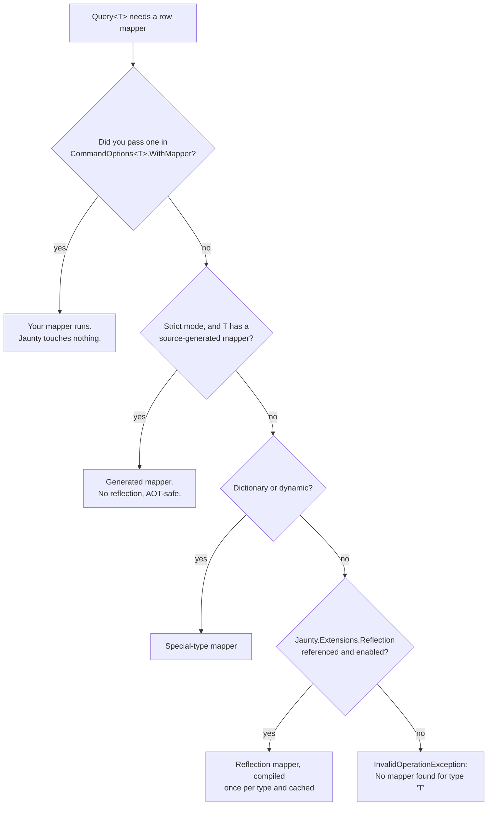
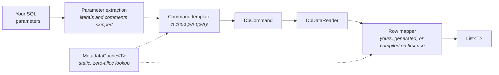
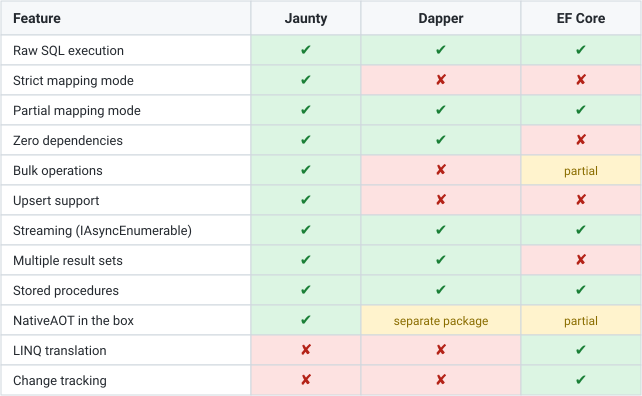
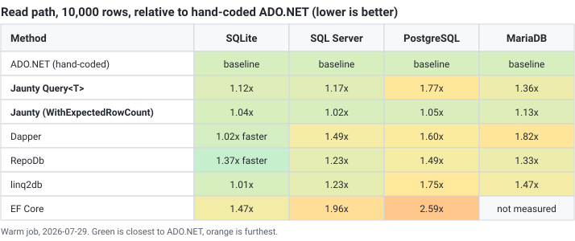
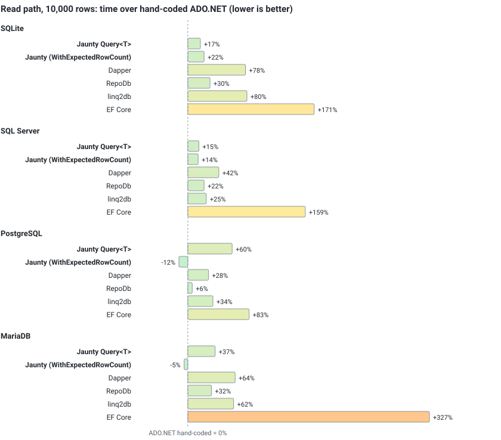
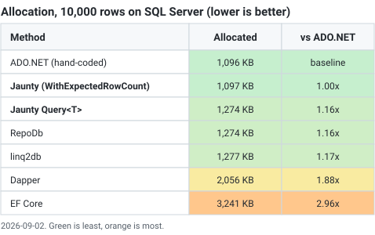
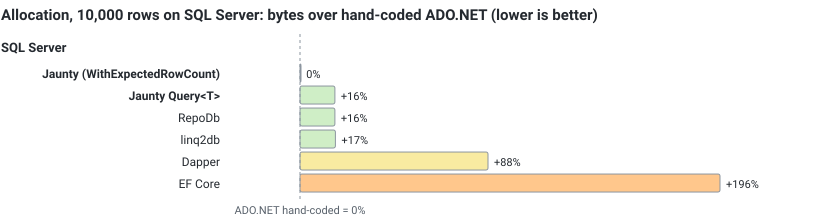

# Jaunty

<p align="center">
  
</p>

The micro-ORM that respects your SQL and your time.

[](https://github.com/extrode/jaunty/actions/workflows/ci.yml)
[](LICENSE.md)
[](#installation)
[](#nativeaot)
[](#installation)

> [!IMPORTANT]
> Jaunty is free to use, including in commercial production. No seat count, no order form, no expiry.
> The source is published under [ISL-R](LICENSE.md), which is not an OSI-approved open-source license:
> you may use it and read it, but not modify or redistribute it as a library. Shipping the unmodified
> packages inside your own application is covered by the
> [Redistribution Exception](LICENSE-DISTRIBUTION-EXCEPTION.md), royalty-free and non-expiring.
> What is sold is [support](docs/06-releases/pricing.md), never the right to use the software.

If you have used Dapper, you already know how Jaunty feels. It is a set of extension methods on the
`IDbConnection` you already have, so any ADO.NET provider works and there is no context object to
create, configure or dispose. You write the SQL, Jaunty runs it and hands back objects.

```csharp
using Jaunty;

var products = connection.Query<Product>(
    "SELECT * FROM products WHERE category_id = @CategoryId",
    new { CategoryId = 1 });
```

The SQL that runs is the SQL you wrote. There is no LINQ translation and no query rewriting. When
you want a builder, the optional `Extrode.Jaunty.Fluent` package generates parameterized SQL from
typed expressions, and the core never depends on it.

---

## Contents

- [Quick start](#quick-start)
- [Strict by default](#strict-by-default)
- [Jaunty and Dapper](#jaunty-and-dapper)
- [Jaunty or JauntyQ?](#jaunty-or-jauntyq)
- [Three ways to write a query](#three-ways-to-write-a-query)
- [Installation](#installation)
- [How Jaunty picks a mapper](#how-jaunty-picks-a-mapper)
- [API reference](#api-reference)
- [Parameters](#parameters)
- [Transactions and timeouts](#transactions-and-timeouts)
- [Naming: attributes and conventions](#naming-attributes-and-conventions)
- [Logging and diagnostics](#logging-and-diagnostics)
- [Async and streaming](#async-and-streaming)
- [Under the hood](#under-the-hood)
- [Comparison](#comparison)
- [Documentation](#documentation)
- [License](#license)

---

## Quick start

```csharp
using Jaunty;

// Strict mapping: every property needs a column
var products = connection.Query<Product>(
    "SELECT id AS Id, name AS Name, price AS Price FROM products");

// Partial mapping: map what is there, leave the rest at default
var summaries = connection.QueryPartial<ProductSummary>(
    "SELECT id AS Id, name AS Name FROM products");

// Scalars
var count = connection.QueryScalar<long>("SELECT COUNT(*) FROM products");

// Parameters, named or positional
var filtered = connection.Query<Product>(sql, new { CategoryId = 1 });
var filtered = connection.Query<Product>(sql, 1);
var filtered = connection.Query<Product>(sql, 1, "active", 50.00m);

// Async with cancellation
var products = await connection.QueryAsync<Product>(sql, cancellationToken);

// Insert, update, delete, upsert
var id   = connection.Insert(product);   // identity value
var rows = connection.Update(product);   // rows affected
var rows = connection.Delete(product);
var rows = connection.Upsert(product);   // insert if new, update if it exists

// Bulk
var rows = connection.BulkInsert(products);
var rows = connection.BulkUpdate(products);
var rows = connection.BulkDelete(products);
```

---

## Strict by default

`Query<T>` expects the entity and the result set to agree. If a property has no matching column,
Jaunty throws at the call site instead of handing you a half-filled object.

```csharp
public class Product
{
    public int Id { get; set; }
    public string Name { get; set; }
    public decimal Price { get; set; }
}

// Throws: no 'Price' column
var products = connection.Query<Product>("SELECT id, name FROM products");
// InvalidOperationException: "Strict mapping failed: property 'Price' has no matching column"
```

Silent partial mapping is a bug that surfaces far from where it started. If you wanted all three
properties, you should hear about it while you are still at your desk. If you want a subset, say so:

```csharp
var summaries = connection.QueryPartial<ProductSummary>(
    "SELECT id AS Id, name AS Name FROM products");
```

`QueryPartial<T>` is not a workaround. Projections and DTOs legitimately select a subset, and
partial mode is the right tool for them. The check runs once per distinct result-set shape, not
once per row, so it costs nothing you would notice.

| | `Query<T>` | `QueryPartial<T>` |
|---|---|---|
| Property with no column | throws | left at its default |
| Column with no property | throws under the reflection mapper, ignored by the generated one | ignored |

The full precedence, and which mapper enforces which direction, is in
[query-partial-methods.md](docs/01-api-reference/query-partial-methods.md#which-mapper-enforces-which-direction).
[Migrating to Jaunty](docs/08-learn/migrating/README.md) shows how to move a lenient codebase over
without fighting it.

---

## Jaunty and Dapper

Most people choosing Jaunty are choosing between it and Dapper, so here is the honest version.

| | Dapper | Jaunty |
|---|---|---|
| Strict-by-default mapping | silent partial map | yes, `QueryPartial<T>` opts out per call |
| Zero runtime dependencies on `net8.0`/`net10.0` | yes | yes |
| NativeAOT via source generator | separate package (Dapper.AOT) | in the box, verified in CI |
| Fluent query builder | no | `Extrode.Jaunty.Fluent`, optional |
| Bulk copy | paid add-on (Dapper Plus) | three providers, included |
| Scaffolding CLI | no | `Extrode.Jaunty.Scaffolding.Cli` |
| DuckDB and flat-file sources | no | `Extrode.Jaunty.FlatFiles.DuckDB` |
| Dialect-aware SQL generation | no | SQL Server, PostgreSQL, MySQL, SQLite |
| Built-in audit trail | no | `AuditInterceptor` |

Strict mapping is the row to weigh first. It is not a performance claim, so it holds whichever
library benchmarks faster on a given path.

Jaunty is a good fit when you publish under NativeAOT, when dependency count matters, when you want
SQL you can read in the source and find in the query log, or when you need bulk copy, scaffolding or
DuckDB without assembling three more vendors. It also targets `net472` and `netstandard2.0`
alongside modern .NET from one codebase.

It is not the tool for change tracking, a unit of work, lazy loading or migrations. That is EF Core's
job, and using both together is a reasonable architecture. It is also not a LINQ provider: the
Fluent package builds SQL from expressions, it does not translate `IQueryable`. Four dialects are
supported; on any other database the core still executes your SQL through ADO.NET, but
dialect-aware generation does not apply.

Team familiarity counts too. Dapper is the library your next hire already knows, and that is worth
weighing. Learning Jaunty is not a big ask, though: the method names are the ones you expect, the
parameters bind the way you expect, and a developer who knows Dapper is productive with Jaunty in an
afternoon.

---

## Jaunty or JauntyQ?

Jaunty starts from C#. [JauntyQ](https://github.com/extrode/jauntyq) starts from SQL. They are two
products, not two modes of one product, and the choice is about how you like to work.

With Jaunty you solve the problem in the language you are already writing: attribute-mapped
entities, `Insert`/`Update`/`Delete` against a POCO, typed expressions through the Fluent builder,
and a hand-written SQL string whenever SQL is the clearer tool. Values are parameterized by
construction and results map strictly.

JauntyQ is for the developer who says: I know SQL, I know what I want to run, validate it and
otherwise stay out of my way. Every query is a real `.sql` file versioned next to the code. The
generator validates it at build time against a committed schema snapshot and emits ADO.NET that reads
by ordinal, with no reflection and no runtime SQL parsing.

Neither product silently maps the wrong thing. JauntyQ catches it at build time against a snapshot,
Jaunty at the call site against the live result set. If the second description sounds like you, the
[JauntyQ README](https://github.com/extrode/jauntyq) covers that direction in the same depth.

---

## Three ways to write a query

Every listing below is real output, not an illustration.

### 1. Your own SQL

Hand-written SQL is a first-class way to use Jaunty, not an escape hatch. This one selects three
columns rather than a whole `Product`, so it is a projection and `QueryPartial<T>` is the right
method:

```csharp
var products = connection.QueryPartial<Product>(
    "SELECT product_id, product_name, unit_price FROM products WHERE category_id = @CategoryId",
    new { CategoryId = 1 });
```

### 2. Let the entity carry the SQL

For CRUD, the entity's mapping is all Jaunty needs, and the source generator emits the SQL at build
time:

```csharp
var all      = connection.GetAll<Product>();
var one      = connection.Get<Product>(1);
long newId   = connection.Insert(product);
int updated  = connection.Update(product);
int deleted  = connection.Delete(product);
```

What those five calls send to the database:

```sql
SELECT product_id, product_name, category_id, unit_price, units_in_stock, discontinued FROM products
SELECT product_id, product_name, category_id, unit_price, units_in_stock, discontinued FROM products WHERE product_id = @product_id
INSERT INTO products (product_name, category_id, unit_price, units_in_stock, discontinued) VALUES (@product_name, @category_id, @unit_price, @units_in_stock, @discontinued); SELECT last_insert_rowid();
UPDATE products SET product_name = @product_name, category_id = @category_id, unit_price = @unit_price, units_in_stock = @units_in_stock, discontinued = @discontinued WHERE product_id = @product_id
DELETE FROM products WHERE product_id = @product_id
```

No `SELECT *` anywhere, so a column added to the table tomorrow cannot silently change the shape of
your result. The identity fetch is dialect-specific: `last_insert_rowid()` on SQLite,
`CAST(SCOPE_IDENTITY() AS BIGINT)` on SQL Server, `RETURNING` on PostgreSQL, `LAST_INSERT_ID()` on
MySQL.

### 3. The Fluent builder

For anything past CRUD, the optional `Extrode.Jaunty.Fluent` package takes typed expressions:

```csharp
using Jaunty.Fluent;

var rows = connection.From<Product>()
    .InnerJoin<Category>()
    .On(p => p.CategoryId, c => c.CategoryId)
    .Where((p, c) => p.CategoryId == 1)
    .SelectBoth();                       // List<(Product From, Category Joined)>

foreach (var (product, category) in rows)
    Console.WriteLine($"{product.ProductName} ({category.CategoryName})");
```

and produces:

```sql
SELECT p.product_id, p.product_name, p.category_id, p.unit_price, p.units_in_stock, p.discontinued,
       c.category_id, c.category_name, c.description
FROM products p
INNER JOIN categories c ON p.category_id = c.category_id
WHERE (p.category_id = @p_category_id)
```

`p` and `c` are the names you wrote. A lambda parameter survives into the expression tree as data,
so the builder aliases each table after the identifier already standing for it in your code.
`@p_category_id` is a parameter you can grep for. `ToSql()` returns the string without executing
anything, so the SQL is reviewable in a test.

Aliases are inferred per join and only when every name a join needs is usable; a name that is a SQL
keyword, already taken, or the same as a table in the query is declined, and an explicit
`From<Product>("prd")` always wins. Grouping, `HAVING`, paging and the rest are in the
[Fluent API reference](docs/01-api-reference/fluent-api.md).

---

## Installation

```bash
dotnet add package Extrode.Jaunty
```

Targets `netstandard2.0`, `net8.0` and `net10.0`, and works with any ADO.NET provider.

On `net8.0` and `net10.0` the package has no dependencies at all; the dependency groups in the
shipped `.nuspec` are empty. `netstandard2.0` is there for consumers who cannot move off an older
framework, and it carries two Microsoft-published backports of types that are built into modern
.NET: `Microsoft.Bcl.AsyncInterfaces` for `IAsyncEnumerable<T>` and
`System.Diagnostics.DiagnosticSource`.

`ILogger` and dependency-injection integration live in a separate opt-in package,
`Extrode.Jaunty.Extensions.Logging`, which is why the core needs neither. Every dependency of every
package is listed in [dependencies.md](docs/02-architecture/dependencies.md).

---

## How Jaunty picks a mapper

You have the right to a mapper. If you cannot afford one, or do not provide one, one will be
provided for you.

Every read needs something that turns a row into a `T`. Jaunty asks in this order and takes the
first answer:



Your data is always yours to shape. The steps, from most control to least:

**Bring your own mapper.** Hand Jaunty a delegate and it will not look at your type at all.
Useful for a legacy table, a computed column, or a type you do not own.

```csharp
var products = connection.Query<Product>(
    "SELECT product_id, product_name, unit_price FROM products",
    CommandOptions<Product>.WithMapper(r => new Product
    {
        Id    = r.GetInt32(0),
        Name  = r.GetString(1),
        Price = r.GetDecimal(2)
    }));
```

**Let the generator write it.** Mark the entity with `[Table]` and the bundled source generator
emits a mapper at build time: ordinals resolved once per result set, no reflection, no trim or AOT
warnings. This is the path to be on for NativeAOT.

```csharp
using Jaunty.Attributes;

[Table("products")]
public partial class Product
{
    [Key] public int Id { get; set; }
    public string Name { get; set; }
    public decimal Price { get; set; }
}
```

**Fall back to reflection.** Reference `Extrode.Jaunty.Extensions.Reflection`, call
`JauntyReflectionExtensions.UseReflectionMapping()` once at startup, and any plain class maps with
setters compiled on first use. This is the Dapper experience, and it is the one thing the core
leaves out on purpose so that the core stays AOT-clean.

```csharp
JauntyReflectionExtensions.UseReflectionMapping();

var products = connection.Query<Product>("SELECT id AS Id, name AS Name, price AS Price FROM products");
```

Attributes steer any of the three: `[Column("unit_price")]` renames, `[Ignore]` skips, `[Key]` marks
the primary key. See [Naming](#naming-attributes-and-conventions).

---

## API reference

<details open>
<summary>Reading</summary>

| Method | Returns | Mapping | Description |
|--------|---------|---------|-------------|
| `Query<T>()` | `List<T>` | Strict | Every property needs a column |
| `QueryPartial<T>()` | `List<T>` | Partial | Map only matching columns |
| `QueryFirst<T>()` | `T` | Strict | First row, throws if empty |
| `QueryFirstOrDefault<T>()` | `T?` | Strict | First row, null if empty |
| `QuerySingle<T>()` | `T` | Strict | Exactly one row, throws otherwise |
| `QuerySingleOrDefault<T>()` | `T?` | Strict | Single or null |
| `QueryScalar<T>()` | `T` | | First column of first row |
| `QueryStream<T>()` | `IEnumerable<T>` | Strict | Streams rows as they are read |
| `QueryPartialStream<T>()` | `IEnumerable<T>` | Partial | Streams partial rows |
| `QueryMultiple()` | `GridReader` | | Several result sets in one round trip |
| `Get<T>(id)` / `GetAll<T>()` | `T?` / `List<T>` | Strict | SQL generated from the entity |

Every method has an `Async` counterpart that takes a `CancellationToken`.

</details>

<details open>
<summary>Writing</summary>

| Method | Returns | Description |
|--------|---------|-------------|
| `Insert<T>()` | `long` | Insert, returns the identity value |
| `Update<T>()` | `int` | Update by primary key |
| `Delete<T>()` / `Delete<T>(id)` | `int` | Delete by entity or by key |
| `Upsert<T>()` | `int` | Insert or update by primary key |
| `BulkInsert<T>()` / `BulkUpdate<T>()` / `BulkDelete<T>()` | `int` | Batched writes, native bulk copy for 100+ rows |

All write methods have async counterparts.

</details>

<details open>
<summary>Multiple result sets: <code>QueryMultiple</code> and <code>GridReader</code></summary>

`QueryMultiple` runs a batch and returns a `GridReader`. Each `Read*` call advances to the next
result set, and the reader has the same strict, partial, first, single and scalar family as the
connection methods.

```csharp
using var grid = connection.QueryMultiple(@"
    SELECT * FROM products WHERE category_id = @CategoryId;
    SELECT * FROM categories WHERE id = @CategoryId;
    SELECT COUNT(*) FROM products;",
    new { CategoryId = 1 });

var products = grid.Read<Product>();          // strict
var category = grid.ReadFirst<Category>();    // strict, throws if empty
var total    = grid.ReadScalar<int>();
```

| On `GridReader` | Variants |
|---|---|
| `Read<T>()` | `ReadPartial<T>()`, `ReadStream<T>()`, `ReadPartialStream<T>()` |
| `ReadFirst<T>()` | `ReadFirstOrDefault<T>()`, `ReadPartialFirst<T>()`, `ReadPartialFirstOrDefault<T>()` |
| `ReadSingle<T>()` | `ReadSingleOrDefault<T>()`, `ReadPartialSingle<T>()`, `ReadPartialSingleOrDefault<T>()` |
| `ReadScalar<T>()` | |

Each takes an optional `CommandOptions<T>`, so a custom mapper applies per result set, and each has
an `Async` counterpart. Dispose the grid; it closes the reader and, if Jaunty opened the connection,
the connection.

</details>

<details open>
<summary>Stored procedures</summary>

Stored procedures take `SpParameters` rather than an anonymous object, because direction has to be
stated and nothing should guess it.

```csharp
var results = connection.ExecuteStoredProcedure<Product>("GetProductsByCategory",
    new SpParameters().AddInput("CategoryId", 1));

var parameters = new SpParameters()
    .AddInput("CategoryId", 1)
    .AddOutput("TotalCount", DbType.Int32);

connection.ExecuteStoredProcedureNonQuery("GetProductCount", parameters);
int? count = parameters.Get<int>("TotalCount");
```

The set is `ExecuteStoredProcedure<T>`, `ExecuteStoredProcedureFirst<T>`,
`ExecuteStoredProcedureFirstOrDefault<T>`, `ExecuteStoredProcedureScalar<T>` and
`ExecuteStoredProcedureNonQuery`, each with an `Async` form. `SpParameters` also has
`AddInputOutput` and `AddReturnValue`.

</details>

---

## Parameters

Named parameters come from an object's properties, the way you would expect:

```csharp
var orders = connection.Query<Order>(
    "SELECT * FROM orders WHERE customer_id = @CustomerId AND status = @Status",
    new { CustomerId = "ALFKI", Status = "shipped" });
```

Positional parameters are the part Dapper does not have. Jaunty parses your SQL for parameter names,
skipping string literals and comments, and binds the values in order:

```csharp
var order  = connection.Query<Order>("SELECT * FROM orders WHERE order_id = @Id", 42);
var orders = connection.Query<Order>(
    "SELECT * FROM orders WHERE customer_id = @Customer AND total > @MinTotal",
    "ALFKI", 100.00m);
```

A parameter used twice in the SQL takes one value, and the count is checked before anything is sent:

```csharp
connection.Query<Product>("... WHERE category_id = @Id OR supplier_id = @Id", 7);   // one value

connection.Query<Product>(sql, 1, 2, 3);
// ArgumentException: "Parameter count mismatch: SQL contains 2 unique parameter(s), but 3 value(s) provided."
```

---

## Transactions and timeouts

`CommandOptions` carries the transaction, the timeout, or both. There is one way to pass them, so
`Query(sql, 1, 30)` never has to mean two different things.

```csharp
using var transaction = connection.BeginTransaction();

var orders = connection.Query<Order>(sql, parameters, CommandOptions.WithTransaction(transaction));
var orders = connection.Query<Order>(sql, parameters, CommandOptions.WithTimeout(30));
var orders = connection.Query<Order>(sql, parameters, CommandOptions.With(transaction, timeoutSeconds: 30));

connection.BulkInsert(products, CommandOptions.WithTransaction(transaction));
transaction.Commit();
```

---

## Naming: attributes and conventions

Attributes override names per entity. Jaunty ships its own set in `Jaunty.Attributes`, and it also
honors the ones from `System.ComponentModel.DataAnnotations` (`[Table]`, `[Column]`, `[Key]`,
`[NotMapped]`, `[DatabaseGenerated]`), so an entity you already annotated for EF Core works as it
is. Both the source generator and the reflection mapper recognize both sets.

```csharp
using Jaunty.Attributes;

[Table("order_items")]
public class OrderItem
{
    [Key]
    [Column("item_id")]
    public int Id { get; set; }

    [Column("product_name")]
    public string Name { get; set; }

    [Column("unit_price")]
    public decimal Price { get; set; }

    [Ignore]
    public decimal CalculatedDiscount { get; set; }
}
```

Conventions apply across every entity through three delegates on `JauntyConfig`. Each is nullable,
and null means the .NET name is used unchanged. Jaunty ships no snake-case or pluralization helper;
you supply the conversion, which is a line or two and keeps the core free of an inflector nobody
agrees with.

```csharp
using Jaunty.Configuration;

JauntyConfig.TableNameResolver  = type => $"tbl_{type.Name.ToLowerInvariant()}";
JauntyConfig.ColumnNameResolver = name => $"col_{name.ToLowerInvariant()}";
JauntyConfig.SchemaNameResolver = type =>
    type.Namespace?.EndsWith(".Archive", StringComparison.Ordinal) == true ? "archive" : string.Empty;
```

Precedence is `[Column]`, then the resolver, then the property name. `SchemaNameResolver` sees only
the type, so a blanket `_ => "dbo"` would qualify tables on PostgreSQL and SQLite too; return
`string.Empty` for types that should stay unqualified. Resolvers may be changed after queries have
run, and cached metadata is rebuilt on next use. Per-engine detail is in
[schemas.md](docs/01-api-reference/schemas.md).

---

## Logging and diagnostics

Jaunty runs every command through an interceptor pipeline. Three interceptors ship, and yours plug in
the same way.

**LoggingInterceptor** lives in `Extrode.Jaunty.Extensions.Logging`, so the `ILogger` dependency
stays out of the core:

```csharp
using Jaunty.Interceptors;
using Jaunty.Configuration;

var loggingInterceptor = new LoggingInterceptor(
    loggerFactory.CreateLogger<LoggingInterceptor>(),
    new LoggingConfiguration
    {
        MinimumLogLevel = LogLevel.Information,
        SlowQueryThreshold = TimeSpan.FromSeconds(1),
        LogSql = true,
        LogParameters = true,
        SensitiveParameterNames = new HashSet<string> { "Password", "SSN", "CreditCard" }
    });

JauntyConfig.InterceptorPipeline = new InterceptorPipeline(new[] { loggingInterceptor });
```

**AuditInterceptor** keeps a bounded in-memory record of every command, its phase, duration and
failure, with no parameter values captured:

```csharp
using Jaunty.Diagnostics;

var audit = new AuditInterceptor(maxRecords: 1000);
JauntyConfig.InterceptorPipeline = new InterceptorPipeline(new[] { audit });

foreach (var record in audit.GetRecentRecords(50))
    Console.WriteLine($"{record.Timestamp}: {record.Phase} - {record.CommandText}");
```

**DiagnosticSource** events (`Jaunty.Database.Command.Executing`, `.Executed`, `.Failed`) are
emitted for OpenTelemetry, Application Insights and friends. Subscribe through
`JauntyDiagnosticListener.Instance`.

**Your own interceptor** implements `ICommandInterceptor`:

```csharp
public class TimingInterceptor : ICommandInterceptor
{
    public ValueTask OnCommandExecutingAsync(CommandContext context, CancellationToken ct) => default;

    public ValueTask OnCommandExecutedAsync(CommandContext context, CancellationToken ct)
    {
        Console.WriteLine($"Query took {context.Elapsed.TotalMilliseconds:F2}ms");
        return default;
    }

    public ValueTask OnCommandFailedAsync(CommandContext context, Exception ex, CancellationToken ct)
    {
        Console.WriteLine($"Query failed: {ex.Message}");
        return default;
    }
}
```

With a DI container, `services.AddJauntyLogging(...)` and `serviceProvider.ApplyJauntyInterceptors()`
from the Logging package do the wiring. Without one, `JauntyConfig.AddInterceptor` registers an
interceptor directly, which is also the right call under NativeAOT.

---

## Async and streaming

Every method has an async counterpart, and `CancellationToken` is optional everywhere.

```csharp
var products = await connection.QueryAsync<Product>(sql, cancellationToken);
var id       = await connection.InsertAsync(product);
var rows     = await connection.BulkInsertAsync(products);

using var grid = await connection.QueryMultipleAsync(sql);
var products   = await grid.ReadAsync<Product>();
```

For large result sets, stream instead of buffering:

```csharp
foreach (var product in connection.QueryStream<Product>("SELECT * FROM products"))
    Process(product);

await foreach (var product in connection.QueryStreamAsync<Product>("SELECT * FROM products", cancellationToken))
    await ProcessAsync(product);
```

---

## Under the hood

### The pipeline

Everything that can be decided once is decided once, at build time by the source generator or on
the first use of a type. What is left per query is parameter binding and the reader loop.



Column mappings live in static generic caches, parameter getters are compiled once per anonymous
type, and the SQL scan for parameter names is cheap next to a network round trip.

### Connection management

If the connection was closed, Jaunty opens it, runs the command and closes it again. If it was
already open, Jaunty leaves it open. No surprises and no leaked connections.

### NULL handling

Nullable properties (`int?`, `string`) receive `null`. A non-nullable value type receiving a NULL
throws `InvalidOperationException`, because a silent zero is a wrong answer.

### NativeAOT

`IsTrimmable` and `IsAotCompatible` are set for every `net8.0`+ target, so the trim and AOT
analyzers run on every build and their warnings are errors. No Jaunty assembly produces a trim or
AOT warning; the warnings that appear when publishing the scaffolding CLI all come from third-party
ADO.NET drivers and BCL serialization assemblies that the core does not reference. Verified
2026-08-29 by publishing the CLI on `net8.0` (36.98 MB) and `net10.0` (34.63 MB) for win-x64.

Every reflection site in the shipped assemblies carries a reviewed `AOT-SAFE` justification, checked
by `scripts/Verify-NativeAOT.ps1` and listed in
[reflection-and-trimming.md](docs/02-architecture/reflection-and-trimming.md). Two projects are
excluded because AOT does not apply to them: `Jaunty.Extensions.Reflection`, whose purpose is
reflection and which you reference to opt out of the guarantee, and `Jaunty.SourceGenerator`, which
runs inside the compiler.

For AOT, use the generated mappers and register interceptors through `JauntyConfig.AddInterceptor`
rather than a DI container.

### Bulk copy

With `Jaunty.Extensions.Reflection` loaded and `UseNativeBulkCopy()` called, batches of 100 rows or
more use the provider's native path:

| Database | Native API | Measured against a transactional loop (2026-07-04) |
|----------|-----------|------------------|
| SQL Server | `SqlBulkCopy` | 3.5x to 36.6x |
| PostgreSQL | `NpgsqlBinaryImporter` (COPY) | 6.9x to 7.6x |
| MySQL/MariaDB | chunked multi-row INSERT | 12.9x to 16.1x |
| SQLite | prepared-loop INSERT (no bulk API exists) | parity with hand-coded ADO.NET |

Thresholds, batch size and timeout are on `BulkCopyConfiguration`. Native bulk UPDATE and DELETE
do not exist in most providers, so those run as optimized SQL inside a transaction. Read-path
comparisons against ADO.NET, Dapper, EF Core, RepoDb and linq2db are in
[BENCHMARKS-2026-07-04.md](docs/05-quality/reports/BENCHMARKS-2026-07-04.md): Jaunty is the
lowest-allocating of the compared ORMs and competitive with Dapper on throughput.

---

## Comparison



<details>
<summary>Text version</summary>

| Feature | Jaunty | Dapper | EF Core |
|---------|:------:|:------:|:-------:|
| Raw SQL execution | ✔ | ✔ | ✔ |
| Strict mapping mode | ✔ | ✘ | ✘ |
| Partial mapping mode | ✔ | ✔ | ✔ |
| Positional parameters | ✔ | ✘ | ✘ |
| Zero dependencies | ✔ | ✔ | ✘ |
| Bulk operations | ✔ | ✘ | ✔ |
| Upsert support | ✔ | ✘ | ✔ |
| Streaming (IAsyncEnumerable) | ✔ | ✘ | ✔ |
| Multiple result sets | ✔ | ✔ | limited |
| Stored procedures | ✔ | ✔ | ✔ |
| NativeAOT in the box | ✔ | separate package | partial |
| LINQ translation | ✘ | ✘ | ✔ |
| Change tracking | ✘ | ✘ | ✔ |

</details>

This compares what each library ships in the box. A cross means the package itself does not provide
the feature, not that it cannot be done: several rows are covered for Dapper by `Dapper.Contrib` or
`Z.Dapper.Plus`, and for EF Core by `EFCore.BulkExtensions`. The
[migration guides](docs/08-learn/migrating/README.md) are more candid about the trade-offs, including
the ones that favor the other library.

### Benchmarks

Read path, warm job, 10,000 rows, measured 2026-09-02 on four providers. Every number is relative
to a hand-coded ADO.NET loop on the same provider, and lower is better. The loop uses typed
getters, sizes its list up front, and reads each column as the type the provider reports; an
earlier version of it paid a text round-trip on SQLite's `REAL` column, which is why the July
reports showed two libraries faster than ADO.NET. The SQLite column is from a separate 10,000-row run on the same
harness, because the 38-minute four-provider run drifted on that in-process column; the report
shows both.



The same numbers as the extra time each library spends over ADO.NET:



Allocation at 10,000 rows on SQL Server. Lower is better here too.





<details>
<summary>Text version</summary>

| Method | SQLite | SQL Server | PostgreSQL | MariaDB |
|---|---|---|---|---|
| ADO.NET (hand-coded) | baseline | baseline | baseline | baseline |
| Jaunty `Query<T>` | 1.33x | 1.15x | 1.60x | 1.37x |
| Jaunty (`WithExpectedRowCount`) | 1.28x | 1.14x | 1.14x faster | 1.05x faster |
| Dapper | 1.84x | 1.42x | 1.28x | 1.64x |
| RepoDb | 1.42x | 1.22x | 1.06x | 1.32x |
| linq2db | 1.94x | 1.25x | 1.34x | 1.62x |
| EF Core | 3.06x | 2.59x | 1.83x | 4.27x |

| Method | Allocated | vs ADO.NET |
|---|---|---|
| ADO.NET (hand-coded) | 1,096 KB | baseline |
| Jaunty (`WithExpectedRowCount`) | 1,097 KB | 1.00x |
| Jaunty `Query<T>` | 1,274 KB | 1.16x |
| RepoDb | 1,274 KB | 1.16x |
| linq2db | 1,277 KB | 1.17x |
| Dapper | 2,056 KB | 1.88x |
| EF Core | 3,241 KB | 2.96x |

</details>

**If you know roughly how many rows are coming, say so.** `Query<T>` collects into a `List<T>`
that starts at 64 slots and doubles; for 10,000 rows the last array lands on the large-object
heap and costs a Gen2 collection, which is the whole of the gap between the two Jaunty rows on
PostgreSQL and MariaDB above. `CommandOptions<T>.WithExpectedRowCount(n)` sizes it once. An
estimate is enough; it does not have to be exact.

The full run, the machine, the 100-row tables, the harness corrections and the comparison with
the July numbers are in
[benchmarks-2026-09-02.md](docs/05-quality/reports/benchmarks-2026-09-02.md). The earlier reports
are [benchmarks-2026-07-29.md](docs/05-quality/reports/benchmarks-2026-07-29.md) and
[BENCHMARKS-2026-07-04.md](docs/05-quality/reports/BENCHMARKS-2026-07-04.md). How the read path
got from 1.80x slower than ADO.NET to where it is, step by step with the code, is in
[How Jaunty got fast](docs/08-learn/how-jaunty-got-fast.md).

---

## Documentation

- [Migrating from Dapper or EF Core](docs/08-learn/migrating/README.md), and the strict-mapping rule to read first
- [Error messages, explained](docs/08-learn/error-messages.md): the query that produces each one, and the fix
- [Fluent API reference](docs/01-api-reference/fluent-api.md)
- [Architecture decisions](docs/02-architecture/ARCHITECTURE-DECISIONS.md)
- [Contributing](CONTRIBUTING.md)

---

## License

Jaunty is free to use, including in commercial production. No seat count, no order, no expiry. What
is sold is support. Two documents apply:

- [The Islamic Software License - Restricted (ISL-R), Version 1.2](LICENSE.md) governs both the
  source in this repository and the published packages. Section 2 grants a worldwide, royalty-free
  right to use the software for any lawful purpose, including internal commercial use, and to read
  the source. It does not grant modification, redistribution as a library, or derivative works.
- [The Jaunty Redistribution Exception, Version 1.0](LICENSE-DISTRIBUTION-EXCEPTION.md) permits you
  to ship the unmodified packages inside your own application, container image, installer or hosted
  service. It is royalty-free and does not expire.

> [!CAUTION]
> The ethical restrictions in ISL-R Sections 4 and 5 are conditions of the grant, not of payment.
> They bind a user who pays nothing as they bind one who pays, and they travel with the
> redistributed binaries.

This is not an open-source license. Support pricing:
[docs/06-releases/pricing.md](docs/06-releases/pricing.md).
