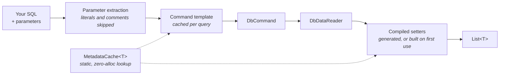

# Jaunty

<p align="center">
  <picture>
    <source media="(prefers-color-scheme: dark)" srcset="docs/_assets/logo/jaunty-mark-dark.svg">
    
  </picture>
</p>

**The micro-ORM that respects your SQL and your time.**

[](https://github.com/extrode/jaunty/actions/workflows/ci.yml)
[](LICENSE.md)
[](#installation)
[](#nativeaot)
[](#installation)

> [!IMPORTANT]
> **Free to use, including in commercial production** — no seat count, no order form, no expiry.
> Source-available under [ISL-R](LICENSE.md), which is **not** an OSI-approved open-source licence:
> you may use and read the source, but not modify or redistribute it as a library. Shipping the
> unmodified packages inside your own application is covered by the
> [Redistribution Exception](LICENSE-DISTRIBUTION-EXCEPTION.md), royalty-free and non-expiring.
> What is sold is [support](docs/06-releases/pricing.md), never the right to use the software.

Jaunty is a high-performance data access library for .NET that does one thing exceptionally well: execute your SQL and map results to objects. No LINQ translation, no hidden query rewriting, no magic — the SQL that runs is the SQL you wrote.

When you do want a builder, `Extrode.Jaunty.Fluent` is a separate, optional package that generates parameterized SQL from typed expressions. The core never depends on it.

```csharp
var products = connection.Query<Product>(
    "SELECT * FROM products WHERE category_id = @CategoryId",
    new { CategoryId = 1 });
```

---

## Why Jaunty Exists

Most micro-ORMs let you write SQL and get objects back. Jaunty does this too—but with deliberate design choices that catch bugs earlier and run faster.

**The core philosophy:**
- **Performant** — Compiled expression trees, not runtime reflection
- **Efficient** — Minimal allocations, cached metadata, and no package dependencies at all on `net8.0`/`net10.0`
- **AOT-ready** — Publishes under NativeAOT with no trim or AOT warnings from any Jaunty assembly
- **Elegant** — Clean API that reads like intent, not ceremony

### Strict by Default

When you call `Query<T>`, Jaunty requires that the entity and the result set agree: every property must have a matching column. Under the reflection mapper the check runs **in both directions**, so an extra column throws too. This is intentional. ([Which mapper enforces which direction](docs/01-api-reference/query-partial-methods.md#which-mapper-enforces-which-direction))

```csharp
public class Product
{
    public int Id { get; set; }
    public string Name { get; set; }
    public decimal Price { get; set; }
}

// This throws immediately - missing 'Price' column
var products = connection.Query<Product>(
    "SELECT id, name FROM products");
// InvalidOperationException: "Strict mapping failed: property 'Price' has no matching column"
```

> [!WARNING]
> Silent partial mapping is a bug waiting to happen. If you wanted all three properties, you should
> know immediately that your query is wrong. If you want partial data, say so with `QueryPartial<T>`.

This catches mismatches at development time, not when a customer reports weird behavior in production.

---

## What Jaunty Does That Others Don't

Comparison is against Dapper, the micro-ORM most people are choosing between Jaunty and.

| Capability | Dapper | Jaunty |
|---|---|---|
| **Strict-by-default mapping** — a missing column throws immediately | silent partial map | yes; `QueryPartial<T>` opts out per call |
| Zero runtime dependencies on `net8.0`/`net10.0` | yes | yes |
| NativeAOT via source generator | separate package (Dapper.AOT) | in the box, verified in CI on every build |
| Fluent query builder | no | `Extrode.Jaunty.Fluent`, optional |
| Bulk copy | paid add-on (Dapper Plus) | three providers, included |
| Scaffolding CLI | no | `Extrode.Jaunty.Scaffolding.Cli` |
| DuckDB and flat-file sources | no | `Extrode.Jaunty.FlatFiles.DuckDB` |
| Dialect-aware SQL generation | no | SQL Server, PostgreSQL, MySQL, SQLite |
| Built-in audit trail | no | `AuditInterceptor` — every command, phase, duration and failure, with no parameter values captured |

**Strict-by-default mapping is the one to weigh first.** It is not a performance claim, so it holds
whichever library benchmarks faster on a given path: a query that stops matching your entity fails
at the call site rather than silently handing back a half-populated object. Every other row in the
table is something you could assemble from packages; that row is a different default.

> [!NOTE]
> **`QueryPartial<T>` is not a workaround.** Strict mapping is the default because entities and
> per-query DTOs should match their result set exactly, but projections legitimately do not — and
> for those, `QueryPartial<T>` is the right method, not a concession.

[The two mapping modes](#the-two-mapping-modes) covers the distinction, and [migrating to
Jaunty](docs/08-learn/migrating/README.md) covers how to port an existing lenient codebase without
fighting it.

## When to Use Jaunty — and When Not To

**Reach for Jaunty when:**

- You are publishing under **NativeAOT** or trimming aggressively, and want mapping generated at
  build time with no reflection in the core.
- **Dependency count matters** — a plugin, a library, a container you are keeping small. On
  `net8.0` and `net10.0` the dependency groups in the shipped `.nuspec` are empty.
- You want **SQL you can read in the source and find in the query log**, unchanged.
- A **wrong result matters more than a fast one**: strict mapping turns a silent data bug into an
  exception during development.
- You need **bulk copy, scaffolding, or DuckDB and flat-file querying** without assembling three
  more vendors.
- You target **`net472` or `netstandard2.0`** alongside modern .NET from one codebase.

**Do not reach for Jaunty when:**

- You want **change tracking, a unit of work, lazy loading, or migrations**. That is EF Core's job
  and Jaunty does not try to do it. Using both together is a reasonable architecture.
- You want to **write LINQ and have a database translate it**. Jaunty executes SQL; the Fluent
  package builds SQL from expressions but is not a LINQ provider.
- **Team familiarity is the binding constraint.** Dapper is the thing your next hire already knows,
  and that is a real cost worth pricing honestly.
- You need a **database Jaunty has no dialect for**. Four are supported; anything else means core
  execution works through ADO.NET but dialect-aware generation does not.
- You want an **OSI-approved licence**. Jaunty is source-available under ISL-R, not open source —
  see [License](#license) before adopting it.

## Jaunty or JauntyQ?

**Jaunty starts from C#. [JauntyQ](https://github.com/extrode/jauntyq) starts from SQL.** They are two
products, not two modes of one product, and the split is a question about you rather than about your
database.

Jaunty is the traditional ORM of the pair. You solve the problem in the language you are already
writing: typed expressions through the optional `Extrode.Jaunty.Fluent` builder, attribute-mapped
entities, `Insert`/`Update`/`Delete` against a POCO, and a raw SQL string on the occasions where SQL
is the clearer tool. What Jaunty takes off your hands is the part you should not have to think
about. Values are parameterized by construction, so SQL injection is not a thing you defend against
per query. Results map strictly, so `Query<T>` throws when an entity property has no matching column
instead of handing you a half-populated object. Fluent is expression-first, not a LINQ provider: it
builds SQL from typed expressions and does not translate arbitrary `IQueryable`.

JauntyQ is for the developer whose position is: *I know SQL, I know what I want to run, validate it
and otherwise stay out of my way.* It takes that seriously. Every query is a real `.sql` file you
wrote, versioned next to the code; the generator validates it at build time against a committed
schema snapshot and emits ADO.NET that reads by ordinal with explicit `DbType` binding, no
reflection and no runtime SQL parsing. Neither product will silently map the wrong thing. They just
catch it at different moments: JauntyQ at build time against a snapshot, Jaunty at the call site
against the live result set.

> [!NOTE]
> If that second description is you, read on at
> [github.com/extrode/jauntyq](https://github.com/extrode/jauntyq) — you will be better served there,
> and its README covers the SQL-in/C#-out direction in the same detail this one covers Jaunty's.

### C# in, SQL out

Every listing below is real output, not an illustration. The core API needs no query at all: the
entity carries the mapping, and the source generator emits the SQL at build time.

```csharp
using Jaunty;

var all      = connection.GetAll<Product>();
var one      = connection.Get<Product>(1);
long newId   = connection.Insert(product);
int updated  = connection.Update(product);
int deleted  = connection.Delete(product);
```

What those five calls send to the database:

```sql
SELECT product_id, product_name, category_id, unit_price, units_in_stock, discontinued FROM products
SELECT product_id, product_name, category_id, unit_price, units_in_stock, discontinued FROM products WHERE product_id = @product_id
INSERT INTO products (product_name, category_id, unit_price, units_in_stock, discontinued) VALUES (@product_name, @category_id, @unit_price, @units_in_stock, @discontinued); SELECT last_insert_rowid();
UPDATE products SET product_name = @product_name, category_id = @category_id, unit_price = @unit_price, units_in_stock = @units_in_stock, discontinued = @discontinued WHERE product_id = @product_id
DELETE FROM products WHERE product_id = @product_id
```

> [!NOTE]
> No `SELECT *` anywhere, so a column added to the table tomorrow cannot silently change the shape
> of your result.

The identity fetch is dialect-specific: `last_insert_rowid()` on
SQLite, `CAST(SCOPE_IDENTITY() AS BIGINT)` on SQL Server, `RETURNING` on PostgreSQL,
`LAST_INSERT_ID()` on MySQL. Every value is a parameter, so SQL injection is not a thing you defend
against per query.

For anything past CRUD, the Fluent builder takes typed expressions:

```csharp
using Jaunty.Fluent;

var rows = connection.From<Product>()
    .InnerJoin<Category>()
    .On(p => p.CategoryId, c => c.CategoryId)
    .Where((p, c) => p.CategoryId == 1)
    .SelectBoth();                       // List<(Product From, Category Joined)>

foreach (var (product, category) in rows)
    Console.WriteLine($"{product.ProductName} ({category.CategoryName})");
```

and produces:

```sql
SELECT p.product_id, p.product_name, p.category_id, p.unit_price, p.units_in_stock, p.discontinued,
       c.category_id, c.category_name, c.description
FROM products p
INNER JOIN categories c ON p.category_id = c.category_id
WHERE (p.category_id = @p_category_id)
```

**`p` and `c` are the names you wrote.** A lambda parameter survives into the expression tree as
data, so the builder aliases each table after the identifier already standing for it in your code.
Nothing is renamed and nothing is numbered: `@p_category_id` is a parameter you can grep for, and
the two `category_id` columns are left to collide by name because `SelectBoth()` reads each entity
from its own ordinals, not by column name.

> [!TIP]
> `ToSql()` returns that string without executing anything, so the SQL is reviewable in a test.

Aliases are inferred per join and only when every name a join needs is usable. A name that is a SQL
keyword, is already taken, or matches a table in the query is declined, and that join keeps the
fully qualified form. An explicit `From<Product>("prd")` always wins.

An alias retires the table name — SQL's rule, not Jaunty's — so a string condition written after one
has to use it. `Where("p.unit_price > 20")` runs; `Where("products.unit_price > 20")` is rejected by
the database, naming the token to change. A subquery inside the string is its own scope and may name
the table freely, and a query that uses no lambda `On` aliases nothing, so `products.` keeps working
there. [Error Messages, Explained](docs/08-learn/error-messages.md) has the failure and its fixes.

The same rule reaches the parameters a `HAVING` clause binds. An operand is named after the
aggregate it is compared to, read off the expression tree rather than the rendered SQL:

```csharp
var sql = connection.From<Product>()
    .InnerJoin<Category>()
    .On((p, c) => p.CategoryId == c.CategoryId)
    .GroupBy((p, c) => p.CategoryId)
    .Having(g => g.Sum((p, c) => p.UnitPrice) > 150m)
    .ToSql(g => new { g.Key, Count = g.Count() });
```

```sql
SELECT p.category_id AS "Key", COUNT(*) AS Count
FROM products p
INNER JOIN categories c ON (p.category_id = c.category_id)
GROUP BY p.category_id
HAVING SUM(p.unit_price) > @sum_p_unit_price
```

`g.Count() > 3` binds `@count`, and so does `3 < g.Count()` — the side that is an aggregate names
the side that is a value, whichever way round you wrote it. A number is spent only where one query
compares the same aggregate twice, which gives `@count_2`.

Raw SQL is a first-class option here, not an escape hatch. This one selects three columns rather
than a whole `Product`, so it is a projection and `QueryPartial<T>` is the right method — `Query<T>`
would throw on the properties with no matching column:

```csharp
var products = connection.QueryPartial<Product>(
    "SELECT product_id, product_name, unit_price FROM products WHERE category_id = @CategoryId",
    new { CategoryId = 1 });
```

## Installation

```bash
dotnet add package Extrode.Jaunty
```

Targets `netstandard2.0`, `net8.0` and `net10.0`. Works with any ADO.NET provider.

**On `net8.0` and `net10.0`, `Extrode.Jaunty` has no dependencies at all** — the dependency groups
in the shipped `.nuspec` are empty.

`netstandard2.0` is there for consumers who cannot move off an older framework, and it is the one
target that carries package references:

| Package | What it backports | In-box since |
|---|---|---|
| `Microsoft.Bcl.AsyncInterfaces` | `IAsyncEnumerable<T>`, `IAsyncDisposable` | .NET Core 3.0 |
| `System.Diagnostics.DiagnosticSource` | `DiagnosticSource`, `DiagnosticListener`, `Activity` | .NET Core 3.0 |

Both are Microsoft-published backports of types that are built into modern .NET, not third-party
libraries. `Microsoft.Bcl.AsyncInterfaces` is what keeps the async streaming API the same shape on
that target instead of absent from it.

`ILogger` and dependency-injection integration are a separate opt-in package,
`Extrode.Jaunty.Extensions.Logging`, which is why core needs neither. Every dependency of every
package is listed in [`docs/02-architecture/dependencies.md`](docs/02-architecture/dependencies.md).

---

## Quick Start

```csharp
using Jaunty;

// Strict mapping - all properties must have matching columns
var products = connection.Query<Product>(
    "SELECT id AS Id, name AS Name, price AS Price FROM products");

// Partial mapping - only map what exists
var summaries = connection.QueryPartial<ProductSummary>(
    "SELECT id AS Id, name AS Name FROM products");

// Scalar values
var count = connection.QueryScalar<long>("SELECT COUNT(*) FROM products");

// Parameters - named or positional
var filtered = connection.Query<Product>(sql, new { CategoryId = 1 });
var filtered = connection.Query<Product>(sql, 1);  // positional
var filtered = connection.Query<Product>(sql, 1, "active", 50.00m);  // multiple

// Async with cancellation
var products = await connection.QueryAsync<Product>(sql, cancellationToken);

// Insert, Update, Delete
var id = connection.Insert(product);        // Returns identity value
var rows = connection.Update(product);      // Returns rows affected
var rows = connection.Delete(product);      // Returns rows affected

// Bulk operations
var rows = connection.BulkInsert(products);   // Fast bulk insert
var rows = connection.BulkUpdate(products);   // Fast bulk update
var rows = connection.BulkDelete(products);   // Fast bulk delete

// Native bulk copy path engages automatically for 100+ rows
// Automatically enabled when Jaunty.Extensions.Reflection is loaded
JauntyReflectionExtensions.UseNativeBulkCopy();
var rows = connection.BulkInsert(largeProductList);  // Uses SqlBulkCopy, NpgsqlBinaryImporter, etc.

// Upsert (insert or update)
var rows = connection.Upsert(product);  // Inserts if new, updates if exists
```

---

## The Two Mapping Modes

### `Query<T>` — Strict Mode

The entity and the result set must agree. A property with no matching column throws on every
path; a column with no matching property throws only under the reflection mapper.

| Condition | Reflection mapper | Source-generated mapper |
|---|---|---|
| Property has no column | `InvalidOperationException` — `Strict mapping failed: property 'Total' has no matching column in result set for type 'Order'.` | whatever the provider's `GetOrdinal` throws for an unknown name (`ArgumentOutOfRangeException` on SQLite, `IndexOutOfRangeException` on SqlClient) |
| Column has no property | `InvalidOperationException` — `Mapping failed: Column 'shipped_on' does not map to any property of type 'Order'.` | **Ignored** — the generated `OrdinalMap` resolves the properties it knows and never enumerates the result columns |

Which one runs is decided by `DrDispatcher`, which prefers the generated mapper in strict mode.
[The full precedence order](docs/01-api-reference/query-partial-methods.md#which-mapper-enforces-which-direction).

```csharp
public class Order
{
    public int OrderId { get; set; }
    public DateTime OrderDate { get; set; }
    public decimal Total { get; set; }
}

// All 3 columns required
var orders = connection.Query<Order>(
    "SELECT order_id AS OrderId, order_date AS OrderDate, total AS Total FROM orders");

// Missing 'Total' - throws InvalidOperationException
var orders = connection.Query<Order>(
    "SELECT order_id AS OrderId, order_date AS OrderDate FROM orders");

// Extra 'shipped_on' - throws under the reflection mapper; ignored by the generated one
var orders = connection.Query<Order>(
    "SELECT order_id AS OrderId, order_date AS OrderDate, total AS Total, shipped_on FROM orders");
```

The checks run once per distinct result-set shape, not once per row.

**Use strict mode when:** You expect complete entities. This is the default because it's the safer choice.

### `QueryPartial<T>` — Partial Mode

Map only the columns that exist. Unmatched properties keep their default values.

```csharp
public class OrderSummary
{
    public int OrderId { get; set; }
    public DateTime OrderDate { get; set; }
}

// Only selecting what we need
var summaries = connection.QueryPartial<OrderSummary>(
    "SELECT order_id AS OrderId, order_date AS OrderDate FROM orders");

// Extra columns in result? Ignored silently.
var summaries = connection.QueryPartial<OrderSummary>(
    "SELECT order_id AS OrderId, order_date AS OrderDate, total, customer_id FROM orders");
```

**Use partial mode when:** You're intentionally selecting a subset of columns, using DTOs, or working with projections.

---

## Complete API Reference

<details open>
<summary><b>Query methods (read operations)</b></summary>

| Method | Returns | Mapping | Description |
|--------|---------|---------|-------------|
| `Query<T>()` | `List<T>` | Strict | Every property needs a column; under reflection every column needs a property too |
| `QueryPartial<T>()` | `List<T>` | Partial | Map only matching columns |
| `QueryFirst<T>()` | `T` | Strict | First row, throws if empty |
| `QueryFirstOrDefault<T>()` | `T?` | Strict | First row, null if empty |
| `QuerySingle<T>()` | `T` | Strict | Exactly one row, throws otherwise |
| `QuerySingleOrDefault<T>()` | `T?` | Strict | Single or null |
| `QueryScalar<T>()` | `T` | — | First column of first row |
| `QueryStream<T>()` | `IEnumerable<T>` | Strict | Streaming results |
| `QueryPartialStream<T>()` | `IEnumerable<T>` | Partial | Streaming partial results |
| `QueryMultiple()` | `GridReader` | — | Multiple result sets |

All methods have async counterparts (`QueryAsync<T>()`, etc.) with `CancellationToken` support.

</details>

<details open>
<summary><b>Write operations</b></summary>

| Method | Returns | Description |
|--------|---------|-------------|
| `Insert<T>()` | `long` | Insert entity, returns identity value |
| `Update<T>()` | `int` | Update entity by primary key |
| `Delete<T>()` | `int` | Delete entity by primary key |
| `Delete<T>(id)` | `int` | Delete by ID value |
| `BulkInsert<T>()` | `int` | Bulk insert multiple entities |
| `BulkUpdate<T>()` | `int` | Bulk update multiple entities |
| `BulkDelete<T>()` | `int` | Bulk delete multiple entities |
| `Upsert<T>()` | `int` | Insert or update by primary key |

All write methods have async counterparts.

</details>

### Stored Procedures

Stored procedures take `SpParameters`, not an anonymous object. Direction has to be stated —
that is the whole reason for the separate type — so there is no shorthand that guesses it.

```csharp
// Rows back
var results = connection.ExecuteStoredProcedure<Product>("GetProductsByCategory",
    new SpParameters().AddInput("CategoryId", 1));

// Output parameters, no result set
var parameters = new SpParameters()
    .AddInput("CategoryId", 1)
    .AddOutput("TotalCount", DbType.Int32);

connection.ExecuteStoredProcedureNonQuery("GetProductCount", parameters);
int? count = parameters.Get<int>("TotalCount");   // Get<T> returns T?
```

The full set: `ExecuteStoredProcedure<T>` (a `List<T>`), `ExecuteStoredProcedureFirst<T>`,
`ExecuteStoredProcedureFirstOrDefault<T>`, `ExecuteStoredProcedureScalar<T>` and
`ExecuteStoredProcedureNonQuery` (the affected-row count). Each has an `Async` counterpart taking
a `CancellationToken`. `SpParameters` also carries `AddInputOutput` and `AddReturnValue`.

---

## Parameter Binding

### Named Parameters

```csharp
var orders = connection.Query<Order>(
    "SELECT * FROM orders WHERE customer_id = @CustomerId AND status = @Status",
    new { CustomerId = "ALFKI", Status = "shipped" });
```

### Positional Parameters

Jaunty parses your SQL to extract parameter names, then binds values in order.

```csharp
// Single value
var order = connection.Query<Order>(
    "SELECT * FROM orders WHERE order_id = @Id",
    42);

// Multiple values
var orders = connection.Query<Order>(
    "SELECT * FROM orders WHERE customer_id = @Customer AND total > @MinTotal",
    "ALFKI", 100.00m);

// Array
var orders = connection.Query<Order>(sql, new object[] { "ALFKI", 100.00m });
```

### Duplicate Parameters

Same parameter used multiple times? Provide one value.

```csharp
// @Id appears twice, but we only pass it once
var results = connection.Query<Product>(
    "SELECT * FROM products WHERE category_id = @Id OR supplier_id = @Id",
    7);
```

### Parameter Count Validation

Jaunty validates immediately. No waiting for the database to complain.

```csharp
// SQL has 2 unique parameters, but we passed 3 values
connection.Query<Product>(sql, 1, 2, 3);
// ArgumentException: "Parameter count mismatch: SQL contains 2 unique parameter(s), but 3 value(s) provided."
```

---

## Transactions and Timeouts

Use `CommandOptions` to pass transaction or timeout settings. No overload confusion.

```csharp
using var transaction = connection.BeginTransaction();

// With transaction
var orders = connection.Query<Order>(sql, parameters,
    CommandOptions.WithTransaction(transaction));

// With timeout
var orders = connection.Query<Order>(sql, parameters,
    CommandOptions.WithTimeout(30));

// Both
var orders = connection.Query<Order>(sql, parameters,
    CommandOptions.With(transaction, timeoutSeconds: 30));

transaction.Commit();
```

### Bulk Operations with Transaction

```csharp
using var transaction = connection.BeginTransaction();

try
{
    connection.BulkInsert(products, CommandOptions.WithTransaction(transaction));
    connection.BulkInsert(orders, CommandOptions.WithTransaction(transaction));
    transaction.Commit();
}
catch
{
    transaction.Rollback();
    throw;
}
```

---

## Attribute Mapping

Override table and column names per-entity.

```csharp
using Jaunty.Attributes;

[Table("order_items")]
public class OrderItem
{
    [Column("item_id")]
    public int Id { get; set; }

    [Column("product_name")]
    public string Name { get; set; }

    [Column("unit_price")]
    public decimal Price { get; set; }

    [Ignore]  // Not mapped from database
    public decimal CalculatedDiscount { get; set; }
    
    [Key]  // Primary key
    public int OrderId { get; set; }
    
    [DatabaseGenerated(DatabaseGeneratedOption.Identity)]
    public int Id { get; set; }
}

// SQL uses database column names
var items = connection.QueryPartial<OrderItem>(
    "SELECT item_id, product_name, unit_price FROM order_items");
```

**Priority order:** `[Column]` attribute > `JauntyConfig.ColumnNameResolver` > Property name

---

## Logging and Diagnostics

Jaunty provides built-in command interception for logging, auditing, and custom diagnostics.

### LoggingInterceptor

Log SQL execution with configurable log levels, slow query detection, and parameter masking.

> Ships in the optional `Extrode.Jaunty.Extensions.Logging` package, which is what keeps the
> `ILogger` and dependency-injection references out of core:
> `dotnet add package Extrode.Jaunty.Extensions.Logging`
>
> To keep core dependency-free, implement `ICommandInterceptor` against your own logger, or consume
> the built-in `DiagnosticSource` events. See
> [`docs/02-architecture/dependencies.md`](docs/02-architecture/dependencies.md).

```csharp
using Microsoft.Extensions.Logging;
using Jaunty.Interceptors;
using Jaunty.Configuration;

// Create logger factory
var loggerFactory = LoggerFactory.Create(builder => builder.AddConsole());

// Configure logging
var loggingConfig = new LoggingConfiguration
{
    MinimumLogLevel = LogLevel.Information,
    SlowQueryThreshold = TimeSpan.FromSeconds(1),
    LogSql = true,
    LogParameters = true,
    SensitiveParameterNames = new HashSet<string> { "Password", "SSN", "CreditCard" }
};

// Create interceptor
var loggingInterceptor = new LoggingInterceptor(
    loggerFactory.CreateLogger<LoggingInterceptor>(),
    loggingConfig);

// Register with Jaunty
JauntyConfig.InterceptorPipeline = new InterceptorPipeline(new[] { loggingInterceptor });
```

**Configuration Options**:
- `MinimumLogLevel` - Minimum log level (default: `LogLevel.Information`)
- `SlowQueryThreshold` - Threshold for slow query warnings (default: `TimeSpan.Zero` = disabled)
- `LogSql` - Whether to log SQL command text (default: `true`)
- `LogParameters` - Whether to log parameter values (default: `true`)
- `SensitiveParameterNames` - Parameter names to mask in logs (default: empty)

### AuditInterceptor

Track command execution for compliance and troubleshooting without logging sensitive data.

```csharp
using Jaunty.Diagnostics;

var auditInterceptor = new AuditInterceptor(maxRecords: 1000);
JauntyConfig.InterceptorPipeline = new InterceptorPipeline(new[] { auditInterceptor });

// Get recent audit records
var recentCommands = auditInterceptor.GetRecentRecords(50);
foreach (var record in recentCommands)
{
    Console.WriteLine($"{record.Timestamp}: {record.Phase} - {record.CommandText}");
}

// Clear audit log
auditInterceptor.Clear();
```

**AuditRecord Properties**:
- `Timestamp` - UTC timestamp
- `Phase` - Executing, Executed, or Failed
- `CommandText` - SQL command text
- `CommandType` - Text, StoredProcedure, or TableDirect
- `Database` - Database name
- `ElapsedMilliseconds` - Execution duration
- `Success` - Whether execution succeeded
- `ExceptionType` / `ExceptionMessage` - Exception details on failure

### DiagnosticSource Integration

Jaunty emits events via `DiagnosticSource` for integration with OpenTelemetry, Application Insights, and other telemetry systems.

```csharp
using System.Diagnostics;
using Jaunty.Diagnostics;

// Subscribe to Jaunty events
var listener = new DiagnosticListener("Jaunty");
using var subscription = listener.Subscribe(new DiagnosticObserver());

// Or use the singleton instance
JauntyDiagnosticListener.Instance.Subscribe(new DiagnosticObserver());
```

**Event Names**:
- `Jaunty.Database.Command.Executing` - Before command execution
- `Jaunty.Database.Command.Executed` - After successful execution
- `Jaunty.Database.Command.Failed` - When execution fails

**Example Observer**:
```csharp
public class DiagnosticObserver : IObserver<KeyValuePair<string, object?>>
{
    public void OnNext(KeyValuePair<string, object?> evt)
    {
        switch (evt.Key)
        {
            case JauntyDiagnosticListener.CommandExecutingEventName:
                var executing = (CommandExecutingPayload)evt.Value!;
                Console.WriteLine($"Executing: {executing.CommandText}");
                break;

            case JauntyDiagnosticListener.CommandExecutedEventName:
                var executed = (CommandExecutedPayload)evt.Value!;
                Console.WriteLine($"Completed in {executed.ElapsedMilliseconds:F2}ms");
                break;

            case JauntyDiagnosticListener.CommandFailedEventName:
                var failed = (CommandFailedPayload)evt.Value!;
                Console.WriteLine($"Failed: {failed.ExceptionMessage}");
                break;
        }
    }

    public void OnError(Exception error) { }
    public void OnCompleted() { }
}
```

### Custom Interceptors

Implement `ICommandInterceptor` for custom cross-cutting concerns.

```csharp
using Jaunty.Interceptors;

public class TimingInterceptor : ICommandInterceptor
{
    public ValueTask OnCommandExecutingAsync(CommandContext context, CancellationToken ct)
    {
        // Record start time, add custom headers, etc.
        return new ValueTask();
    }

    public ValueTask OnCommandExecutedAsync(CommandContext context, CancellationToken ct)
    {
        Console.WriteLine($"Query took {context.Elapsed.TotalMilliseconds:F2}ms");
        return new ValueTask();
    }

    public ValueTask OnCommandFailedAsync(CommandContext context, Exception ex, CancellationToken ct)
    {
        Console.WriteLine($"Query failed: {ex.Message}");
        return new ValueTask();
    }
}
```

**Interceptor Lifecycle**:
1. `OnCommandExecutingAsync` - Called before command execution
2. `OnCommandExecutedAsync` - Called after successful execution
3. `OnCommandFailedAsync` - Called when execution fails

### Dependency Injection

Register interceptors with `IServiceCollection`. These extension methods ship in the optional
`Extrode.Jaunty.Extensions.Logging` package — **Jaunty core requires no DI container**, and
`JauntyConfig.AddInterceptor` registers an interceptor without one.

```csharp
using Jaunty;

var services = new ServiceCollection();

// Add logging
services.AddJauntyLogging(options =>
{
    options.MinimumLogLevel = LogLevel.Information;
    options.SlowQueryThreshold = TimeSpan.FromSeconds(1);
});

// Add custom interceptors
services.AddSingleton<TimingInterceptor>();
services.AddSingleton<ICommandInterceptor>(sp => sp.GetRequiredService<TimingInterceptor>());

// Apply interceptors after building the service provider
var serviceProvider = services.BuildServiceProvider();
serviceProvider.ApplyJauntyInterceptors();
```

---

## Global Configuration

Naming is resolved through three delegates on `JauntyConfig`. Each is nullable, and null means
"use the .NET name unchanged" — so a type with no resolver configured maps `ProductName` to a
`ProductName` column.

```csharp
using Jaunty.Configuration;

public static Func<Type, string>?   SchemaNameResolver   // type   -> schema
public static Func<Type, string>?   TableNameResolver    // type   -> table
public static Func<string, string>? ColumnNameResolver   // member -> column
```

**Jaunty ships no built-in convention helpers.** There is no snake-case or pluralisation function
to reach for; you supply the conversion, which is a few lines and keeps the core free of an
inflector nobody agrees with:

```csharp
JauntyConfig.TableNameResolver  = type => $"tbl_{type.Name.ToLowerInvariant()}";
JauntyConfig.ColumnNameResolver = name => $"col_{name.ToLowerInvariant()}";
```

**`SchemaNameResolver` is global and dialect-blind.** It sees the entity type and nothing else,
so `_ => "dbo"` emits `dbo.products` against PostgreSQL and SQLite too. Scope it by type, or
return `string.Empty` for the types that should stay unqualified — Jaunty emits a schema only
when one is named, and never substitutes an engine default of its own. Per-engine detail is in
[`docs/01-api-reference/schemas.md`](docs/01-api-reference/schemas.md).

```csharp
JauntyConfig.SchemaNameResolver = type =>
    type.Namespace?.EndsWith(".Archive", StringComparison.Ordinal) == true ? "archive" : string.Empty;
```

**Resolvers may be changed after queries have run.** Setting any of them bumps a configuration
generation, and metadata compiled under an older generation — including the per-reader setter
caches, which would otherwise map through setters built for the old column names — is retired and
rebuilt on next use. Startup is still the right place to configure them, for the obvious reason
that a mid-flight change throws away work; it is no longer a correctness requirement.

---

## Async Support

Every method has an async counterpart. `CancellationToken` is optional.

```csharp
// Query async
var products = await connection.QueryAsync<Product>(sql);
var products = await connection.QueryAsync<Product>(sql, cancellationToken);

// Write async
var id = await connection.InsertAsync(product);
var rows = await connection.BulkInsertAsync(products);
var rows = await connection.UpsertAsync(product);

// Streaming async
await foreach (var product in connection.QueryStreamAsync<Product>(sql, cancellationToken))
{
    Console.WriteLine($"{product.Id}: {product.Name}");
}

// Multiple result sets async
using var grid = await connection.QueryMultipleAsync(sql);
var products = grid.Read<Product>();
var categories = grid.Read<Category>();
```

---

## Multiple Result Sets

Execute multiple queries in a single round-trip.

```csharp
using var grid = connection.QueryMultiple(@"
    SELECT * FROM products WHERE category_id = @CategoryId;
    SELECT * FROM categories WHERE id = @CategoryId;
    SELECT COUNT(*) FROM products;
", new { CategoryId = 1 });

var products = grid.Read<Product>().ToList();
var category = grid.ReadFirst<Category>();
var totalProducts = grid.ReadScalar<int>();
```

---

## Streaming Large Result Sets

For large result sets, use streaming to avoid buffering everything in memory.

```csharp
// Synchronous streaming
foreach (var product in connection.QueryStream<Product>("SELECT * FROM products"))
{
    Process(product);
}

// Async streaming (.NET 8+)
await foreach (var product in connection.QueryStreamAsync<Product>("SELECT * FROM products"))
{
    await ProcessAsync(product);
}
```

---

## How It Works

### Connection Management

Jaunty respects your connection state:

- If the connection was **closed**, Jaunty opens it, executes, and closes it
- If the connection was **already open**, Jaunty leaves it open

No surprises. No leaked connections.

### Performance Architecture

Everything that can be decided once is decided once — at build time by the source generator, or on
first use of a type. What is left per query is parameter binding and the reader loop.



1. **Compiled Setters** — Property setters are compiled via expression trees when a type is first used. No reflection during query execution.

2. **Metadata Caching** — Column mappings are cached in static generic classes (`MetadataCache<T>`). Zero allocation per query for metadata lookup.

3. **Parameter Caching** — Named parameter property getters are compiled and cached per anonymous type.

4. **SQL Parsing** — Parameter extraction skips string literals, comments, and quoted identifiers. Cheap compared to network roundtrip.

5. **Command Template Caching** — SQL parameter templates cached per query type.

6. **Bulk Copy Optimization** — Native bulk copy APIs (SqlBulkCopy, NpgsqlBinaryImporter, chunked multi-row INSERT on MySQL/MariaDB) automatically used for 100+ rows via `Jaunty.Extensions.Reflection`. The gain depends on provider and batch size; measurement status is tracked in [BENCHMARKS-2026-07-04.md](docs/05-quality/reports/BENCHMARKS-2026-07-04.md).

### NativeAOT

Jaunty is built to publish under NativeAOT. `IsTrimmable` and `IsAotCompatible` are set for every
`net8.0`+ target, so the trim and AOT analyzers run on every build, and warnings are errors.

Verified 2026-08-29 by publishing the scaffolding CLI on both legs:

| Leg | Binary | Size |
|---|---|---|
| `net8.0` win-x64 (control) | produced, runs | 36.98 MB |
| `net10.0` win-x64 | produced, `--help` exits 0 | **34.63 MB** |

**No Jaunty assembly produces a trim or AOT warning.** That is accurate about build output and is
not by itself a proof of safety: a few sites are clean because of an `UnconditionalSuppressMessage`,
which is an assertion by the author rather than a proof by the tool. The warnings that do appear all come from
third-party ADO.NET drivers and BCL serialization assemblies pulled in by the CLI —
`Microsoft.Data.SqlClient`, `MySqlConnector`, `Microsoft.IdentityModel.Tokens`,
`System.Data.Common` — none of which are referenced by Jaunty core.

`scripts/Verify-NativeAOT.ps1` additionally checks that every reflection site in the shipped
assemblies carries a reviewed `AOT-SAFE` justification: **15 sites, all justified.**
[`docs/02-architecture/reflection-and-trimming.md`](docs/02-architecture/reflection-and-trimming.md)
lists every one of them with its reason and what, if anything, you have to do about it.

Two projects are deliberately excluded, because AOT does not apply to them:

- **`Jaunty.Extensions.Reflection`** — reflection is its stated purpose. Referencing it is how a
  consumer opts out of the AOT guarantee; the mapper ladder falls back to it only if you install it.
- **`Jaunty.SourceGenerator`** — a `netstandard2.0` Roslyn component that runs inside the compiler
  and is never published.

For AOT, prefer source-generated mappers (`IMapped`, emitted by the bundled generator) and register
interceptors directly via `JauntyConfig.AddInterceptor` rather than through a DI container.

### NULL Handling

- **Nullable types** (`int?`, `string`, etc.): NULL becomes `default`
- **Non-nullable value types**: NULL throws `InvalidOperationException`

```csharp
public class Product
{
    public int Id { get; set; }           // NULL throws
    public int? CategoryId { get; set; }  // NULL becomes null
    public string Name { get; set; }      // NULL becomes null
}
```

---

## Design Decisions

### Why strict mapping by default?

Silent partial mapping causes bugs that surface far from their origin. Strict mode fails fast with a clear message. If you want partial data, `QueryPartial<T>` makes that intent explicit.

### Why parse SQL for positional parameters?

The cost of scanning a SQL string for `@param` tokens is negligible compared to network latency and query execution. The benefit—natural syntax like `Query(sql, 1, 2, 3)`—is worth it.

### Why `CommandOptions` instead of overloads?

Overloads for every combination of transaction/timeout/parameters create ambiguity. `Query(sql, 1, 30)` could mean "parameter 1, timeout 30" or "parameters 1 and 30". `CommandOptions` eliminates confusion.

### Why cache metadata in static constructors?

Performance. Static generic classes initialize once per type and live for the application lifetime. Configuration should happen at startup before queries run—this is a feature, not a limitation.

### Why separate Bulk operations?

Bulk operations use optimized paths for batch inserts/updates/deletes. They're faster than individual operations when working with collections.

### Native Bulk Copy Performance

For large datasets (100+ rows), Jaunty automatically uses native bulk copy APIs when `Jaunty.Extensions.Reflection` is loaded:

| Database | Native API | Advantage vs transactional loop |
|----------|-----------|------------------|
| SQL Server | `SqlBulkCopy` | **3.5-36.6x (measured 2026-07-04)** |
| PostgreSQL | `NpgsqlBinaryImporter` (COPY) | **6.9-7.6x (measured 2026-07-04)** |
| MySQL/MariaDB | Chunked multi-row INSERT | **12.9-16.1x (measured 2026-07-04)** |
| SQLite | Prepared-loop INSERT (no bulk API exists) | parity with hand-coded ADO.NET (measured) |

All rows above are measured with the in-repo BulkCopyBenchmarks suite
against a hand-coded transactional-loop baseline (100 to 10,000 rows;
larger batches see the bigger gains). Measured read-path comparisons
(vs ADO.NET, Dapper, EF Core, RepoDb, linq2db) are published in
[BENCHMARKS-2026-07-04.md](docs/05-quality/reports/BENCHMARKS-2026-07-04.md):
Jaunty is the lowest-allocating of the compared ORMs and competitive with
Dapper on throughput.

**Configuration**:
```csharp
using Jaunty.Configuration;

// Enable/disable native bulk copy (default: true)
BulkCopyConfiguration.EnableNativeBulkCopy = true;

// Set minimum rows to trigger native bulk copy (default: 100)
BulkCopyConfiguration.MinimumRowsForNativeBulkCopy = 100;

// Configure batch size (default: 10000)
BulkCopyConfiguration.DefaultBatchSize = 10000;

// Set timeout in seconds (default: 30)
BulkCopyConfiguration.DefaultTimeout = 30;
```

**Note**: Native bulk UPDATE and DELETE are not available in most database providers. Jaunty uses optimized standard SQL within transactions for these operations.

---

## Comparison

| Feature | Jaunty | Dapper | EF Core |
|---------|--------|--------|---------|
| Raw SQL execution | Yes | Yes | Yes |
| Strict mapping mode | Yes | No | No |
| Partial mapping mode | Yes | Yes | Yes |
| Positional parameters | Yes | No | No |
| Zero dependencies | Yes | Yes | No |
| Connection state management | Yes | Yes | Yes |
| Bulk operations | Yes | No | Yes |
| Upsert support | Yes | No | Yes |
| Streaming (IAsyncEnumerable) | Yes | No | Yes |
| Multiple result sets | Yes | Yes | Limited |
| Stored procedures | Yes | Yes | Yes |
| LINQ translation | No | No | Yes |
| Change tracking | No | No | Yes |

> [!NOTE]
> **This compares what each library ships in the box.** A "No" means the package itself does not
> provide the feature, not that it cannot be done — several of these rows are covered for Dapper by
> add-on packages such as `Dapper.Contrib` or `Z.Dapper.Plus`, and for EF Core by
> `EFCore.BulkExtensions`. Pick on the whole picture, not this table: the
> [migration guides](docs/08-learn/migrating/README.md) are more honest about the trade-offs,
> including the ones that favour the other library.

---

## Documentation

For more detailed documentation, see:

- [`docs/08-learn/migrating/`](docs/08-learn/migrating/README.md) - Migrating from Dapper or EF Core, and the strict-mapping rule to read first
- [`docs/08-learn/error-messages.md`](docs/08-learn/error-messages.md) - Error messages explained: the query that produces each one, and the fix
- [`CONTRIBUTING.md`](CONTRIBUTING.md) - Contributing guide
- [`docs/03-development/api-design-guidelines.md`](docs/03-development/api-design-guidelines.md) - API design guidelines
- [`docs/03-development/code-review-checklist.md`](docs/03-development/code-review-checklist.md) - Code review checklist
- [`docs/02-architecture/ARCHITECTURE-DECISIONS.md`](docs/02-architecture/ARCHITECTURE-DECISIONS.md) - Architecture decision records

---

## License

**Jaunty is free to use, including in commercial production.** No seat count, no Order, no expiry. What is sold is support. Two documents apply:

- **The Islamic Software License - Restricted (ISL-R), Version 1.0** - see [LICENSE.md](LICENSE.md) - governs both the source in this repository and the published packages. Section 2 grants a worldwide, royalty-free right to use the software for any lawful purpose, including internal commercial use, and to read the source. It does not grant modification, redistribution as a library, or derivative works.
- **The Jaunty Redistribution Exception, Version 1.0** - see [LICENSE-DISTRIBUTION-EXCEPTION.md](LICENSE-DISTRIBUTION-EXCEPTION.md) - permits you to ship the unmodified packages inside your own application, container image, installer or hosted service. Without it, ISL-R's no-distribution clause would make deploying an application that references Jaunty impossible. It is royalty-free and does not expire.

> [!CAUTION]
> **The ethical restrictions in ISL-R Sections 4 and 5 are conditions of the grant, not of payment.**
> They bind a user who pays nothing as they bind one who pays, and they travel with the
> redistributed binaries.

This is not an open-source license. [LICENSE-EULA.md](LICENSE-EULA.md) is the instrument of the previous paid, Order-conditioned model; it is retained for the historical record and does not govern use under the free model.

Support pricing: [docs/06-releases/pricing.md](docs/06-releases/pricing.md).

---

Built by [Syed Beparey](https://github.com/sbeparey)
