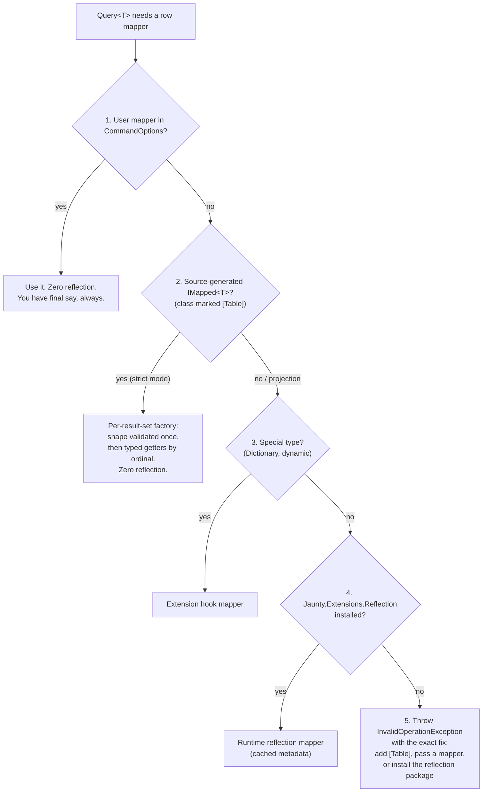
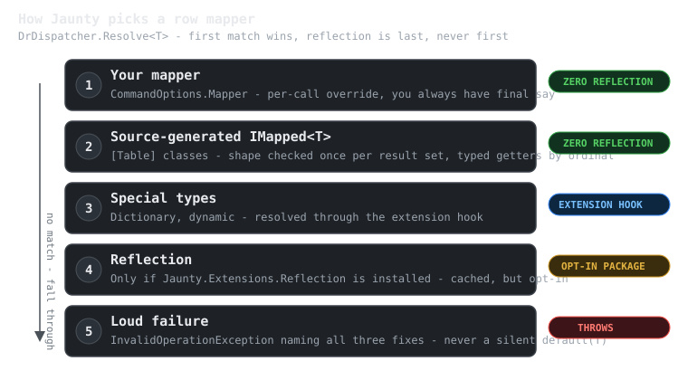
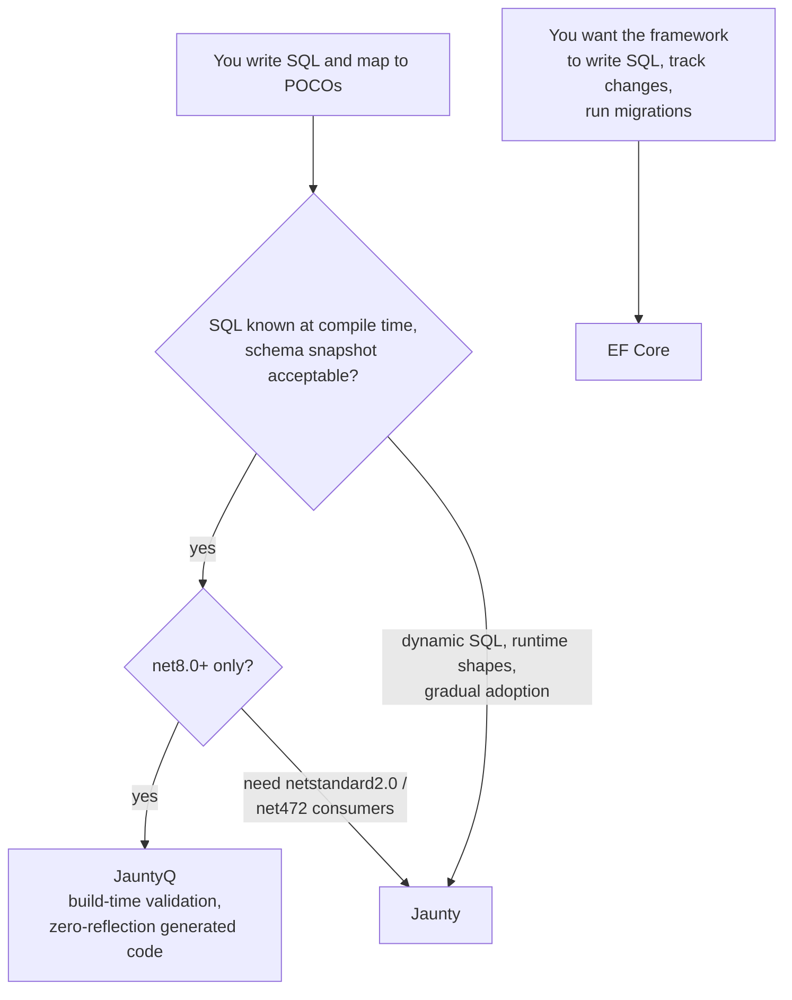

# Why Jaunty (and Why Not)

Jaunty is a micro-ORM for .NET: you write SQL, it gives you objects back, and it stays out of the way. That much it shares with Dapper. The difference is a set of deliberate design choices that catch bugs earlier and cost less at runtime. This page is the honest version of the pitch: what problems Jaunty solves, what it refuses to solve, and how to decide quickly whether it belongs in your stack.

## The problems Jaunty solves

**Silent mapping drift.** Most micro-ORMs map whatever columns happen to match and quietly default the rest. Rename a column and your `Order.Total` is `0` in production, not an error. Jaunty's `Query<T>` is strict by default: every public writable property must have a matching column, or you get an exception at the call site, in development, with the property named. When you genuinely want a projection, you say so with `QueryPartial<T>` - the loose behavior is opt-in, never the default.

**The reflection tax.** Jaunty resolves row mappers through a fixed ladder, and reflection is the last rung, not the first. See the diagram below - this is the design decision most users never notice, and the reason Jaunty works under Native AOT where reflection-based mappers break.

**Allocation overhead.** Measured against Dapper, EF Core, RepoDb, and linq2db in the in-repo benchmark suite, Jaunty is the lowest-allocating of the compared ORMs and competitive with Dapper on throughput (see the [quality section](../05-quality/README.md) for the published benchmark reports - the claims here are measured, not aspirational; the full numbers live in `docs/05-quality/reports/BENCHMARKS-2026-07-04.md` in the repository).

**Slow bulk writes.** `Jaunty.Extensions.Reflection` routes 100+ row operations to native bulk APIs per provider: `SqlBulkCopy` on SQL Server, binary `COPY` on PostgreSQL, chunked multi-row `INSERT` on MySQL/MariaDB, and a prepared-statement loop on SQLite (where "clever" bulk paths measured slower than the simple one, so Jaunty does the simple one).

**Observability as an afterthought.** Interceptors (`LoggingInterceptor`, `AuditInterceptor`, or your own), slow-query thresholds, and `DiagnosticSource` integration are built in - you can see every SQL statement, timing, and parameter without wrapping the library.

## The mapper resolution ladder

When Jaunty needs to turn a `DbDataReader` row into your `T`, it tries five things in order. The first three involve zero reflection; the fourth exists only if you explicitly install it.

Three details worth knowing:

- **Your mapper always wins.** Step 1 means you can take over row materialization for any single call without configuring anything globally.
- **Generated mappers only serve strict mode.** A projection may omit columns the generated mapper assumes exist, so `QueryPartial<T>` deliberately skips step 2 rather than risk reading a column that is not there.
- **Failure is loud and specific.** If nothing can map your type, Jaunty throws with the three ways to fix it. No silent `default(T)`, ever.

## What Jaunty deliberately does not do

If you need these, Jaunty is the wrong tool, and that is by design:

- **No LINQ-to-SQL translation.** You write SQL. If you want the compiler to write SQL for you, use EF Core.
- **No change tracking, unit-of-work, or identity map.** Objects are plain data. You decide what to save and when.
- **No lazy loading.** Every query is explicit. N+1 problems are visible in your code, not hidden in a proxy.
- **No migrations engine.** Your schema lifecycle is your own (though the sibling product JauntyQ understands migration scripts at build time - see below).
- **Not open source.** Jaunty is a commercial product: binaries ship under the ISL-EULA (the license grant is tied to your order), and source access at higher tiers is governed by the ISL-R inspection license. See [pricing](../06-releases/pricing.md) - there is a 30-day full trial. If OSS licensing is a hard requirement, use Dapper - it is a fine library and this page will not pretend otherwise.

There is a feature-by-feature comparison with Dapper and EF Core in the repository README.

## Jaunty or JauntyQ?

Jaunty has a sibling: [JauntyQ](https://jauntyq.extrode.com) moves the entire ORM to compile time. Your SQL lives in `.sql` files, is validated against a committed schema snapshot during the build, and becomes generated C# with typed ordinal getters - a renamed column is a build error, not a production incident.

Rule of thumb: JauntyQ when your queries are known at build time and you can commit a schema snapshot; Jaunty when you need runtime flexibility, older TFMs, or a drop-in Dapper upgrade path. They share a philosophy - SQL is yours, mapping is strict, reflection is a last resort - so moving between them is a change of mechanics, not mindset.

## Next steps

- [Quick start](README.md) - install and first query in five minutes.
- [Learn by doing](../08-learn/README.md) - a guided tutorial and coding exercises.
- Design decisions - why strict mapping, why `CommandOptions`, why parsed positional parameters: see the "Design Decisions" section of the repository README.
