# Streaming Methods

## Overview

Streaming methods provide memory-efficient processing of large result sets by returning `IEnumerable<T>` or `IAsyncEnumerable<T>` instead of loading all results into memory at once. These methods are ideal for processing large datasets without consuming excessive memory.

### How a streamed query differs from a buffered one

```mermaid
flowchart TD
    subgraph B["Query&lt;T&gt; / GetAll&lt;T&gt;: buffered"]
        B1["Open the connection<br/>if it was closed"] --> B2["Interceptor pipeline<br/>wraps the execution"]
        B2 --> B3["Read every row into<br/>a List&lt;T&gt;"]
        B3 --> B4["Close the connection<br/>if Jaunty opened it"]
        B4 --> B5["Return the list.<br/>Every row is in memory."]
    end

    subgraph S["QueryStream&lt;T&gt; / QueryStreamAsync&lt;T&gt;: streamed"]
        S1["Nothing happens until<br/>you start enumerating"] --> S2["Open the connection<br/>if it was closed"]
        S2 --> S3["No interceptor pipeline"]
        S3 --> S4["Yield one row,<br/>then wait for you"]
        S4 --> S4
        S4 --> S5["Close the connection<br/>when you stop enumerating"]
    end

    class B3 warn
    class B5 info
    class S3 bad
    class S4 ok

    classDef ok fill:#1f6f4a,stroke:#2ea36a,color:#eaf6ef
    classDef bad fill:#7a1f2e,stroke:#c2405a,color:#fdeaee
    classDef info fill:#1f4f7a,stroke:#3a86c8,color:#e8f2fb
    classDef warn fill:#7a4a1f,stroke:#c07c34,color:#fdf1e3
```



Three consequences follow from the shape, and each of them is a thing to plan around rather than
a defect:

| | buffered | streamed |
|---|---|---|
| when the query runs | at the call | at the first `MoveNext` |
| peak memory | the whole result set | one row |
| interceptors | run | **do not run** |
| connection held | for the length of the call | until you stop enumerating |

**Interceptors do not run on a streamed query.** This is intended. An interceptor wraps an
execution and reports on its result, and a lazy `IAsyncEnumerable` has no result to report until
every row has been read, so wrapping one would force the full materialization that streaming
exists to avoid. If you need logging or metrics on a streamed read, put them in the loop body.

**The connection stays open for as long as you enumerate.** A streamed query that you abandon
part way through releases its connection when the enumerator is disposed, which `foreach` and
`await foreach` do for you at the end of the block. Storing the enumerator and forgetting it holds
a connection open until the garbage collector reaches it.

**Do not stream into another query on the same connection.** Issuing a second command while a
reader is open on the same connection either throws or opens a second connection behind your
back, depending on the provider. Buffer the first result with `Query<T>` when the loop body needs
the connection.

## Synchronous Streaming Methods

### QueryStream&lt;T&gt;(string sql)

Executes a query and returns an enumerable sequence of entities using strict mapping mode. Results are processed lazily as they are enumerated.

**Signature:**
```csharp
public static IEnumerable<T> QueryStream<T>(this IDbConnection connection, string sql) where T : new()
```

**Parameters:**
- `connection`: The database connection
- `sql`: The SQL query to execute

**Returns:**
- `IEnumerable<T>`: A lazy enumerable of entities of type T

**Example:**
```csharp
foreach (var product in connection.QueryStream<Product>("SELECT * FROM products"))
{
    // Process each product individually
    ProcessProduct(product);
}
```

### QueryStream&lt;T&gt;(string sql, object parameters)

Executes a parameterized query and returns an enumerable sequence of entities using strict mapping mode.

**Signature:**
```csharp
public static IEnumerable<T> QueryStream<T>(this IDbConnection connection, string sql, object parameters) where T : new()
```

### QueryStream&lt;T&gt;(string sql, CommandOptions&lt;T&gt; options)

Executes a query with command options and returns an enumerable sequence of entities using strict mapping mode.

**Signature:**
```csharp
public static IEnumerable<T> QueryStream<T>(this IDbConnection connection, string sql, CommandOptions<T> options) where T : new()
```

### QueryStream&lt;T&gt;(string sql, object parameters, CommandOptions&lt;T&gt; options)

Executes a parameterized query with command options and returns an enumerable sequence of entities using strict mapping mode.

**Signature:**
```csharp
public static IEnumerable<T> QueryStream<T>(this IDbConnection connection, string sql, object parameters, CommandOptions<T> options) where T : new()
```

## Asynchronous Streaming Methods

### QueryStreamAsync&lt;T&gt;(string sql, CancellationToken cancellationToken = default)

Asynchronously executes a query and returns an async enumerable sequence of entities using strict mapping mode.

**Signature:**
```csharp
public static IAsyncEnumerable<T> QueryStreamAsync<T>(this IDbConnection connection, string sql, CancellationToken cancellationToken = default) where T : new()
```

**Parameters:**
- `connection`: The database connection
- `sql`: The SQL query to execute
- `cancellationToken`: Cancellation token for the operation

**Returns:**
- `IAsyncEnumerable<T>`: An async enumerable of entities of type T

**Example:**
```csharp
await foreach (var product in connection.QueryStreamAsync<Product>("SELECT * FROM products"))
{
    // Process each product individually
    await ProcessProductAsync(product);
}
```

### QueryStreamAsync&lt;T&gt;(string sql, object parameters, CancellationToken cancellationToken = default)

Asynchronously executes a parameterized query and returns an async enumerable sequence of entities using strict mapping mode.

**Signature:**
```csharp
public static IAsyncEnumerable<T> QueryStreamAsync<T>(this IDbConnection connection, string sql, object parameters, CancellationToken cancellationToken = default) where T : new()
```

### QueryStreamAsync&lt;T&gt;(string sql, CommandOptions&lt;T&gt; options, CancellationToken cancellationToken = default)

Asynchronously executes a query with command options and returns an async enumerable sequence of entities using strict mapping mode.

**Signature:**
```csharp
public static IAsyncEnumerable<T> QueryStreamAsync<T>(this IDbConnection connection, string sql, CommandOptions<T> options, CancellationToken cancellationToken = default) where T : new()
```

### QueryStreamAsync&lt;T&gt;(string sql, object parameters, CommandOptions&lt;T&gt; options, CancellationToken cancellationToken = default)

Asynchronously executes a parameterized query with command options and returns an async enumerable sequence of entities using strict mapping mode.

**Signature:**
```csharp
public static IAsyncEnumerable<T> QueryStreamAsync<T>(this IDbConnection connection, string sql, object parameters, CommandOptions<T> options, CancellationToken cancellationToken = default) where T : new()
```

## Partial Mapping Streaming Methods

### QueryPartialStream&lt;T&gt;(string sql)

Executes a query and returns an enumerable sequence of entities using partial mapping mode.

**Signature:**
```csharp
public static IEnumerable<T> QueryPartialStream<T>(this IDbConnection connection, string sql) where T : new()
```

### QueryPartialStream&lt;T&gt;(string sql, object parameters)

Executes a parameterized query and returns an enumerable sequence of entities using partial mapping mode.

**Signature:**
```csharp
public static IEnumerable<T> QueryPartialStream<T>(this IDbConnection connection, string sql, object parameters) where T : new()
```

### QueryPartialStream&lt;T&gt;(string sql, CommandOptions&lt;T&gt; options)

Executes a query with command options and returns an enumerable sequence of entities using partial mapping mode.

**Signature:**
```csharp
public static IEnumerable<T> QueryPartialStream<T>(this IDbConnection connection, string sql, CommandOptions<T> options) where T : new()
```

### QueryPartialStream&lt;T&gt;(string sql, object parameters, CommandOptions&lt;T&gt; options)

Executes a parameterized query with command options and returns an enumerable sequence of entities using partial mapping mode.

**Signature:**
```csharp
public static IEnumerable<T> QueryPartialStream<T>(this IDbConnection connection, string sql, object parameters, CommandOptions<T> options) where T : new()
```

**Example:**
```csharp
// Only product_id and product_name are selected; partial mapping tolerates the missing columns
foreach (var product in connection.QueryPartialStream<Product>("SELECT product_id, product_name FROM products"))
{
    ProcessProduct(product);
}
```

## Async Partial Mapping Streaming Methods

### QueryPartialStreamAsync&lt;T&gt;(string sql, CancellationToken cancellationToken = default)

Asynchronously executes a query and returns an async enumerable sequence of entities using partial mapping mode.

**Signature:**
```csharp
public static IAsyncEnumerable<T> QueryPartialStreamAsync<T>(this IDbConnection connection, string sql, CancellationToken cancellationToken = default) where T : new()
```

### QueryPartialStreamAsync&lt;T&gt;(string sql, object parameters, CancellationToken cancellationToken = default)

Asynchronously executes a parameterized query and returns an async enumerable sequence of entities using partial mapping mode.

**Signature:**
```csharp
public static IAsyncEnumerable<T> QueryPartialStreamAsync<T>(this IDbConnection connection, string sql, object parameters, CancellationToken cancellationToken = default) where T : new()
```

### QueryPartialStreamAsync&lt;T&gt;(string sql, CommandOptions&lt;T&gt; options, CancellationToken cancellationToken = default)

Asynchronously executes a query with command options and returns an async enumerable sequence of entities using partial mapping mode.

**Signature:**
```csharp
public static IAsyncEnumerable<T> QueryPartialStreamAsync<T>(this IDbConnection connection, string sql, CommandOptions<T> options, CancellationToken cancellationToken = default) where T : new()
```

### QueryPartialStreamAsync&lt;T&gt;(string sql, object parameters, CommandOptions&lt;T&gt; options, CancellationToken cancellationToken = default)

Asynchronously executes a parameterized query with command options and returns an async enumerable sequence of entities using partial mapping mode.

**Signature:**
```csharp
public static IAsyncEnumerable<T> QueryPartialStreamAsync<T>(this IDbConnection connection, string sql, object parameters, CommandOptions<T> options, CancellationToken cancellationToken = default) where T : new()
```

**Example:**
```csharp
// Only product_id and product_name are selected; partial mapping tolerates the missing columns
await foreach (var product in connection.QueryPartialStreamAsync<Product>("SELECT product_id, product_name FROM products"))
{
    await ProcessProductAsync(product);
}
```

## Unbuffered Partial Mapping Streaming Methods

These overloads are functionally identical to the `QueryPartialStream` overloads above — results are streamed and not buffered in memory. They exist as an alias for callers who prefer the "unbuffered" naming to describe the streaming behavior.

### QueryPartialUnbuffered&lt;T&gt;(string sql)

Executes a query and streams the results as entities of type T using partial mapping mode (unbuffered).

**Signature:**
```csharp
public static IEnumerable<T> QueryPartialUnbuffered<T>(this IDbConnection connection, string sql) where T : new()
```

### QueryPartialUnbuffered&lt;T&gt;(string sql, object parameters)

Executes a parameterized query and streams the results as entities of type T using partial mapping mode (unbuffered).

**Signature:**
```csharp
public static IEnumerable<T> QueryPartialUnbuffered<T>(this IDbConnection connection, string sql, object parameters) where T : new()
```

### QueryPartialUnbuffered&lt;T&gt;(string sql, CommandOptions&lt;T&gt; options)

Executes a query with command options and streams the results as entities of type T using partial mapping mode (unbuffered).

**Signature:**
```csharp
public static IEnumerable<T> QueryPartialUnbuffered<T>(this IDbConnection connection, string sql, CommandOptions<T> options) where T : new()
```

### QueryPartialUnbuffered&lt;T&gt;(string sql, object parameters, CommandOptions&lt;T&gt; options)

Executes a parameterized query with command options and streams the results as entities of type T using partial mapping mode (unbuffered).

**Signature:**
```csharp
public static IEnumerable<T> QueryPartialUnbuffered<T>(this IDbConnection connection, string sql, object parameters, CommandOptions<T> options) where T : new()
```

**Example:**
```csharp
// Unbuffered stream - most memory efficient for large result sets
foreach (var product in connection.QueryPartialUnbuffered<Product>("SELECT id, name FROM products"))
{
    Console.WriteLine($"{product.Id}: {product.Name}");
}
```

## Unbuffered Async Partial Mapping Streaming Methods

### QueryPartialUnbufferedAsync&lt;T&gt;(string sql, CancellationToken cancellationToken = default)

Asynchronously executes a query and streams the results as entities of type T using partial mapping mode (unbuffered).

**Signature:**
```csharp
public static IAsyncEnumerable<T> QueryPartialUnbufferedAsync<T>(this IDbConnection connection, string sql, CancellationToken cancellationToken = default) where T : new()
```

### QueryPartialUnbufferedAsync&lt;T&gt;(string sql, object parameters, CancellationToken cancellationToken = default)

Asynchronously executes a parameterized query and streams the results as entities of type T using partial mapping mode (unbuffered).

**Signature:**
```csharp
public static IAsyncEnumerable<T> QueryPartialUnbufferedAsync<T>(this IDbConnection connection, string sql, object parameters, CancellationToken cancellationToken = default) where T : new()
```

### QueryPartialUnbufferedAsync&lt;T&gt;(string sql, CommandOptions&lt;T&gt; options, CancellationToken cancellationToken = default)

Asynchronously executes a query with command options and streams the results as entities of type T using partial mapping mode (unbuffered).

**Signature:**
```csharp
public static IAsyncEnumerable<T> QueryPartialUnbufferedAsync<T>(this IDbConnection connection, string sql, CommandOptions<T> options, CancellationToken cancellationToken = default) where T : new()
```

### QueryPartialUnbufferedAsync&lt;T&gt;(string sql, object parameters, CommandOptions&lt;T&gt; options, CancellationToken cancellationToken = default)

Asynchronously executes a parameterized query with command options and streams the results as entities of type T using partial mapping mode (unbuffered).

**Signature:**
```csharp
public static IAsyncEnumerable<T> QueryPartialUnbufferedAsync<T>(this IDbConnection connection, string sql, object parameters, CommandOptions<T> options, CancellationToken cancellationToken = default) where T : new()
```

**Example:**
```csharp
// Unbuffered async stream - most memory efficient for large result sets
await foreach (var product in connection.QueryPartialUnbufferedAsync<Product>("SELECT id, name FROM products"))
{
    await ProcessProductAsync(product);
}
```

## Notes

- **Memory Efficiency**: Streaming methods are memory-efficient for large result sets as they don't load all results into memory at once
- **Lazy Evaluation**: Results are processed as they are enumerated
- **Connection Lifetime**: The connection remains open during enumeration and should not be used for other operations until enumeration is complete
- **Disposal**: The underlying data reader is automatically disposed when enumeration completes
- **Cancellation**: Async streaming methods support cancellation tokens for cooperative cancellation
- **EnumeratorCancellation**: The `[EnumeratorCancellation]` attribute ensures the cancellation token is properly passed to the async enumerator