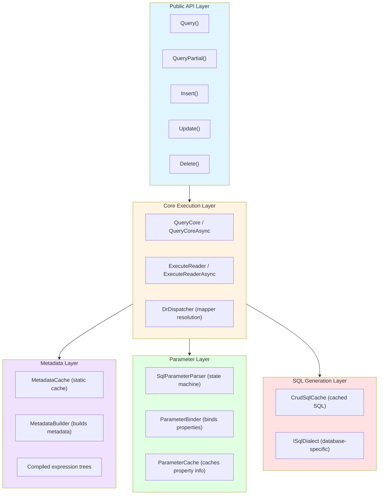
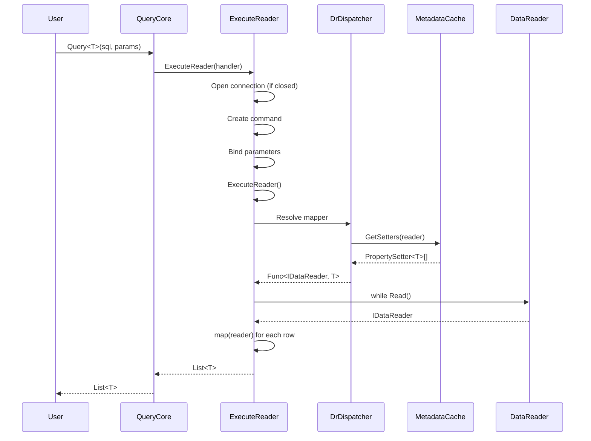
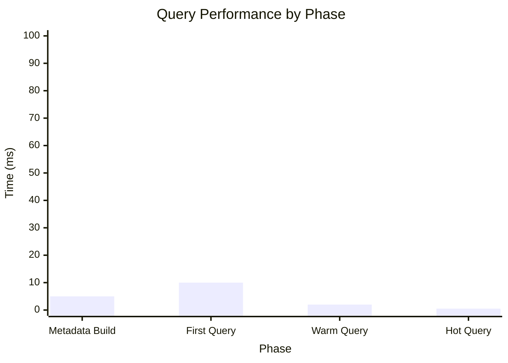

# Architecture Documentation

Comprehensive architecture documentation for Jaunty micro-ORM with visual diagrams and detailed specifications.

---

## Quick Navigation

| Document | Purpose | Best For |
|----------|---------|----------|
| [`architecture-visuals.md`](architecture-visuals.md) | **Visual diagrams** - Flow charts, sequence diagrams, state machines | Quick understanding, visual learners |
| [`architecture-specification.md`](architecture-specification.md) | **Complete spec** - All components, layers, data flows, extension points | Deep dive, implementation reference |
| [`design-philosophy.md`](design-philosophy.md) | **Design decisions** - Why Jaunty is designed this way | Understanding trade-offs |
| [`metadata-system-spec.md`](metadata-system-spec.md) | **Metadata system** - Caching, expression trees, compiled delegates | Understanding performance |
| [`parameter-binding-spec.md`](parameter-binding-spec.md) | **Parameter binding** - SQL parsing, parameter binding, validation | Understanding parameter handling |
| [`performance-spec.md`](performance-spec.md) | **Performance guide** - Optimization techniques, benchmarks | Writing high-performance code |

---

## System Overview

---

## Key Components

### Public API Layer

**Purpose**: User-facing extension methods on `IDbConnection`

**Key Files**:
- `src/Jaunty/Read/Query.cs`, `QueryAsync.cs`
- `src/Jaunty/Read/QueryPartial.cs`, `QueryPartialAsync.cs`
- `src/Jaunty/Write/Insert.cs`, `Update.cs`, `Delete.cs`
- `src/Jaunty/Multiple/QueryMultiple.cs`

**See**: [`architecture-specification.md#1-public-api-layer`](architecture-specification.md#1-public-api-layer)

---

### Core Execution Layer

**Purpose**: Central query execution, connection management, mapper resolution

**Key Files**:
- `src/Jaunty/Internals/QueryCore.cs`, `QueryCoreAsync.cs`
- `src/Jaunty/Internals/ExecuteReader.cs`, `ExecuteReaderAsync.cs`
- `src/Jaunty/Internals/DrDispatcher.cs`

**See**: [`architecture-specification.md#2-core-execution-layer`](architecture-specification.md#2-core-execution-layer)

---

### Metadata Layer

**Purpose**: Build and cache entity metadata, compile expression trees

**Key Files**:
- `src/Jaunty/Internals/Entity/MetadataCache.cs`
- `src/Jaunty/Internals/Entity/MetadataBuilder.cs`
- `src/Jaunty/Internals/Entity/EntityMetadata.cs`
- `src/Jaunty/Internals/MappedCache.cs`

**See**: [`metadata-system-spec.md`](metadata-system-spec.md)

---

### Parameter Layer

**Purpose**: Extract parameter names from SQL, bind object properties

**Key Files**:
- `src/Jaunty/Internals/Parameters/SqlParameterParser.cs`
- `src/Jaunty/Internals/Parameters/ParameterBinder.cs`
- `src/Jaunty/Internals/Parameters/ParameterCache.cs`

**See**: [`parameter-binding-spec.md`](parameter-binding-spec.md)

---

### SQL Generation Layer

**Purpose**: Generate and cache CRUD SQL, handle database dialects

**Key Files**:
- `src/Jaunty/Internals/CrudSqlCache.cs`
- `src/Jaunty/Internals/CachedCrudSql.cs`
- `src/Jaunty/Internals/Dialects/ISqlDialect.cs`

**See**: [`architecture-specification.md#5-sql-generation-layer`](architecture-specification.md#5-sql-generation-layer)

---

## Data Flows

### Query Execution Flow

**See**: [`architecture-visuals.md#query-execution-lifecycle`](architecture-visuals.md#query-execution-lifecycle)

---

## Performance Characteristics

| Phase | Time | Allocations |
|-------|------|-------------|
| Metadata build (one-time) | ~5ms | Metadata + delegates |
| First query (cold) | ~10ms | Command + reader |
| Warm query | ~2ms per 1000 rows | Entity instances |
| Hot query (optimized) | ~0.5ms per 1000 rows | Minimal |

**See**: [`performance-spec.md`](performance-spec.md)

---

## Threading Model

| Component | Thread-Safe | Notes |
|-----------|-------------|-------|
| Public API methods | Yes | All methods are thread-safe |
| Static caches | Yes | Initialized once, immutable |
| `DbConnection` | No | User responsibility |
| `DbCommand` | No | Created per operation |
| `DbTransaction` | No | User responsibility |

**See**: [`architecture-specification.md#threading-model`](architecture-specification.md#threading-model)

---

## Multi-Targeting

| Feature | netstandard2.0 | net8.0 |
|---------|----------------|--------|
| Collections | `Dictionary<K,V>` | `FrozenDictionary<K,V>` |
| Async return | `Task<T>` | `ValueTask<T>` |
| Strings | Regular | `string.Create`, `Span<T>` |

**See**: [`architecture-specification.md#multi-targeting-strategy`](architecture-specification.md#multi-targeting-strategy)

---

## For Human Readers

### Start Here
1. [`architecture-visuals.md`](architecture-visuals.md) - Visual overview
2. [`design-philosophy.md`](design-philosophy.md) - Why Jaunty is designed this way
3. [`architecture-specification.md`](architecture-specification.md) - Deep dive

### For Specific Tasks
- **Adding a new query method**: See [`architecture-specification.md#1-public-api-layer`](architecture-specification.md#1-public-api-layer)
- **Understanding caching**: See [`metadata-system-spec.md`](metadata-system-spec.md)
- **Debugging parameter issues**: See [`parameter-binding-spec.md`](parameter-binding-spec.md)
- **Optimizing performance**: See [`performance-spec.md`](performance-spec.md)

---

## See Also

| Document | Purpose |
|----------|---------|
| [`../../00-quick-start/README.md`](../../00-quick-start/README.md) | Quick start guide |
| [`../../01-api-reference/README.md`](../../01-api-reference/README.md) | API reference |
| [`../../03-development/README.md`](../../03-development/README.md) | Development guides |
