# Jaunty Architecture Specification

**Version**: 2026.02.19  
**Status**: Active  
**Maintainer**: Project Team

> This document provides a complete architectural specification of the Jaunty micro-ORM, including system overview, component specifications, data flows, and performance characteristics.

---

## Table of Contents

1. [System Overview](#system-overview)
2. [Architectural Layers](#architectural-layers)
3. [Component Specifications](#component-specifications)
4. [Data Flow](#data-flow)
5. [Performance Architecture](#performance-architecture)
6. [Threading Model](#threading-model)
7. [Multi-Targeting Strategy](#multi-targeting-strategy)
8. [Extension Points](#extension-points)

---

## System Overview

### Purpose

Jaunty is a lightweight, high-performance micro-ORM for .NET that:
- Executes raw SQL and maps results to objects
- Uses strict mapping by default (catches bugs early)
- Has zero external dependencies (framework-only)
- Targets `netstandard2.0` and `net8.0`

### Design Goals

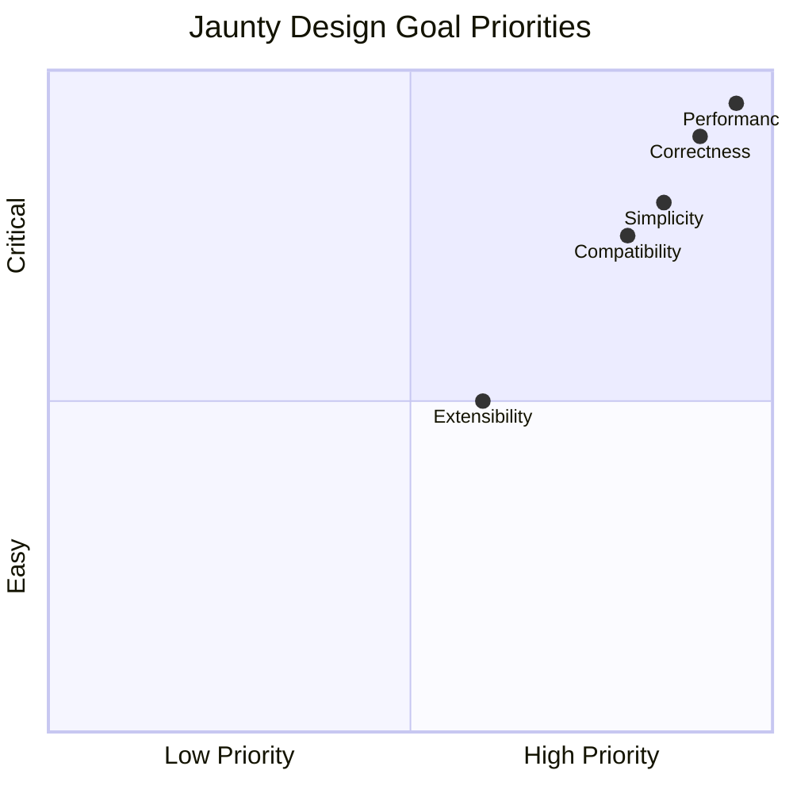
```mermaid
quadrantChart
    title Jaunty Design Goal Priorities
    x-axis "Low Priority" --> "High Priority"
    y-axis "Easy" --> "Critical"
    "Performance": [0.95, 0.95]
    "Correctness": [0.90, 0.90]
    "Simplicity": [0.85, 0.80]
    "Compatibility": [0.80, 0.75]
    "Extensibility": [0.60, 0.50]
```

| Goal | Priority | Description |
|------|----------|-------------|
| **Performance** | Critical | Minimal allocations, compiled delegates, cached metadata |
| **Correctness** | Critical | Strict mapping by default, clear error messages |
| **Simplicity** | High | No magic, explicit SQL, predictable behavior |
| **Compatibility** | High | Support netstandard2.0 and net8.0 |
| **Extensibility** | Medium | Custom mappers, configuration, dialects |

### Non-Goals (What Jaunty Does NOT Do)

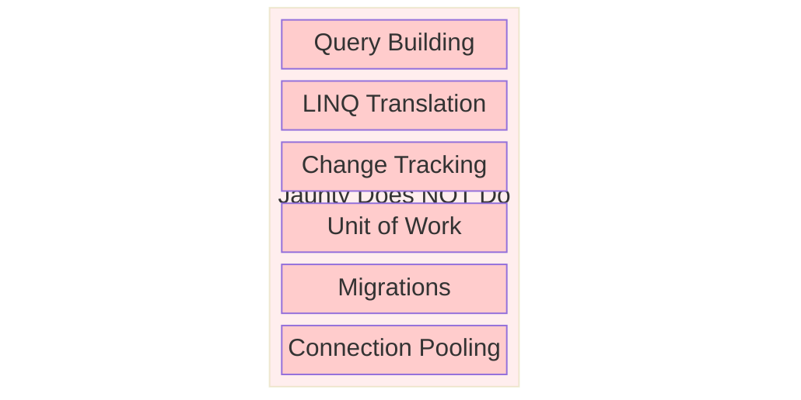
```mermaid
block-beta
    columns 3
    space:1
    block:nonGoals[" Jaunty Does NOT Do"]
        columns 1
        qb["Query Building"]
        linq["LINQ Translation"]
        ct["Change Tracking"]
        ul["Unit of Work"]
        mig["Migrations"]
        cp["Connection Pooling"]
    end
    space:1
    
    style nonGoals fill:#fee
    style qb fill:#fcc
    style linq fill:#fcc
    style ct fill:#fcc
    style ul fill:#fcc
    style mig fill:#fcc
    style cp fill:#fcc
```

---

## Architectural Layers

### Layer Diagram

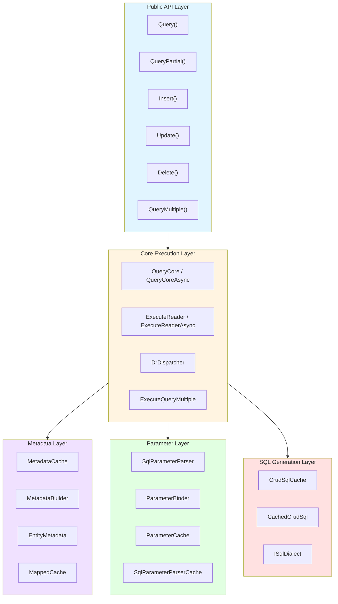
```mermaid
flowchart TD
    subgraph API["Public API Layer"]
        A1["Query<T>()"]
        A2["QueryPartial<T>()"]
        A3["Insert<T>()"]
        A4["Update<T>()"]
        A5["Delete<T>()"]
        A6["QueryMultiple()"]
    end
    
    subgraph CORE["Core Execution Layer"]
        C1["QueryCore / QueryCoreAsync"]
        C2["ExecuteReader / ExecuteReaderAsync"]
        C3["DrDispatcher"]
        C4["ExecuteQueryMultiple"]
    end
    
    subgraph META["Metadata Layer"]
        M1["MetadataCache<T>"]
        M2["MetadataBuilder"]
        M3["EntityMetadata"]
        M4["MappedCache<T>"]
    end
    
    subgraph PARAM["Parameter Layer"]
        P1["SqlParameterParser"]
        P2["ParameterBinder"]
        P3["ParameterCache"]
        P4["SqlParameterParserCache"]
    end
    
    subgraph SQL["SQL Generation Layer"]
        S1["CrudSqlCache<T>"]
        S2["CachedCrudSql"]
        S3["ISqlDialect"]
    end
    
    API --> CORE
    CORE --> META
    CORE --> PARAM
    CORE --> SQL
    
    style API fill:#e1f5ff
    style CORE fill:#fff4e1
    style META fill:#f0e1ff
    style PARAM fill:#e1ffe1
    style SQL fill:#ffe1e1
```

### Layer Responsibilities

| Layer | Components | Responsibility |
|-------|------------|----------------|
| **Public API** | Extension methods on `IDbConnection` | User-facing API, parameter validation, options handling |
| **Core Execution** | `QueryCore`, `ExecuteReader`, `DrDispatcher` | Command execution, connection management, mapper resolution |
| **Metadata** | `MetadataCache<T>`, `MetadataBuilder` | Entity metadata caching, compiled expression trees |
| **Parameter** | `SqlParameterParser`, `ParameterBinder` | SQL parameter extraction, object-to-parameter binding |
| **SQL Generation** | `CrudSqlCache<T>`, `ISqlDialect` | CRUD SQL generation, database-specific syntax |

---

## Component Specifications

### 1. Public API Layer

**Location**: `src/Jaunty/Read/`, `src/Jaunty/Write/`, `src/Jaunty/Multiple/`, etc.

**Pattern**: Extension methods on `IDbConnection` using C# 13 extension syntax.

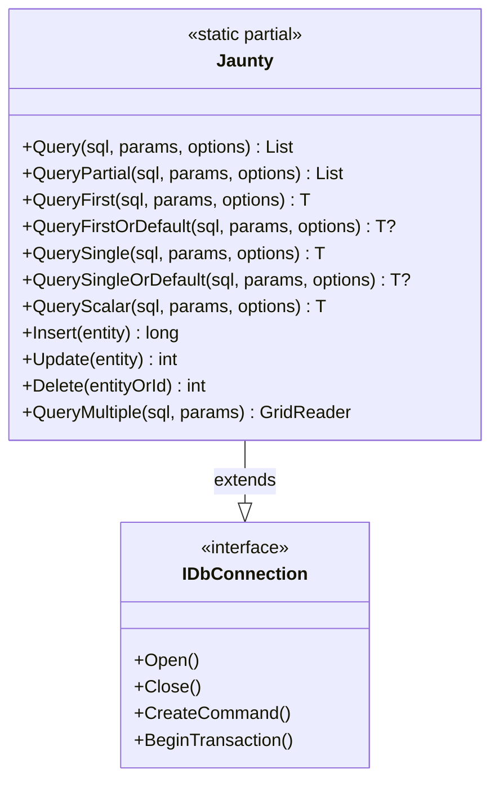
```mermaid
classDiagram
    class Jaunty {
        <<static partial>>
        +Query<T>(sql, params, options) List<T>
        +QueryPartial<T>(sql, params, options) List<T>
        +QueryFirst<T>(sql, params, options) T
        +QueryFirstOrDefault<T>(sql, params, options) T?
        +QuerySingle<T>(sql, params, options) T
        +QuerySingleOrDefault<T>(sql, params, options) T?
        +QueryScalar<T>(sql, params, options) T
        +Insert<T>(entity) long
        +Update<T>(entity) int
        +Delete<T>(entityOrId) int
        +QueryMultiple(sql, params) GridReader
    }
    
    class IDbConnection {
        <<interface>>
        +Open()
        +Close()
        +CreateCommand()
        +BeginTransaction()
    }
    
    Jaunty --|> IDbConnection : extends
```

**Key Characteristics**:
- All methods are extension methods
- Consistent parameter ordering: `sql`, `parameters`, `options`, `cancellationToken`
- `where T : new()` constraint for entity types
- Sync uses `IDbConnection`, async uses `DbConnection`

---

### 2. Core Execution Layer

#### QueryCore Flow

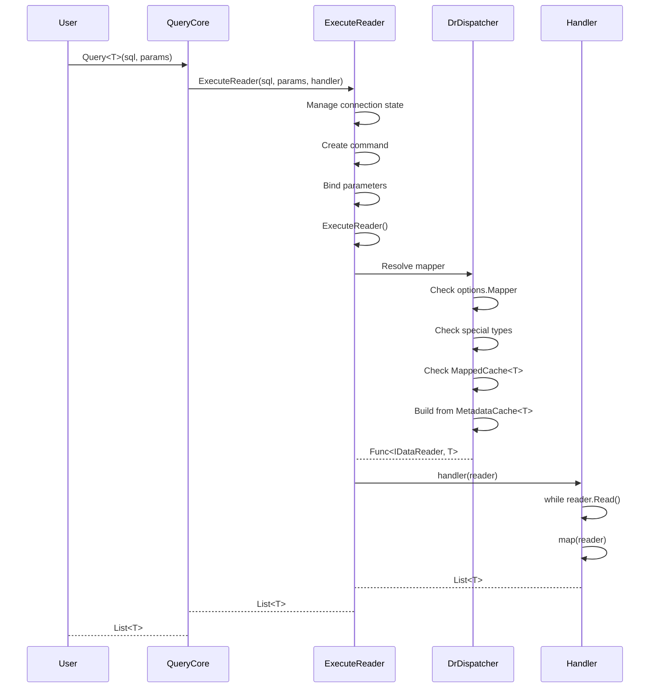
```mermaid
sequenceDiagram
    participant User
    participant QueryCore
    participant ExecuteReader
    participant DrDispatcher
    participant Handler
    
    User->>QueryCore: Query<T>(sql, params)
    QueryCore->>ExecuteReader: ExecuteReader(sql, params, handler)
    
    ExecuteReader->>ExecuteReader: Manage connection state
    ExecuteReader->>ExecuteReader: Create command
    ExecuteReader->>ExecuteReader: Bind parameters
    ExecuteReader->>ExecuteReader: ExecuteReader()
    
    ExecuteReader->>DrDispatcher: Resolve mapper
    DrDispatcher->>DrDispatcher: Check options.Mapper
    DrDispatcher->>DrDispatcher: Check special types
    DrDispatcher->>DrDispatcher: Check MappedCache<T>
    DrDispatcher->>DrDispatcher: Build from MetadataCache<T>
    DrDispatcher-->ExecuteReader: Func<IDataReader, T>
    
    ExecuteReader->>Handler: handler(reader)
    Handler->>Handler: while reader.Read()
    Handler->>Handler: map(reader)
    Handler-->ExecuteReader: List<T>
    ExecuteReader-->QueryCore: List<T>
    QueryCore-->User: List<T>
```

#### Connection State Management

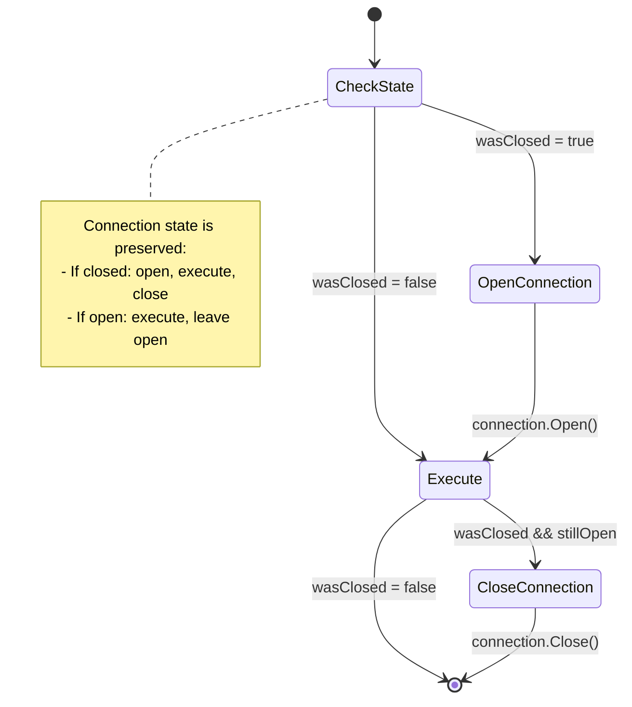
```mermaid
stateDiagram-v2
    [*] --> CheckState
    CheckState --> OpenConnection: wasClosed = true
    CheckState --> Execute: wasClosed = false
    
    OpenConnection --> Execute: connection.Open()
    Execute --> CloseConnection: wasClosed && stillOpen
    Execute --> [*]: wasClosed = false
    
    CloseConnection --> [*]: connection.Close()
    
    note right of CheckState
        Connection state is preserved:
        - If closed: open, execute, close
        - If open: execute, leave open
    end note
```

---

### 3. Metadata Layer

#### MetadataCache<T> Initialization

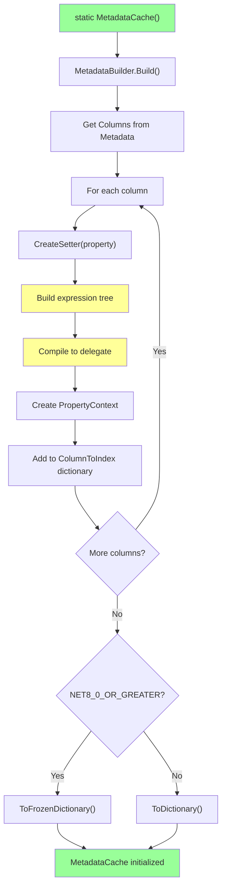
```mermaid
flowchart TD
    Start["static MetadataCache<T>()"] --> Build["MetadataBuilder.Build<T>()"]
    Build --> Columns["Get Columns from Metadata"]
    Columns --> Loop["For each column"]
    
    Loop --> CreateSetter["CreateSetter(property)"]
    CreateSetter --> Expression["Build expression tree"]
    Expression --> Compile["Compile to delegate"]
    Compile --> Context["Create PropertyContext<T>"]
    
    Context --> AddToDict["Add to ColumnToIndex dictionary"]
    AddToDict --> MoreCols{"More columns?"}
    MoreCols -->|Yes| Loop
    MoreCols -->|No| Freeze
    
    Freeze{"NET8_0_OR_GREATER?"} -->|Yes| Frozen["ToFrozenDictionary()"]
    Freeze -->|No| Dict["ToDictionary()"]
    
    Frozen --> Done["MetadataCache initialized"]
    Dict --> Done
    
    style Start fill:#9f9
    style Done fill:#9f9
    style Expression fill:#ff9
    style Compile fill:#ff9
```

#### Metadata Resolution Priority

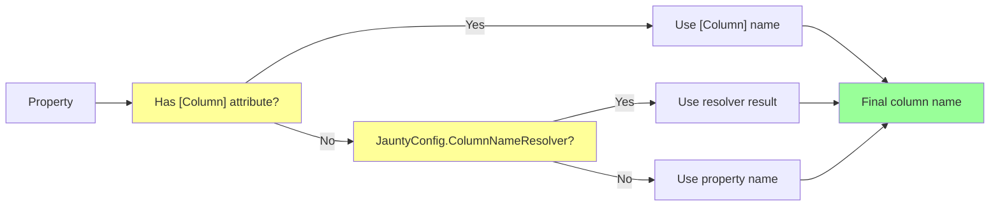
```mermaid
flowchart LR
    Prop["Property"] --> CheckColumn["Has [Column] attribute?"]
    CheckColumn -->|Yes| ColumnName["Use [Column] name"]
    CheckColumn -->|No| CheckConfig["JauntyConfig.ColumnNameResolver?"]
    CheckConfig -->|Yes| ResolverName["Use resolver result"]
    CheckConfig -->|No| PropName["Use property name"]
    
    ColumnName --> Final["Final column name"]
    ResolverName --> Final
    PropName --> Final
    
    style CheckColumn fill:#ff9
    style CheckConfig fill:#ff9
    style Final fill:#9f9
```

---

### 4. Parameter Layer

#### SqlParameterParser State Machine

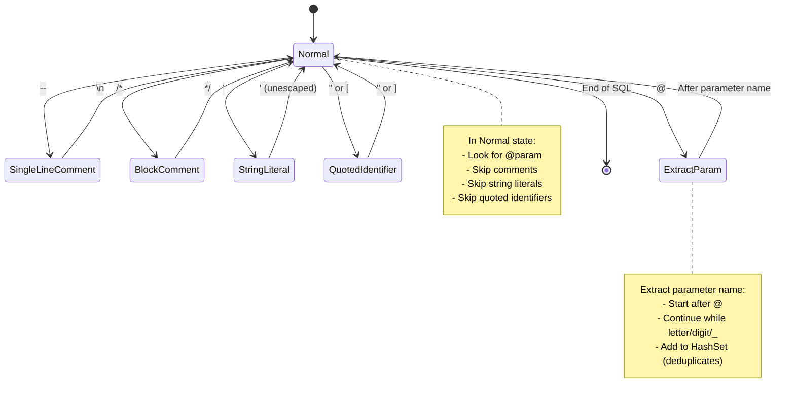
```mermaid
stateDiagram-v2
    [*] --> Normal
    
    Normal --> SingleLineComment: --
    Normal --> BlockComment: /*
    Normal --> StringLiteral: '
    Normal --> QuotedIdentifier: " or [
    Normal --> ExtractParam: @
    Normal --> [*]: End of SQL
    
    SingleLineComment --> Normal: \n
    BlockComment --> Normal: */
    StringLiteral --> Normal: ' (unescaped)
    QuotedIdentifier --> Normal: " or ]
    ExtractParam --> Normal: After parameter name
    
    note right of Normal
        In Normal state:
        - Look for @param
        - Skip comments
        - Skip string literals
        - Skip quoted identifiers
    end note
    
    note right of ExtractParam
        Extract parameter name:
        - Start after @
        - Continue while letter/digit/_
        - Add to HashSet (deduplicates)
    end note
```

#### Parameter Binding Flow

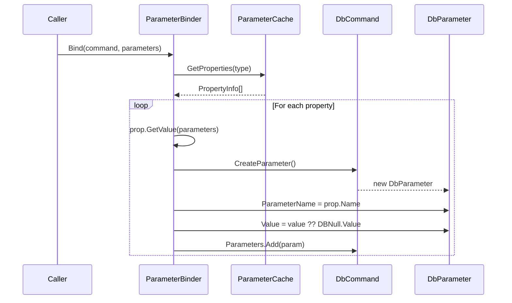
```mermaid
sequenceDiagram
    participant Caller
    participant ParameterBinder
    participant ParameterCache
    participant DbCommand
    participant DbParameter
    
    Caller->>ParameterBinder: Bind(command, parameters)
    ParameterBinder->>ParameterCache: GetProperties(type)
    ParameterCache-->>ParameterBinder: PropertyInfo[]
    
    loop For each property
        ParameterBinder->>ParameterBinder: prop.GetValue(parameters)
        ParameterBinder->>DbCommand: CreateParameter()
        DbCommand-->>DbParameter: new DbParameter
        ParameterBinder->>DbParameter: ParameterName = prop.Name
        ParameterBinder->>DbParameter: Value = value ?? DBNull.Value
        ParameterBinder->>DbCommand: Parameters.Add(param)
    end
```

---

### 5. SQL Generation Layer

#### CRUD SQL Generation

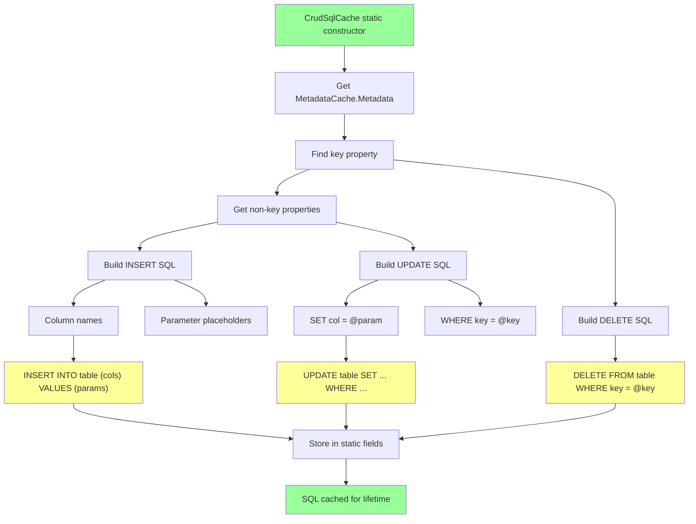
```mermaid
flowchart TD
    Start["CrudSqlCache<T> static constructor"] --> Meta["Get MetadataCache<T>.Metadata"]
    Meta --> KeyProp["Find key property"]
    KeyProp --> NonKeyProps["Get non-key properties"]
    
    NonKeyProps --> BuildInsert["Build INSERT SQL"]
    BuildInsert --> InsertCols["Column names"]
    BuildInsert --> InsertVals["Parameter placeholders"]
    InsertCols --> InsertSQL["INSERT INTO table (cols) VALUES (params)"]
    
    NonKeyProps --> BuildUpdate["Build UPDATE SQL"]
    BuildUpdate --> SetClause["SET col = @param"]
    BuildUpdate --> WhereClause["WHERE key = @key"]
    SetClause --> UpdateSQL["UPDATE table SET ... WHERE ..."]
    
    KeyProp --> BuildDelete["Build DELETE SQL"]
    BuildDelete --> DeleteSQL["DELETE FROM table WHERE key = @key"]
    
    InsertSQL --> Cache["Store in static fields"]
    UpdateSQL --> Cache
    DeleteSQL --> Cache
    Cache --> Done["SQL cached for lifetime"]
    
    style Start fill:#9f9
    style Done fill:#9f9
    style InsertSQL fill:#ff9
    style UpdateSQL fill:#ff9
    style DeleteSQL fill:#ff9
```

---

## Data Flow

### Query Execution Flow


```mermaid
flowchart TD
    User["User calls Query<T>()"] --> ParamBind["Parameter Binding"]
    
    subgraph ParamBind
        PB1["SqlParameterParser<br/>Extract @params from SQL"]
        PB2["SqlParameterParserCache<br/>Cache parsed params"]
        PB3["ParameterBinder<br/>Bind to DbCommand"]
    end
    
    ParamBind --> MetaResolve["Metadata Resolution"]
    
    subgraph MetaResolve
        MR1["MetadataCache<T><br/>Static cache"]
        MR2["MetadataBuilder<br/>Build from attributes"]
        MR3["Compiled setters<br/>Expression trees"]
    end
    
    MetaResolve --> Exec["Command Execution"]
    
    subgraph Exec
        E1["ExecuteReader<br/>Connection mgmt"]
        E2["DbCommand.ExecuteReader<br/>Execute SQL"]
        E3["IDataReader<br/>Result set"]
    end
    
    Exec --> MapResolve["Mapper Resolution"]
    
    subgraph MapResolve
        MR4["DrDispatcher<br/>Resolve mapper"]
        MR5["MappedCache<T><br/>IMapped<T>"]
        MR6["Special types<br/>Dictionary, etc."]
        MR7["Compiled delegates<br/>Property setters"]
    end
    
    MapResolve --> Map["Result Mapping"]
    
    subgraph Map
        M1["while reader.Read()"]
        M2["map(reader)"]
        M3["Add to List<T>"]
    end
    
    Map --> Return["Return List<T>"]
    
    style User fill:#9cf
    style Return fill:#9cf
    style PB1 fill:#ff9
    style MR1 fill:#f9f
    style E1 fill:#9ff
    style MR4 fill:#f9f
    style M1 fill:#ff9
```

### Insert Execution Flow

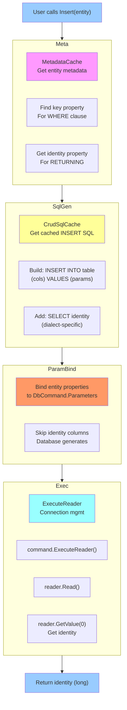
```mermaid
flowchart TD
    User["User calls Insert<T>(entity)"] --> Meta["Metadata Resolution"]
    
    subgraph Meta
        M1["MetadataCache<T><br/>Get entity metadata"]
        M2["Find key property<br/>For WHERE clause"]
        M3["Get identity property<br/>For RETURNING"]
    end
    
    Meta --> SqlGen["SQL Generation"]
    
    subgraph SqlGen
        S1["CrudSqlCache<T><br/>Get cached INSERT SQL"]
        S2["Build: INSERT INTO table<br/>(cols) VALUES (params)"]
        S3["Add: SELECT identity<br/>(dialect-specific)"]
    end
    
    SqlGen --> ParamBind["Parameter Binding"]
    
    subgraph ParamBind
        P1["Bind entity properties<br/>to DbCommand.Parameters"]
        P2["Skip identity columns<br/>Database generates"]
    end
    
    ParamBind --> Exec["Command Execution"]
    
    subgraph Exec
        E1["ExecuteReader<br/>Connection mgmt"]
        E2["command.ExecuteReader()"]
        E3["reader.Read()"]
        E4["reader.GetValue(0)<br/>Get identity"]
    end
    
    Exec --> Return["Return identity (long)"]
    
    style User fill:#9cf
    style Return fill:#9cf
    style M1 fill:#f9f
    style S1 fill:#ff9
    style P1 fill:#f96
    style E1 fill:#9ff
```

---

## Performance Architecture

### Caching Strategy

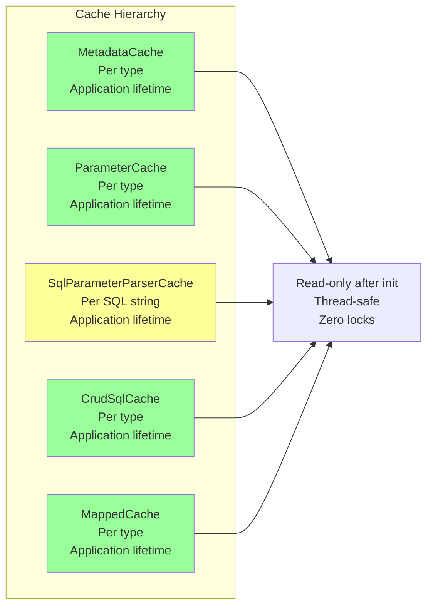
```mermaid
flowchart LR
    subgraph Caches["Cache Hierarchy"]
        direction TB
        
        MC["MetadataCache<T><br/>Per type<br/>Application lifetime"]
        PC["ParameterCache<T><br/>Per type<br/>Application lifetime"]
        SPC["SqlParameterParserCache<br/>Per SQL string<br/>Application lifetime"]
        CC["CrudSqlCache<T><br/>Per type<br/>Application lifetime"]
        MCT["MappedCache<T><br/>Per type<br/>Application lifetime"]
    end
    
    MC --> Access["Read-only after init<br/>Thread-safe<br/>Zero locks"]
    PC --> Access
    SPC --> Access
    CC --> Access
    MCT --> Access
    
    style MC fill:#9f9
    style PC fill:#9f9
    style SPC fill:#ff9
    style CC fill:#9f9
    style MCT fill:#9f9
```

### Allocation Optimization

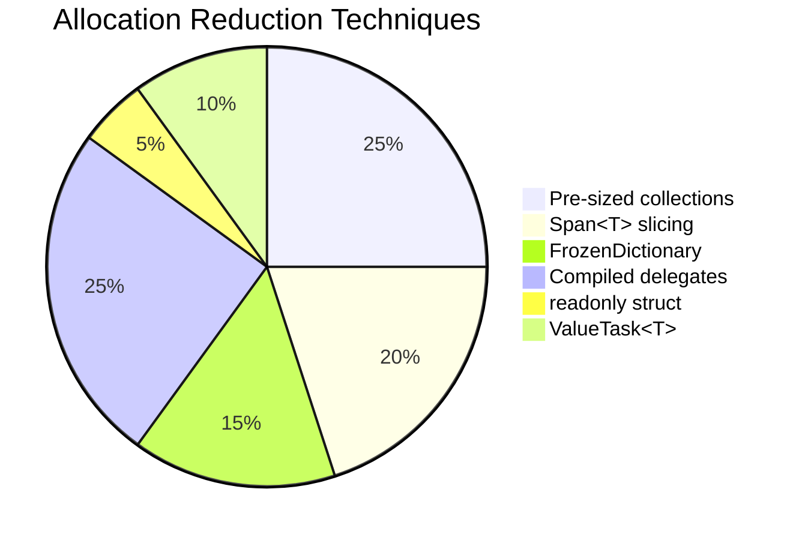
```mermaid
pie title Allocation Reduction Techniques
    "Pre-sized collections" : 25
    "Span<T> slicing" : 20
    "FrozenDictionary" : 15
    "Compiled delegates" : 25
    "readonly struct" : 5
    "ValueTask<T>" : 10
```

### Performance Comparison

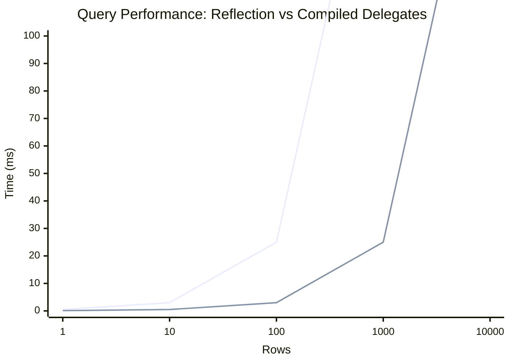
```mermaid
xychart-beta
    title "Query Performance: Reflection vs Compiled Delegates"
    x-axis "Rows" [1, 10, 100, 1000, 10000]
    y-axis "Time (ms)" 0 --> 100
    line "Reflection (PropertyInfo.SetValue)" [0.5, 3, 25, 200, 1800]
    line "Compiled Delegates" [0.1, 0.5, 3, 25, 200]
```

---

## Threading Model

### Thread Safety Guarantees

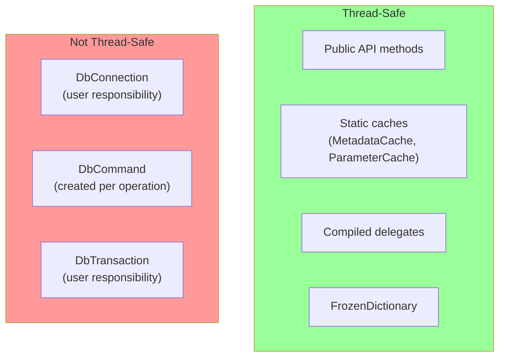
```mermaid
flowchart TD
    subgraph ThreadSafe[" Thread-Safe"]
        TS1["Public API methods"]
        TS2["Static caches<br/>(MetadataCache, ParameterCache)"]
        TS3["Compiled delegates"]
        TS4["FrozenDictionary"]
    end
    
    subgraph NotThreadSafe[" Not Thread-Safe"]
        NS1["DbConnection<br/>(user responsibility)"]
        NS2["DbCommand<br/>(created per operation)"]
        NS3["DbTransaction<br/>(user responsibility)"]
    end
    
    style ThreadSafe fill:#9f9
    style NotThreadSafe fill:#f99
```

### Static Initialization Sequence

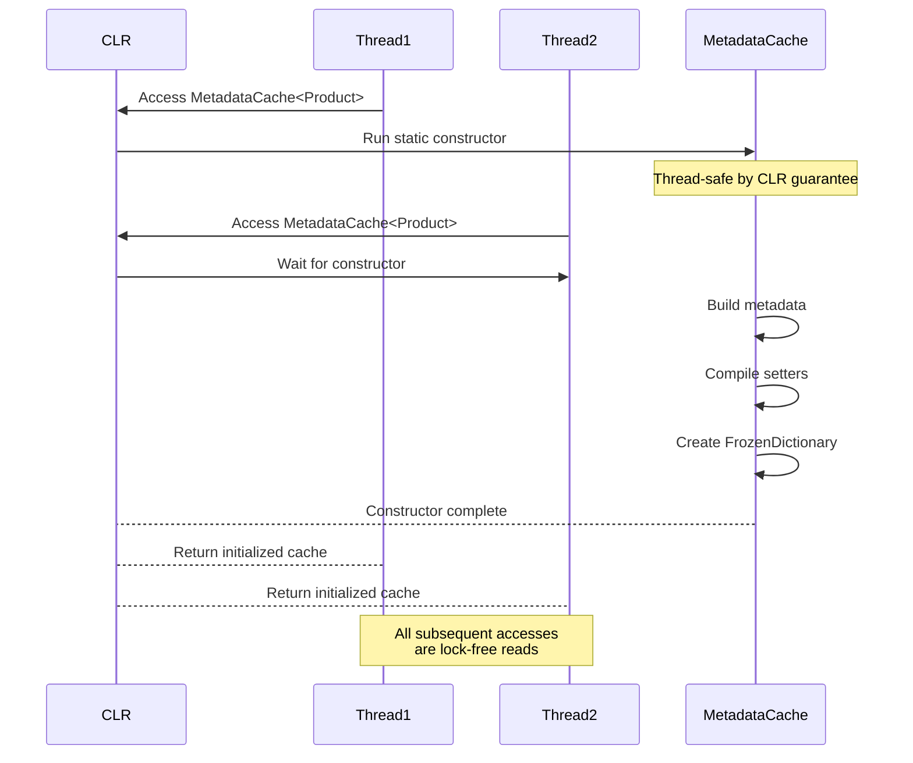
```mermaid
sequenceDiagram
    participant CLR
    participant Thread1
    participant Thread2
    participant MetadataCache
    
    Thread1->>CLR: Access MetadataCache<Product>
    CLR->>MetadataCache: Run static constructor
    Note over MetadataCache: Thread-safe by CLR guarantee
    
    Thread2->>CLR: Access MetadataCache<Product>
    CLR->>Thread2: Wait for constructor
    
    MetadataCache->>MetadataCache: Build metadata
    MetadataCache->>MetadataCache: Compile setters
    MetadataCache->>MetadataCache: Create FrozenDictionary
    
    MetadataCache-->CLR: Constructor complete
    CLR-->Thread1: Return initialized cache
    CLR-->Thread2: Return initialized cache
    
    Note over Thread1,Thread2: All subsequent accesses<br/>are lock-free reads
```

---

## Multi-Targeting Strategy

### Framework Feature Matrix

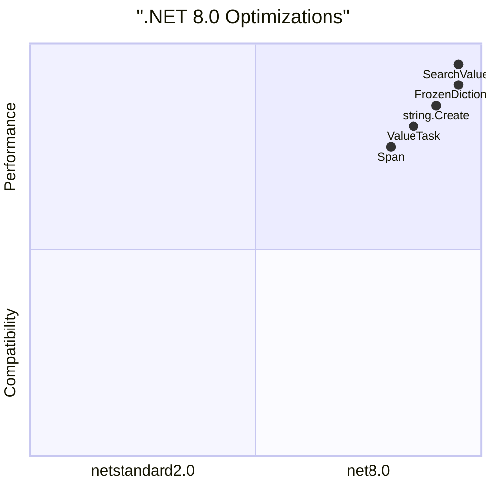
```mermaid
quadrantChart
    title ".NET 8.0 Optimizations"
    x-axis "netstandard2.0" --> "net8.0"
    y-axis "Compatibility" --> "Performance"
    "FrozenDictionary": [0.95, 0.90]
    "ValueTask<T>": [0.85, 0.80]
    "string.Create": [0.90, 0.85]
    "Span<T>": [0.80, 0.75]
    "SearchValues<T>": [0.95, 0.95]
```

### Conditional Compilation Pattern

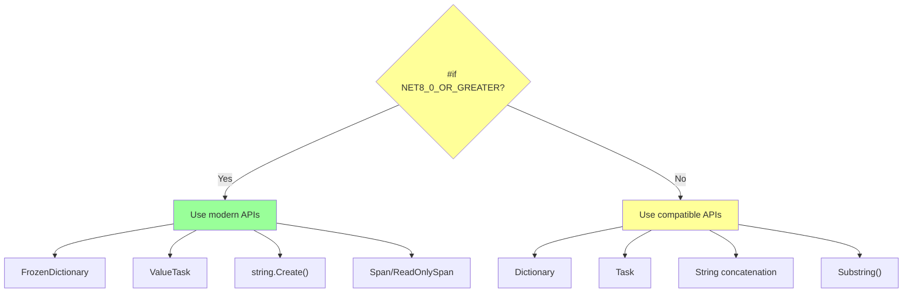
```mermaid
flowchart TD
    Check{"#if NET8_0_OR_GREATER?"} -->|Yes| Modern["Use modern APIs"]
    Check -->|No| Fallback["Use compatible APIs"]
    
    Modern --> M1["FrozenDictionary<K,V>"]
    Modern --> M2["ValueTask<T>"]
    Modern --> M3["string.Create()"]
    Modern --> M4["Span<T>/ReadOnlySpan<T>"]
    
    Fallback --> F1["Dictionary<K,V>"]
    Fallback --> F2["Task<T>"]
    Fallback --> F3["String concatenation"]
    Fallback --> F4["Substring()"]
    
    style Check fill:#ff9
    style Modern fill:#9f9
    style Fallback fill:#ff9
```

---

## Extension Points

### Custom Mapper Registration

```mermaid
flowchart TD
    User["User implements IMapped<T>"] --> Static["MappedCache<T>.Mapper set"]
    Static --> DrDisp["DrDispatcher.Resolve<T>()"]
    DrDisp --> Check{"MappedCache<T>.Mapper<br/>not null?"}
    Check -->|Yes| UseCustom["Use custom mapper"]
    Check -->|No| Fallback["Fallback to MetadataCache"]
    
    UseCustom --> FastPath["Skip metadata reflection"]
    Fallback --> SlowPath["Use compiled delegates"]
    
    style User fill:#9cf
    style UseCustom fill:#9f9
    style FastPath fill:#9f9
```

### Configuration Extension

```mermaid
flowchart LR
    subgraph Config["JauntyConfig"]
        CNR["ColumnNameResolver<br/>Func<string,string>"]
        TNR["TableNameResolver<br/>Func<Type,string>"]
        SNR["SchemaNameResolver<br/>Func<Type,string>"]
    end
    
    Config --> MB["MetadataBuilder.Build<T>()"]
    MB --> Resolve["Resolve names at startup"]
    Resolve --> Cache["Cache in MetadataCache<T>"]
    
    style Config fill:#9cf
    style MB fill:#ff9
    style Cache fill:#9f9
```

---

## Error Handling

### Exception Hierarchy

```mermaid
flowchart TD
    subgraph Jaunty["Jaunty Exceptions"]
        IO["InvalidOperationException<br/>Strict mapping, no results,<br/>multiple results"]
        AE["ArgumentException<br/>Parameter mismatch,<br/>invalid parameter"]
        ANE["ArgumentNullException<br/>Null required argument"]
    end
    
    subgraph PassThrough["Pass-Through Exceptions"]
        DBE["DbException<br/>Database errors"]
        SQL["SqlException<br/>SQL syntax errors"]
    end
    
    style IO fill:#f96
    style AE fill:#f96
    style ANE fill:#f96
    style DBE fill:#9cf
    style SQL fill:#9cf
```

### Error Message Format

```
┌─────────────────────────────────────────────────────────────────┐
│ Strict mapping failed: property 'Price' on type 'Product'      │
│ has no matching column.                                         │
│                                                                 │
│ SQL columns: [id, name, category_id]                           │
│ Missing: [Price]                                                │
└─────────────────────────────────────────────────────────────────┘

┌─────────────────────────────────────────────────────────────────┐
│ Parameter count mismatch: SQL contains 2 unique parameter(s),  │
│ but 3 value(s) provided.                                        │
│                                                                 │
│ SQL parameters: [@CategoryId, @MinPrice]                       │
│ Provided: [1, 100, 200]                                         │
└─────────────────────────────────────────────────────────────────┘
```

---

## See Also

| Document | Purpose |
|----------|---------|
| [`design-philosophy.md`](design-philosophy.md) | Design philosophy and trade-offs |
| [`metadata-system-spec.md`](metadata-system-spec.md) | Metadata caching system details |
| [`parameter-binding-spec.md`](parameter-binding-spec.md) | Parameter binding details |
| [`performance-spec.md`](performance-spec.md) | Performance optimization guide |
| [`../../01-api-reference/README.md`](../../01-api-reference/README.md) | API documentation |
