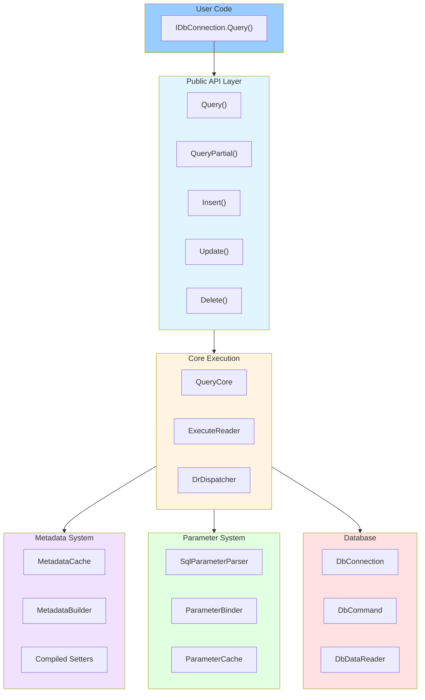
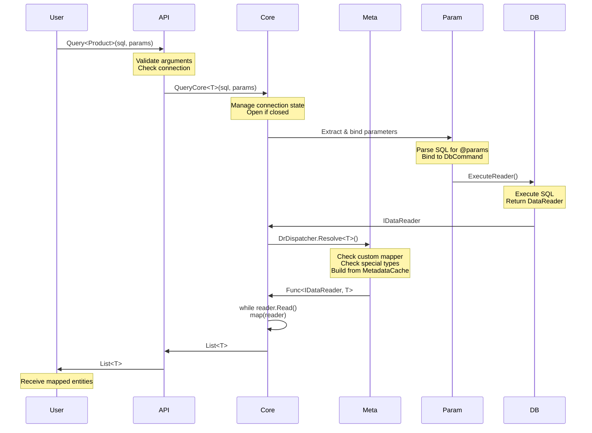
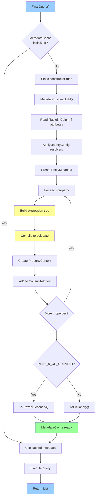
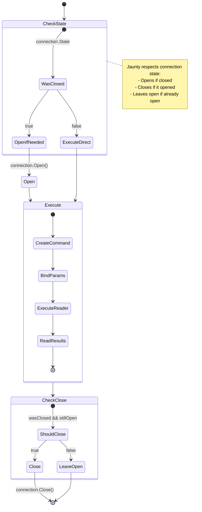
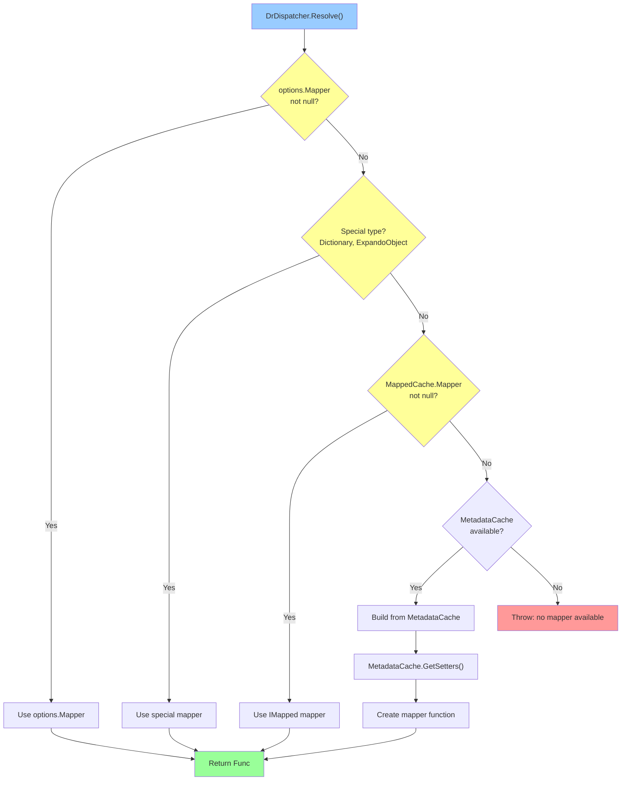
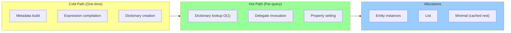
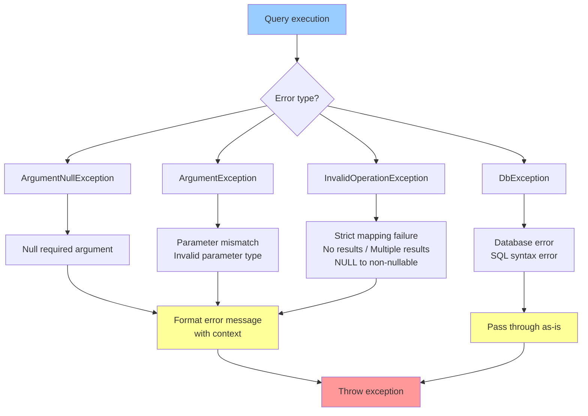
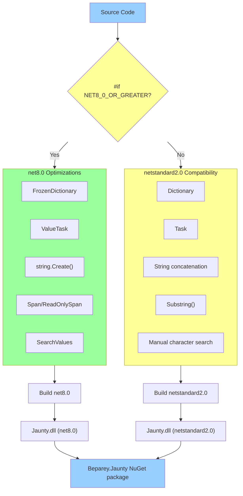

# Architecture Visual Guide

Visual diagrams and illustrations for understanding Jaunty's architecture.

---

## System Architecture Overview

---

## Query Execution Lifecycle

---

## Metadata Initialization Flow

---

## Parameter Binding Flow

```mermaid
flowchart LR
    SQL["SQL with @params"] --> Parse["SqlParameterParser"]
    
    subgraph Parse ["Extraction"]
        P1["State machine<br/>Skip comments, strings"]
        P2["Extract @param names"]
        P3["Deduplicate"]
    end
    
    Parse --> Cache["SqlParameterParserCache"]
    Cache --> Validate{"Validate count"}
    
    Validate -->|Mismatch| Throw["Throw ArgumentException"]
    Validate -->|Match| Bind["ParameterBinder"]
    
    Bind --> Props["Get object properties"]
    Props --> Loop["For each property"]
    Loop --> Create["Create DbParameter"]
    Create --> SetVal["Set Value or DBNull"]
    SetVal --> Add["Add to DbCommand"]
    
    Add --> Exec["Execute command"]
    Throw --> Error["Error returned"]
    
    style SQL fill:#9cf
    style Parse fill:#ff9
    style Cache fill:#ff9
    style Bind fill:#f96
    style Exec fill:#9f9
    style Throw fill:#f99
```

---

## Connection State Management

---

## Mapper Resolution Priority

---

## Performance Hot Paths

**Cold Path** (runs once per type):
- Metadata building: ~1-5ms
- Expression compilation: ~1-10ms
- Dictionary creation: ~0.1-1ms

**Hot Path** (runs per query):
- Dictionary lookup: ~10ns
- Delegate invocation: ~50ns
- Property setting: ~100ns per property

---

## Error Flow

---

## Multi-Targeting Architecture

---

## See Also

| Document | Purpose |
|----------|---------|
| [`architecture-specification.md`](architecture-specification.md) | Complete architecture spec |
| [`metadata-system-spec.md`](metadata-system-spec.md) | Metadata system details |
| [`parameter-binding-spec.md`](parameter-binding-spec.md) | Parameter binding details |
| [`performance-spec.md`](performance-spec.md) | Performance guide |
