# Connection and Transaction Ownership

Jaunty accepts your `IDbConnection` and gives it back in the state it found it. Two booleans carry
that promise through the write paths, and every acquire/release pair is derived from them:

```csharp
bool wasClosed = connection.State == ConnectionState.Closed;
bool ownTransaction = transaction is null;
```

Under `src/Jaunty/Write`, `wasClosed` appears in eight files and `ownTransaction` in six: the six
`Bulk*` files have both, and `Upsert`/`UpsertAsync` have only `wasClosed` because they issue one
statement and own no transaction. The acquire decisions read the booleans in the `try`; the release
decisions read them in the `finally`.

## What that buys you

For the six bulk-write paths:

| you pass | Jaunty opens | Jaunty closes | Jaunty commits |
|---|---|---|---|
| a closed connection, no transaction | yes | yes | yes, its own |
| an open connection, no transaction | no | **no** | yes, its own |
| a connection inside your transaction | no | no | **no** — yours to commit |

An open connection is left open because you opened it, and closing it would break the next
statement in your own unit of work. A supplied transaction is never committed or rolled back by
Jaunty, so a bulk write composes into a larger transaction without an argument.

`Upsert` differs in the last column only: with no transaction supplied its single statement runs in
autocommit, and with one supplied it joins yours. The connection columns are the same.

## The nesting order

There are two nested `try` blocks. The outer one exists for the `finally` that disposes and closes;
the inner one exists for the `catch` that puts session state back.

```mermaid
flowchart TD
    S["wasClosed = state is Closed"] --> V["If the connection is a DbConnection,<br/>validate the supplied transaction<br/>is a DbTransaction"]
    V --> OW["ownTransaction = transaction is null"]
    OW --> T["outer try"]
    T --> O{"wasClosed?"}
    O -- yes --> OP["Open"]
    O -- no --> T2
    OP --> T2["inner try"]
    T2 --> D1{"constraints off,<br/>autocommit dialect?"}
    D1 -- yes --> FK1["Disable FK enforcement<br/>outside any transaction"]
    D1 -- no --> B
    FK1 --> B{"ownTransaction?"}
    B -- yes --> BT["BeginTransaction"]
    B -- no --> D2
    BT --> D2{"constraints off,<br/>in-transaction dialect?"}
    D2 -- yes --> FK2["Disable FK enforcement<br/>inside the transaction"]
    D2 -- no --> W
    FK2 --> W["Write the rows"]
    W --> RE1["Re-enable, in-transaction case"]
    RE1 --> CM{"ownTransaction?"}
    CM -- yes --> COM["Commit"]
    CM -- no --> RE2
    COM --> RE2["Re-enable, autocommit case"]
    RE2 --> F["finally"]

    T2 --> X["catch"]
    X --> XR1["Re-enable, in-transaction case"]
    XR1 --> XB{"ownTransaction?"}
    XB -- yes --> RB["Rollback"]
    XB -- no --> XR2
    RB --> XR2["Re-enable, autocommit case"]
    XR2 --> RT["Rethrow"]
    RT --> F

    F --> FD{"ownTransaction?"}
    FD -- yes --> DI["Dispose the transaction"]
    FD -- no --> FC
    DI --> FC{"wasClosed and<br/>still open?"}
    FC -- yes --> CL["Close"]
    FC -- no --> End["Return"]
    CL --> End

    style COM fill:#1f6f4a,stroke:#2ea36a,color:#eaf6ef
    style RB fill:#7a1f2e,stroke:#c2405a,color:#fdeaee
    style XR1 fill:#7a4a1f,stroke:#c07c34,color:#fdf1e3
    style XR2 fill:#7a4a1f,stroke:#c07c34,color:#fdf1e3
    style FK1 fill:#1f4f7a,stroke:#3a86c8,color:#e8f2fb
    style FK2 fill:#1f4f7a,stroke:#3a86c8,color:#e8f2fb
```



**The re-enable appears twice on each path because the disable does.** Which of the two placements
is live depends on the dialect, and they bracket the commit from opposite sides: the in-transaction
one is undone before the commit, the autocommit-dialect one after it.

The async paths are the same shape with `OpenAsync`, `BeginTransactionAsync`, `CommitAsync`,
`RollbackAsync`, `DisposeAsync` and `CloseAsync` substituted, all of them `NET8_0_OR_GREATER` with
the synchronous call as the fallback on older targets. **Every restore in the `catch` passes
`CancellationToken.None`** — the rollback and both foreign-key re-enables. An operation cancelled
mid-write still has to put things back, and passing the cancelled token would abandon the
transaction instead of undoing it.

## Three rules the shape encodes

**Everything that can throw goes inside the `try` that restores state.** The foreign-key disable and
the `BeginTransaction` call used to sit outside it. A throw from either skipped the `catch`, and
since the `finally` only disposes and closes, the connection went back to the pool with foreign-key
enforcement still off — where the next unrelated caller inherited it. Anything that changes session
state must be inside the block that puts it back.

**Re-enabling is best effort and never masks the original exception.** Each restore in the `catch`
is wrapped in its own empty `catch`. The failure you want to read is the one that started it, and a
secondary failure while cleaning up would otherwise replace it.

**The close is conditional twice.** `wasClosed && connection.State != ConnectionState.Closed`. The
first check is ownership. The second is defensive: nothing in Jaunty closes the connection between
those two points, so it guards against the provider having done so.

## Why the transaction is validated before use

A `DbConnection`'s `IDbCommand.Transaction` setter is `DbCommand`'s explicit interface
implementation, and it casts to `DbTransaction` internally. Assigning a non-`DbTransaction`
`IDbTransaction` through it throws an `InvalidCastException` with no useful message. The write paths
run the supplied transaction through `AsyncTransactionValidator.RequireDbTransaction` first, so an
incompatible transaction produces an `ArgumentException` naming the problem instead. On the
synchronous paths this happens only when the connection is a `DbConnection`; anything else takes the
transaction as given, because the cast that would fail is not in play.

## The foreign-key toggle has two placements

Which one applies is a dialect fact, not a preference.
`ForeignKeyToggleCoordinator.RequiresPreTransactionToggle` is true when constraint-skipping was
asked for and the dialect requires autocommit for the toggle; those engines toggle before
`BeginTransaction` and are undone after the commit, and the rest toggle within the transaction and
are undone before it.

`ValidateTransactionCompatibility` rejects the one combination that cannot work, throwing
`NotSupportedException` when all three hold: constraint-skipping requested, a dialect that requires
autocommit for the toggle, and a transaction supplied by the caller. There is nowhere to put the
toggle in that case, because the transaction is already open before Jaunty is involved.

## See also

- [Bulk copy architecture](bulk-copy-architecture.md) for what the native path does inside this
  frame
- [Command options](../01-api-reference/command-options.md) for supplying the transaction
- [Streaming methods](../01-api-reference/streaming-methods.md) for the one path that holds a
  connection past the call it was made in
