# Connection and Transaction Ownership

Jaunty accepts your `IDbConnection` and gives it back in the state it found it. Two booleans carry
that promise through every write path, and every acquire/release pair in the codebase is derived
from them:

```csharp
bool wasClosed = connection.State == ConnectionState.Closed;
bool ownTransaction = transaction is null;
```

`wasClosed` appears in eight write files, `ownTransaction` in six. They are the same two lines each
time, and both are read only in a `finally`.

## What that buys you

| you pass | Jaunty opens | Jaunty closes | Jaunty commits |
|---|---|---|---|
| a closed connection, no transaction | yes | yes | yes, its own |
| an open connection, no transaction | no | **no** | yes, its own |
| a connection inside your transaction | no | no | **no** — yours to commit |

An open connection is left open because you opened it, and closing it would break the next
statement in your own unit of work. A supplied transaction is never committed or rolled back by
Jaunty, so a bulk write composes into a larger transaction without an argument.

## The nesting order

```mermaid
flowchart TD
    S["wasClosed = state is Closed<br/>ownTransaction = transaction is null"] --> V["Validate the supplied transaction<br/>is a DbTransaction"]
    V --> O{"wasClosed?"}
    O -- yes --> OP["Open"]
    O -- no --> T
    OP --> T["try"]
    T --> D1{"constraints off,<br/>autocommit dialect?"}
    D1 -- yes --> FK1["Disable FK enforcement<br/>outside any transaction"]
    D1 -- no --> B
    FK1 --> B{"ownTransaction?"}
    B -- yes --> BT["BeginTransaction"]
    B -- no --> D2
    BT --> D2{"constraints off,<br/>in-transaction dialect?"}
    D2 -- yes --> FK2["Disable FK enforcement<br/>inside the transaction"]
    D2 -- no --> W
    FK2 --> W["Write the rows"]
    W --> RE["Re-enable FK enforcement"]
    RE --> C{"ownTransaction?"}
    C -- yes --> CM["Commit"]
    C -- no --> F
    CM --> F["finally"]
    W --> X["catch"]
    X --> XR["Re-enable FK enforcement,<br/>swallowing any failure"]
    XR --> XB{"ownTransaction?"}
    XB -- yes --> RB["Rollback, best effort"]
    XB -- no --> RT["Rethrow"]
    RB --> RT
    RT --> F
    F --> FD{"ownTransaction?"}
    FD -- yes --> DI["Dispose the transaction"]
    FD -- no --> FC
    DI --> FC{"wasClosed and<br/>still open?"}
    FC -- yes --> CL["Close"]
    FC -- no --> End["Return"]
    CL --> End

    style CM fill:#1f6f4a,stroke:#2ea36a,color:#eaf6ef
    style RB fill:#7a1f2e,stroke:#c2405a,color:#fdeaee
    style XR fill:#7a4a1f,stroke:#c07c34,color:#fdf1e3
    style FK1 fill:#1f4f7a,stroke:#3a86c8,color:#e8f2fb
    style FK2 fill:#1f4f7a,stroke:#3a86c8,color:#e8f2fb
```



The async paths are the same shape with `OpenAsync`, `CommitAsync`, `DisposeAsync` and `CloseAsync`
substituted, plus one difference that matters: **the rollback passes
`CancellationToken.None`**. An operation cancelled mid-write still has to roll back, and passing the
cancelled token would abandon the transaction instead of undoing it.

## Three rules the shape encodes

**Everything that can throw goes inside the `try` that restores state.** The foreign-key disable and
the `BeginTransaction` call used to sit outside it. A throw from either skipped the `catch`, and
since the `finally` only disposes and closes, the connection went back to the pool with foreign-key
enforcement still off — where the next unrelated caller inherited it. Anything that changes session
state must be inside the block that puts it back.

**Re-enabling is best effort and never masks the original exception.** Each restore in the `catch`
is wrapped in its own empty `catch`. The failure you want to read is the one that started it, and a
secondary failure while cleaning up would otherwise replace it.

**The close is conditional twice.** `wasClosed && connection.State != ConnectionState.Closed`. The
second check is there because the provider may already have closed it — after a fatal error, or
because the transaction's disposal took the connection with it — and closing an already-closed
connection is not universally harmless across providers.

## Why the transaction is validated before use

A `DbConnection`'s `IDbCommand.Transaction` setter is `DbCommand`'s explicit interface
implementation, and it casts to `DbTransaction` internally. Assigning a non-`DbTransaction`
`IDbTransaction` through it throws an `InvalidCastException` with no useful message. The write paths
run the supplied transaction through `AsyncTransactionValidator.RequireDbTransaction` first, so an
incompatible transaction produces an `ArgumentException` naming the problem instead.

## The foreign-key toggle has two placements

Which one applies is a dialect fact, not a preference. Some engines will not change foreign-key
enforcement inside a transaction, so for those the toggle has to happen before `BeginTransaction`
and be undone after the commit; the rest toggle within the transaction and are undone before it.
`ForeignKeyToggleCoordinator.RequiresPreTransactionToggle` decides, and
`ValidateTransactionCompatibility` rejects the combination that cannot work — constraint-skipping
requested against a supplied transaction on a dialect that needs the pre-transaction placement.

## See also

- [Bulk copy architecture](bulk-copy-architecture.md) for what the native path does inside this
  frame
- [Command options](../01-api-reference/command-options.md) for supplying the transaction
- [Streaming methods](../01-api-reference/streaming-methods.md) for the one path that holds a
  connection past the call it was made in
