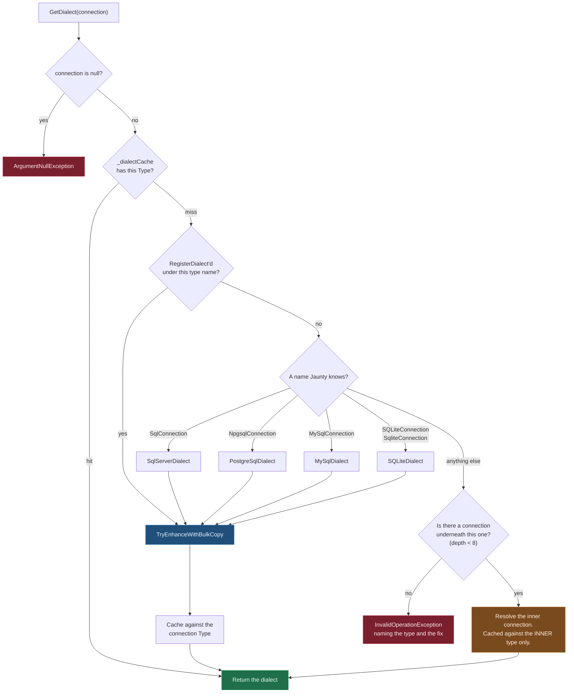
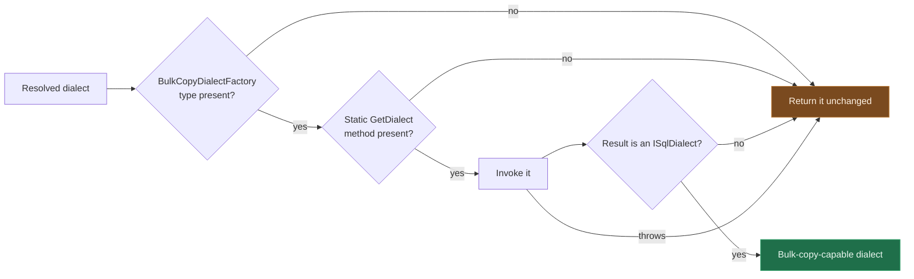

# Dialect Resolution

Every statement Jaunty writes is dialect-specific. Identifier quoting, the upsert form, the
identity-retrieval expression, the paging clause and the parameter ceiling all differ between
engines, so before Jaunty can build SQL it has to decide which `ISqlDialect` your connection
belongs to. It decides from the connection's runtime type name.

Two properties of that decision are worth holding in your head, because both are recent and both
change what you see when something goes wrong:

- **An unrecognized connection type fails.** It does not fall back to SQL Server.
- **A wrapped connection is looked through**, so a profiling or tracing decorator does not hide
  the engine underneath it.

## The resolution order



### Why the fallback was removed

The last arm of the switch used to read `_ => new SqlServerDialect()`. Any connection type Jaunty
did not recognize quietly received `[bracket]` quoting, `MERGE`-based upsert, `SCOPE_IDENTITY()`,
`OFFSET ... FETCH NEXT` paging and a 2,100-parameter ceiling. That is wrong SQL produced silently
rather than an error you can act on, and the documented contract never mentioned a fallback at
all. The miss now propagates so the decorator path gets a chance first, and the failure that
follows names your type and tells you how to register it.

### Why the decorator result is not cached against the outer type

One wrapper type wraps different engines in different places. Caching `ProfiledDbConnection` to
`SQLiteDialect` because the first one you opened held SQLite would hand SQLite's dialect to a
profiled Npgsql connection later in the same process. The recursive call caches against the inner
type, which is the part that identifies an engine.

### The two depth bounds

| bound | value | guards against |
|---|---:|---|
| decorator recursion | 8 | two wrappers exposing each other, which recursed until the stack overflowed |
| `IDialectWrapper` unwrapping | 8 | a third-party wrapper returning itself, or a cycle between two wrappers |

`ReferenceEquals` already caught the one-element cycle. Neither bound is a limit you can reach by
accident: eight layers of connection decorator is not a shape real code has.

## Bulk copy is a capability probed at run time

`UseNativeBulkCopy()` lives in `Jaunty.Extensions.Reflection`, a package the core does not
reference. Rather than a compile-time dependency, resolution ends with a probe: if that assembly
is loaded, the resolved dialect is wrapped in one that can bulk-copy. If it is not, the base
dialect comes back unchanged and every write path still works.



Each of the four exits to the base dialect is a degradation, not a failure. Under trimming the
type or the method can be removed, and the probe returning nothing is the intended outcome rather
than a bug to report.

Custom dialects go through the same probe. They used to return directly from the registration
lookup and skip it, so `UseNativeBulkCopy()` did nothing for them while appearing to work. The
probe passes anything that is not one of the four built-in dialects straight back, so routing
custom registrations through it costs them nothing and removes the inconsistency.

## When resolution fails

```
No SQL dialect is registered for connection type 'FooConnection'. Jaunty resolves dialects
from the connection type name and recognises SqlConnection, NpgsqlConnection, MySqlConnection,
SQLiteConnection and SqliteConnection. If this is a wrapped or profiled connection, Jaunty
could not reach the connection underneath it. Register a dialect for it with
SqlDialectFactory.RegisterDialect("FooConnection", dialect).
```

Two things produce this. Either the engine is one Jaunty has no dialect for, in which case supply
one, or it is a wrapped connection whose inner connection Jaunty could not reach, in which case
registering against the wrapper's type name is the fix that takes one line.

```csharp
SqlDialectFactory.RegisterDialect("FooConnection", new PostgreSqlDialect());
```

## See also

- [Architecture specification](architecture-specification.md) for where dialects sit in the
  wider pipeline
- [Bulk copy architecture](bulk-copy-architecture.md) for what the enhanced dialect does once
  it is resolved
