# Metadata System Specification

**Version**: 2026.02.19  
**Status**: Active

> The metadata system is the foundation of Jaunty's performance. It builds and caches entity metadata once per type, eliminating reflection at query execution time.

---

## Overview

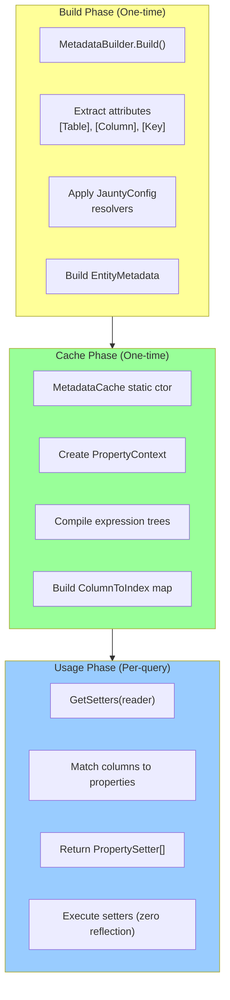

**Key Characteristics**:
- **Build Phase**: Runs once per type, uses reflection
- **Cache Phase**: Compiles delegates, stores in static fields
- **Usage Phase**: Zero reflection, O(1) lookups

---

## Component Architecture

### System Component Diagram

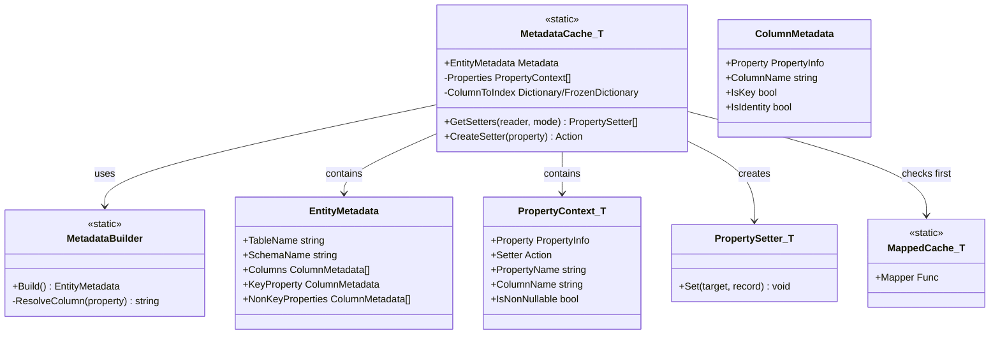

---

## Initialization Flow

### Static Constructor Sequence

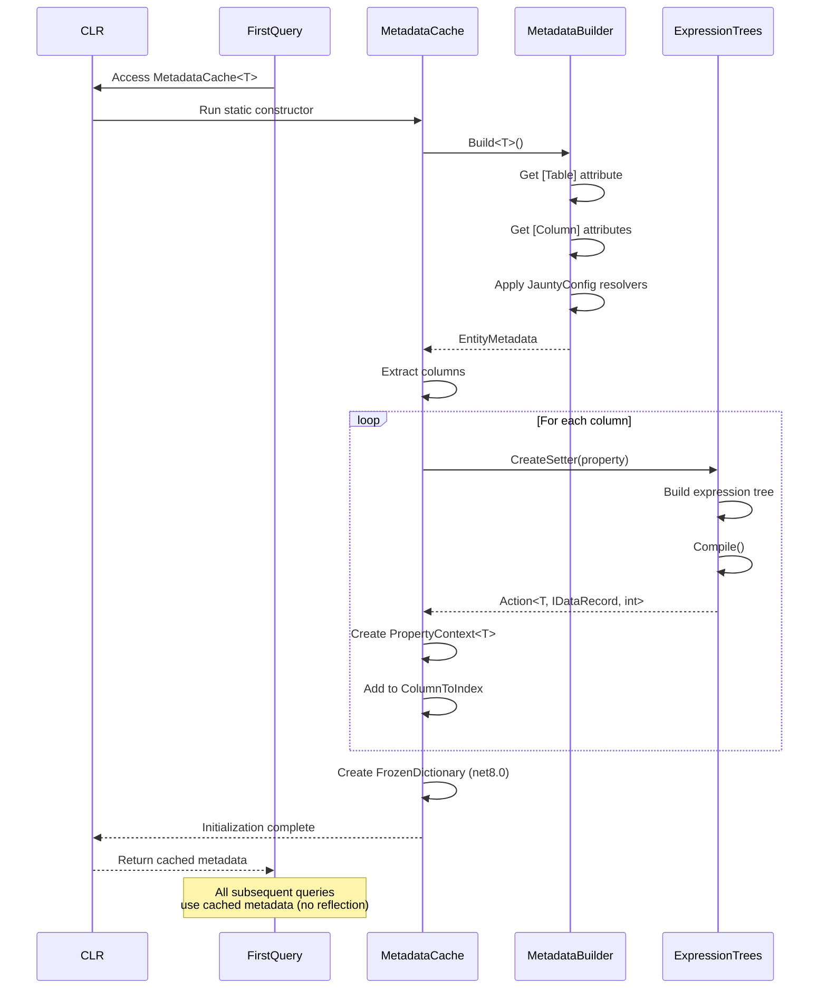

---

## Metadata Resolution

### Column Name Resolution Priority

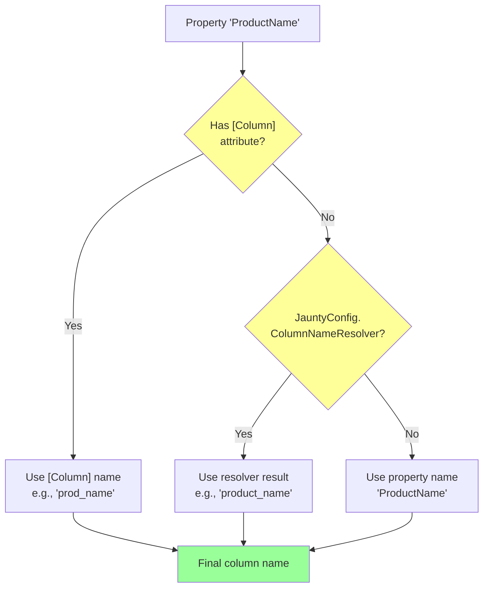

**Example**:

```csharp
public class Product
{
    // [Column] takes priority
    [Column("prod_id")]
    public int Id { get; set; }
    
    // JauntyConfig resolver applies (if no [Column])
    public string ProductName { get; set; }
    
    // JauntyConfig resolver applies
    public decimal Price { get; set; }
}

// With JauntyConfig.ColumnNameResolver = NamingConvention.ToSnakeCase
// Resolution:
// Id -> "prod_id" (from [Column])
// ProductName -> "product_name" (from resolver)
// Price -> "price" (from resolver)
```

---

## Expression Tree Compilation

### CreateSetter Process

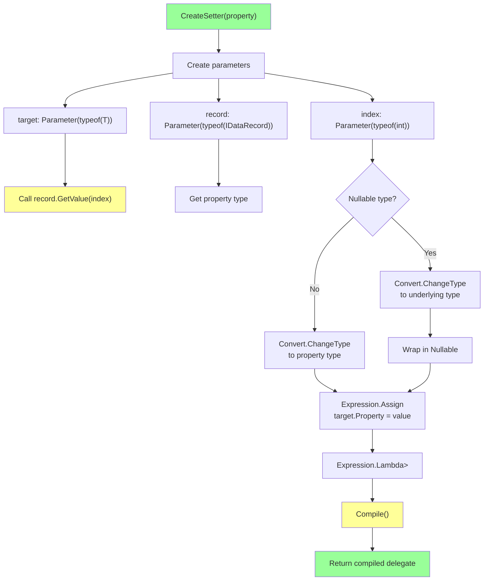

### Generated Expression Tree

```csharp
// For property: public int Id { get; set; }

// Generated lambda:
(T target, IDataRecord record, int index) =>
{
    target.Id = (int)Convert.ChangeType(
        record.GetValue(index),
        typeof(int)
    );
};

// Compiled to IL (no reflection at runtime):
IL_0000: ldarg.0  // target
IL_0001: ldarg.1  // record
IL_0002: ldarg.2  // index
IL_0003: callvirt IDataRecord.GetValue
IL_0008: ldclass typeof(int)
IL_000d: call Convert.ChangeType
IL_0012: unbox.any int
IL_0017: stfld Product.Id
```

---

## Getter/Setter Resolution

### GetSetters Flow

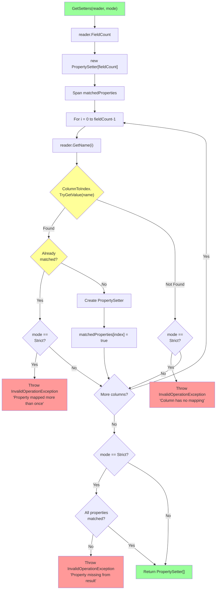

---

## NULL Handling

### NULL Resolution Flow

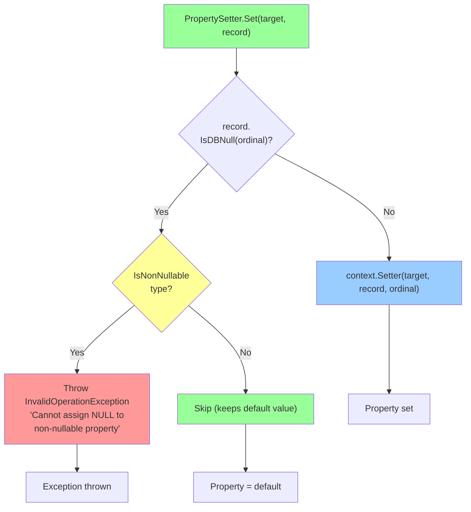

**Type Handling**:

| Type | NULL Behavior |
|------|---------------|
| `string` | Becomes `null` |
| `int?` | Becomes `null` |
| `DateTime?` | Becomes `null` |
| `int` | **Throws** `InvalidOperationException` |
| `DateTime` | **Throws** `InvalidOperationException` |
| `bool` | **Throws** `InvalidOperationException` |

---

## Configuration Interaction

### Static Caching Behavior

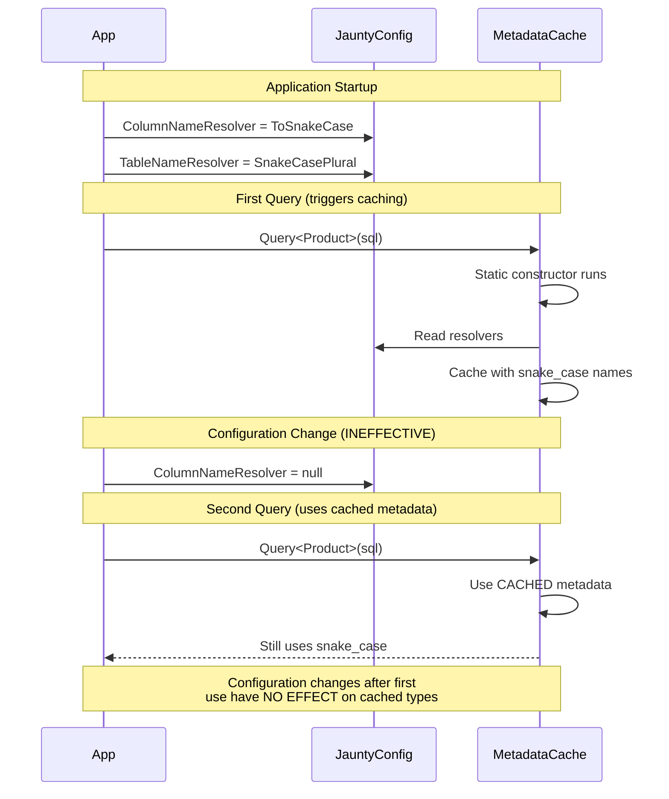

---

## Performance Characteristics

### Initialization Cost (One-Time per Type)

```mermaid
gantt
    title MetadataCache<T> Initialization Timeline
    dateFormat X
    axisFormat %Lms
    
    section Build
    MetadataBuilder.Build<T>     :0, 500
    Extract attributes           :50, 200
    Apply resolvers              :250, 100
    
    section Cache
    Create PropertyContext       :500, 1000
    Build expression trees       :600, 800
    Compile delegates            :1400, 2000
    Build ColumnToIndex          :3400, 500
    
    section Complete
    Ready for queries            :3900, 100
```

**Typical Cost**:
- Entity with 10 properties: ~1-5ms
- Entity with 50 properties: ~5-15ms

### Query Execution Cost (Per-Query)

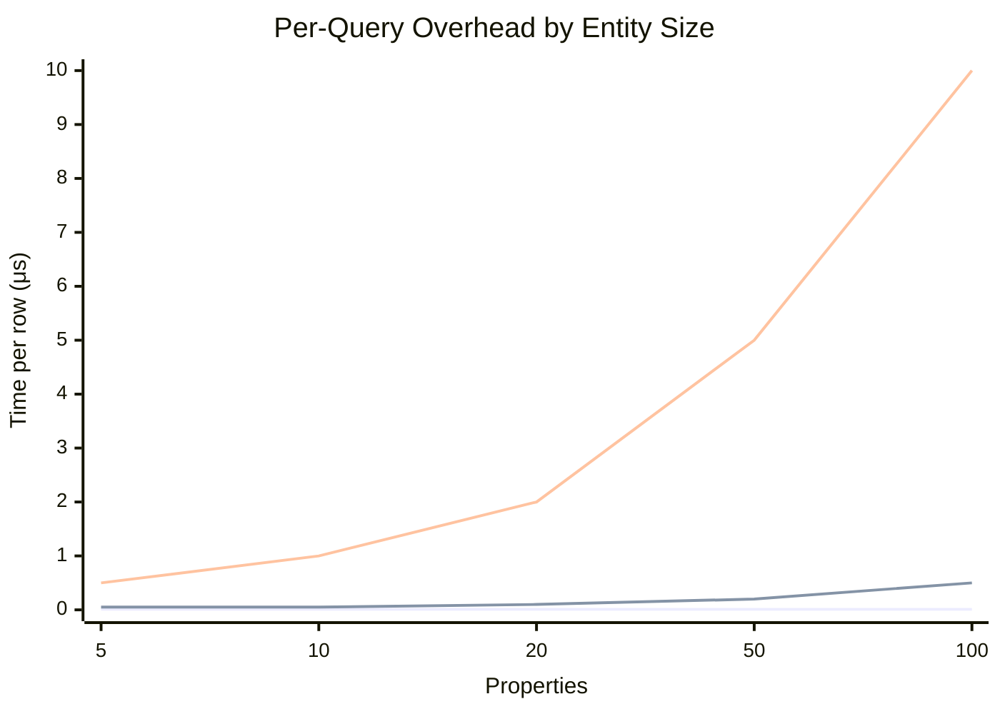

**Typical Cost**:
- Metadata lookup: O(1) - ~10ns
- Column-to-index lookup: O(1) - ~50ns (FrozenDictionary)
- Property setter invocation: O(1) - ~100ns per property

---

## Thread Safety

### Static Initialization Guarantee

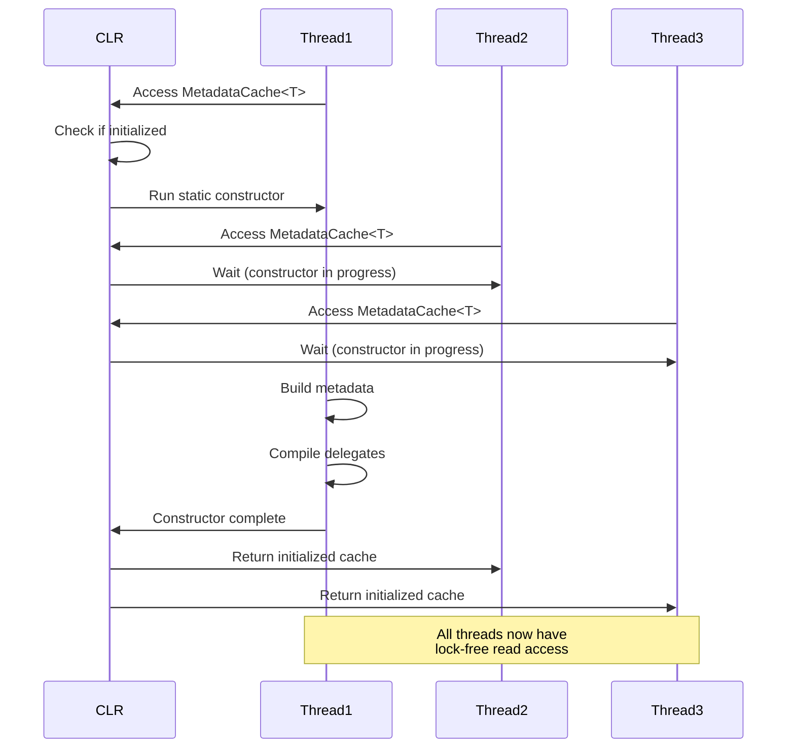

**Guarantees**:
- Static constructors are thread-safe by CLR guarantee
- Only one thread runs the constructor
- Other threads wait until initialization completes
- After initialization: lock-free reads (all fields are `readonly`)

---

## Extension Points

### IMapped<T> Override

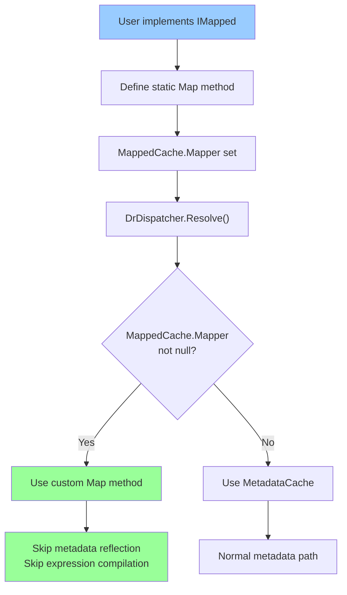

**Example**:

```csharp
public class Product : IMapped<Product>
{
    public int Id { get; set; }
    public string Name { get; set; }
    public decimal Price { get; set; }
    
    // Custom mapping - bypasses MetadataCache
    public static void Map(ref Product target, IDataReader reader, int columnIndex)
    {
        target.Id = reader.GetInt32(columnIndex);
        target.Name = reader.GetString(columnIndex + 1);
        target.Price = reader.GetDecimal(columnIndex + 2);
    }
}
```

---

## Error Handling

### Error Scenarios

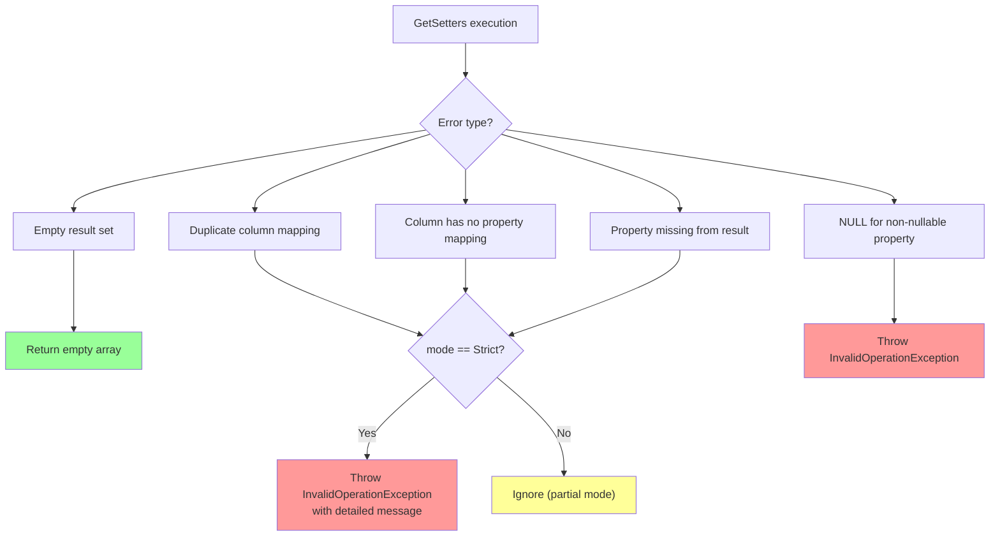

### Error Message Examples

```
┌─────────────────────────────────────────────────────────────────┐
│ Strict mapping failed: property 'Price' (mapped to column      │
│ 'price') was missing from the result set.                       │
│                                                                 │
│ Type: MyApp.Product                                             │
│ SQL columns: [id, name, category_id]                           │
│ Missing properties: [Price]                                     │
└─────────────────────────────────────────────────────────────────┘

┌─────────────────────────────────────────────────────────────────┐
│ Strict mapping failed: Property 'Name' was mapped more than    │
│ once from the result set.                                       │
│                                                                 │
│ Type: MyApp.Product                                             │
│ Duplicate column: 'name' appears at positions 1 and 3          │
└─────────────────────────────────────────────────────────────────┘

┌─────────────────────────────────────────────────────────────────┐
│ Cannot assign NULL to non-nullable property 'Id' on type       │
│ 'Product'.                                                      │
│                                                                 │
│ Column: 'id' (ordinal: 0)                                       │
│ Value: DBNull                                                   │
└─────────────────────────────────────────────────────────────────┘
```

---

## See Also

| Document | Purpose |
|----------|---------|
| [`architecture-specification.md`](architecture-specification.md) | Full architecture |
| [`parameter-binding-spec.md`](parameter-binding-spec.md) | Parameter binding |
| [`performance-spec.md`](performance-spec.md) | Performance optimization |
| [`../../01-api-reference/attributes.md`](../../01-api-reference/attributes.md) | Mapping attributes |
| [`../../01-api-reference/configuration.md`](../../01-api-reference/configuration.md) | JauntyConfig |
