# Metadata System Specification

**Version**: 2026.02.19  
**Status**: Active

> The metadata system is the foundation of Jaunty's performance. It builds and caches entity metadata once per type, eliminating reflection at query execution time.

---

## Overview

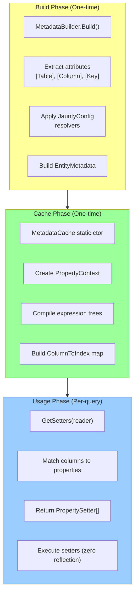
```mermaid
flowchart TD
    subgraph Build["Build Phase (One-time)"]
        A1["MetadataBuilder.Build<T>()"]
        A2["Extract attributes<br/>[Table], [Column], [Key]"]
        A3["Apply JauntyConfig<br/>resolvers"]
        A4["Build EntityMetadata"]
    end
    
    subgraph Cache["Cache Phase (One-time)"]
        B1["MetadataCache<T> static ctor"]
        B2["Create PropertyContext<T>"]
        B3["Compile expression trees"]
        B4["Build ColumnToIndex map"]
    end
    
    subgraph Use["Usage Phase (Per-query)"]
        C1["GetSetters(reader)"]
        C2["Match columns to properties"]
        C3["Return PropertySetter<T>[]"]
        C4["Execute setters (zero reflection)"]
    end
    
    Build --> Cache
    Cache --> Use
    
    style Build fill:#ff9
    style Cache fill:#9f9
    style Use fill:#9cf
```

**Key Characteristics**:
- **Build Phase**: Runs once per type, uses reflection
- **Cache Phase**: Compiles delegates, stores in static fields
- **Usage Phase**: Zero reflection, O(1) lookups

---

## Component Architecture

### System Component Diagram

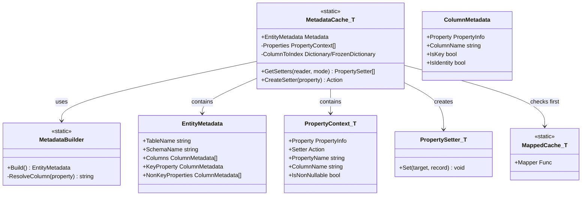
```mermaid
classDiagram
    class MetadataCache_T {
        <<static>>
        +EntityMetadata Metadata
        +GetSetters(reader, mode) PropertySetter<T>[]
        -Properties PropertyContext<T>[]
        -ColumnToIndex Dictionary/FrozenDictionary
        +CreateSetter(property) Action<T, IDataRecord, int>
    }
    
    class MetadataBuilder {
        <<static>>
        +Build<T>() EntityMetadata
        -ResolveColumn(property) string
    }
    
    class EntityMetadata {
        +TableName string
        +SchemaName string
        +Columns ColumnMetadata[]
        +KeyProperty ColumnMetadata
        +NonKeyProperties ColumnMetadata[]
    }
    
    class ColumnMetadata {
        +Property PropertyInfo
        +ColumnName string
        +IsKey bool
        +IsIdentity bool
    }
    
    class PropertyContext_T {
        +Property PropertyInfo
        +Setter Action<T, IDataRecord, int>
        +PropertyName string
        +ColumnName string
        +IsNonNullable bool
    }
    
    class PropertySetter_T {
        +Set(target, record) void
    }
    
    class MappedCache_T {
        <<static>>
        +Mapper Func<IDataReader, T>
    }
    
    MetadataCache_T --> MetadataBuilder : uses
    MetadataCache_T --> EntityMetadata : contains
    MetadataCache_T --> PropertyContext_T : contains
    MetadataCache_T --> PropertySetter_T : creates
    MetadataCache_T --> MappedCache_T : checks first
```

---

## Initialization Flow

### Static Constructor Sequence

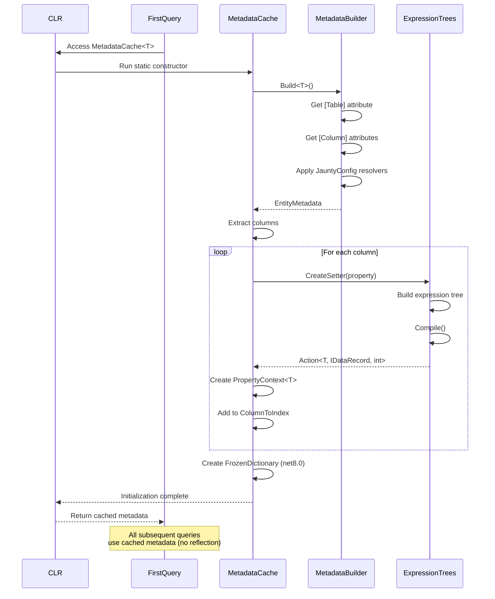
```mermaid
sequenceDiagram
    participant CLR
    participant FirstQuery
    participant MetadataCache
    participant MetadataBuilder
    participant ExpressionTrees
    
    FirstQuery->>CLR: Access MetadataCache<T>
    CLR->>MetadataCache: Run static constructor
    
    MetadataCache->>MetadataBuilder: Build<T>()
    MetadataBuilder->>MetadataBuilder: Get [Table] attribute
    MetadataBuilder->>MetadataBuilder: Get [Column] attributes
    MetadataBuilder->>MetadataBuilder: Apply JauntyConfig resolvers
    MetadataBuilder-->>MetadataCache: EntityMetadata
    
    MetadataCache->>MetadataCache: Extract columns
    loop For each column
        MetadataCache->>ExpressionTrees: CreateSetter(property)
        ExpressionTrees->>ExpressionTrees: Build expression tree
        ExpressionTrees->>ExpressionTrees: Compile()
        ExpressionTrees-->>MetadataCache: Action<T, IDataRecord, int>
        MetadataCache->>MetadataCache: Create PropertyContext<T>
        MetadataCache->>MetadataCache: Add to ColumnToIndex
    end
    
    MetadataCache->>MetadataCache: Create FrozenDictionary (net8.0)
    MetadataCache-->>CLR: Initialization complete
    CLR-->>FirstQuery: Return cached metadata
    
    Note over FirstQuery: All subsequent queries<br/>use cached metadata (no reflection)
```

---

## Metadata Resolution

### Name Resolution Order

Every table, schema and column name is resolved in one order, by one function
(`NameResolution` in `src/Extrode.Jaunty/Internals/Entity/`). Reflection mapping
(`MetadataBuilder`) and source-generated mapping (`GeneratedNameCache`) both call it, so an entity
gets the same names whichever path maps it.

| Name | 1st: attribute, if its name is non-empty | 2nd: resolver, if set and it returns non-null | 3rd: default |
|---|---|---|---|
| Table | `[Table(name)]`: Jaunty's if present, otherwise DataAnnotations' | `JauntyConfig.TableNameResolver(type)` | C# type name |
| Schema | the schema of that same `[Table]` (constructor argument or `Schema =`) | `JauntyConfig.SchemaNameResolver(type)` | none: the name is emitted unqualified |
| Column | Jaunty `[Column(name)]`, otherwise DataAnnotations `[Column(name)]` | `JauntyConfig.ColumnNameResolver(propertyName)` | C# property name |

Three rules:
- An empty attribute name, such as `[Table("")]` or `[Column("")]`, names nothing, so resolution
  falls through to the resolver.
- A resolver is called only when no attribute name applies.
- A resolver that returns `null` falls through to the default. One that returns `""` is used as
  given.

#### Table name

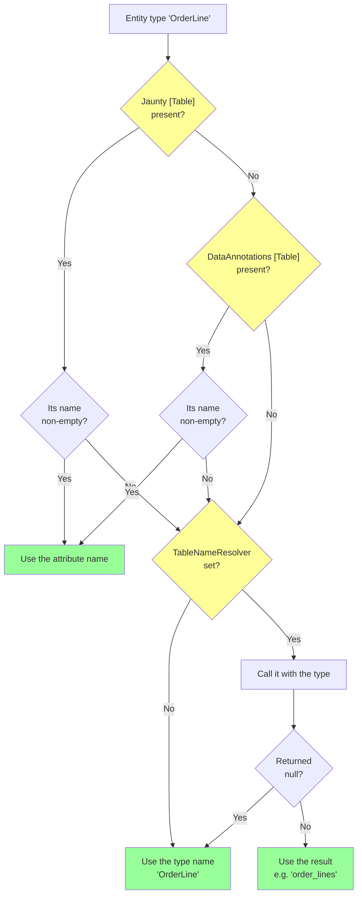
```mermaid
flowchart TD
    Start["Entity type 'OrderLine'"] --> J{"Jaunty [Table]<br/>present?"}
    J -->|Yes| JN{"Its name<br/>non-empty?"}
    J -->|No| D{"DataAnnotations [Table]<br/>present?"}
    D -->|Yes| DN{"Its name<br/>non-empty?"}
    D -->|No| R
    JN -->|Yes| UseAttr["Use the attribute name"]
    JN -->|No| R
    DN -->|Yes| UseAttr
    DN -->|No| R{"TableNameResolver<br/>set?"}
    R -->|No| UseType["Use the type name<br/>'OrderLine'"]
    R -->|Yes| Call["Call it with the type"]
    Call --> Null{"Returned<br/>null?"}
    Null -->|Yes| UseType
    Null -->|No| UseResult["Use the result<br/>e.g. 'order_lines'"]

    style J fill:#ff9
    style D fill:#ff9
    style R fill:#ff9
    style UseAttr fill:#9f9
    style UseType fill:#9f9
    style UseResult fill:#9f9
```

#### Schema name

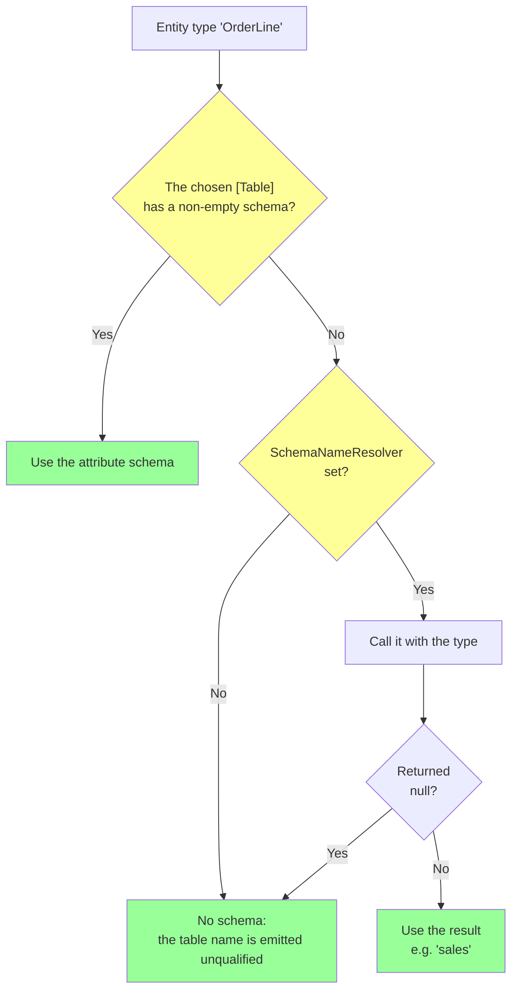
```mermaid
flowchart TD
    Start["Entity type 'OrderLine'"] --> T{"The chosen [Table]<br/>has a non-empty schema?"}
    T -->|Yes| UseAttr["Use the attribute schema"]
    T -->|No| R{"SchemaNameResolver<br/>set?"}
    R -->|No| None["No schema:<br/>the table name is emitted unqualified"]
    R -->|Yes| Call["Call it with the type"]
    Call --> Null{"Returned<br/>null?"}
    Null -->|Yes| None
    Null -->|No| UseResult["Use the result<br/>e.g. 'sales'"]

    style T fill:#ff9
    style R fill:#ff9
    style UseAttr fill:#9f9
    style None fill:#9f9
    style UseResult fill:#9f9
```

The database resolves an unqualified name itself; see
[schema qualification](../01-api-reference/schemas.md).

#### Column name

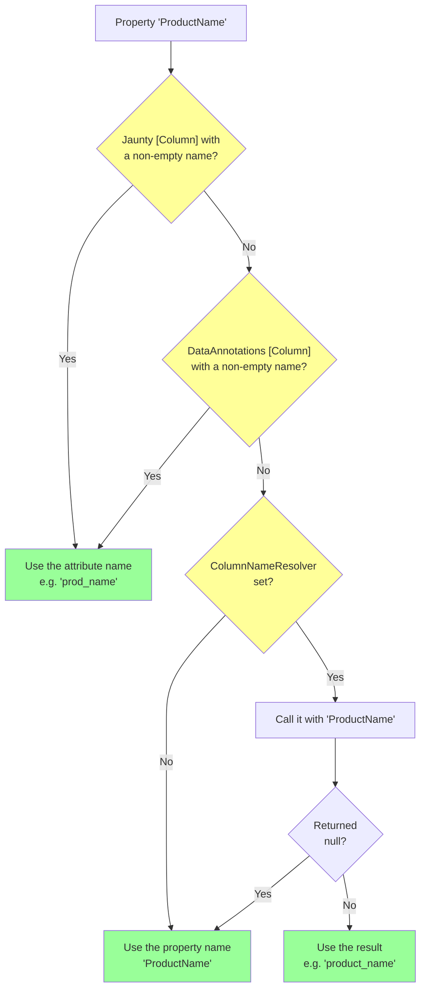
```mermaid
flowchart TD
    Prop["Property 'ProductName'"] --> J{"Jaunty [Column] with<br/>a non-empty name?"}
    J -->|Yes| UseAttr["Use the attribute name<br/>e.g. 'prod_name'"]
    J -->|No| D{"DataAnnotations [Column]<br/>with a non-empty name?"}
    D -->|Yes| UseAttr
    D -->|No| R{"ColumnNameResolver<br/>set?"}
    R -->|No| UseProp["Use the property name<br/>'ProductName'"]
    R -->|Yes| Call["Call it with 'ProductName'"]
    Call --> Null{"Returned<br/>null?"}
    Null -->|Yes| UseProp
    Null -->|No| UseResult["Use the result<br/>e.g. 'product_name'"]

    style J fill:#ff9
    style D fill:#ff9
    style R fill:#ff9
    style UseAttr fill:#9f9
    style UseProp fill:#9f9
    style UseResult fill:#9f9
```

#### When the names are resolved

Reflection mapping resolves names when it builds an entity's metadata. Source-generated mapping
resolves them at runtime too, not at build time. The generator bakes in only the attribute names,
and leaves the rest to `GeneratedNameCache`, which keeps one set of resolved names per
configuration generation. Setting any `JauntyConfig` resolver starts a new generation, so the next
query on either path picks up the new names.

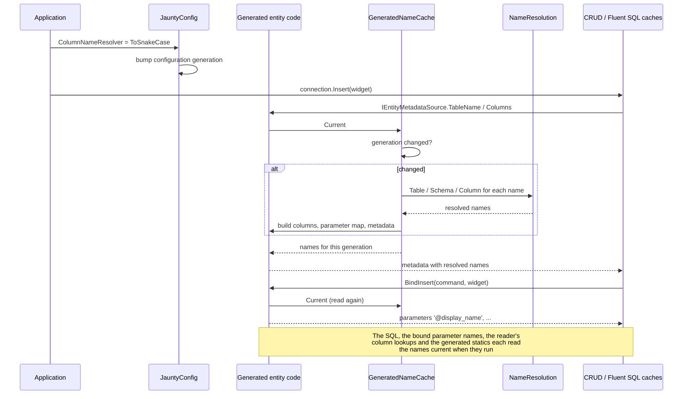
```mermaid
sequenceDiagram
    participant App as Application
    participant Cfg as JauntyConfig
    participant Gen as Generated entity code
    participant Cache as GeneratedNameCache
    participant NR as NameResolution
    participant Core as CRUD / Fluent SQL caches

    App->>Cfg: ColumnNameResolver = ToSnakeCase
    Cfg->>Cfg: bump configuration generation
    App->>Core: connection.Insert(widget)
    Core->>Gen: IEntityMetadataSource.TableName / Columns
    Gen->>Cache: Current
    Cache->>Cache: generation changed?
    alt changed
        Cache->>NR: Table / Schema / Column for each name
        NR-->>Cache: resolved names
        Cache->>Gen: build columns, parameter map, metadata
    end
    Cache-->>Gen: names for this generation
    Gen-->>Core: metadata with resolved names
    Core->>Gen: BindInsert(command, widget)
    Gen->>Cache: Current (read again)
    Gen-->>Core: parameters '@display_name', ...
    Note over Core,Gen: The SQL, the bound parameter names, the reader's<br/>column lookups and the generated statics each read<br/>the names current when they run
```

With no resolver change, a read costs one generation compare, and every step of an operation
sees the same names. A resolver set while an operation is between building its SQL and
binding or reading can pair the old SQL with the new names and fail; set resolvers at startup,
before commands run (see `JauntyConfig` thread safety).

A resolver that maps two properties of one entity to the same column (compared
case-insensitively) is rejected with an `ArgumentException` on both paths. Entities compiled
against a package older than this order keep their build-time names until rebuilt.

**Example**:

```csharp
[Table("")]                      // empty: names nothing, the resolver applies
public partial class OrderLine
{
    [Key]
    public int OrderLineId { get; set; }

    [Column("prod_name")]        // attribute wins over the resolver
    public string ProductName { get; set; } = "";

    public decimal UnitPrice { get; set; }
}

JauntyConfig.TableNameResolver = type => ToSnakeCase(type.Name) + "s";   // your own helper
JauntyConfig.ColumnNameResolver = ToSnakeCase;
```

| Member | Name, reflection or source-generated |
|---|---|
| table | `order_lines` (resolver) |
| `OrderLineId` | `order_line_id` (resolver) |
| `ProductName` | `prod_name` (`[Column]`) |
| `UnitPrice` | `unit_price` (resolver) |

With no resolvers set, the same entity maps to table `OrderLine` with columns `OrderLineId`,
`prod_name` and `UnitPrice`.

FlatFiles does not use this order. It names tables through its own `TableNameResolver`: the
`[Table]` name if the class has one, otherwise the lowercased class name, and it ignores all three
`JauntyConfig` resolvers.

---

## Expression Tree Compilation

### CreateSetter Process

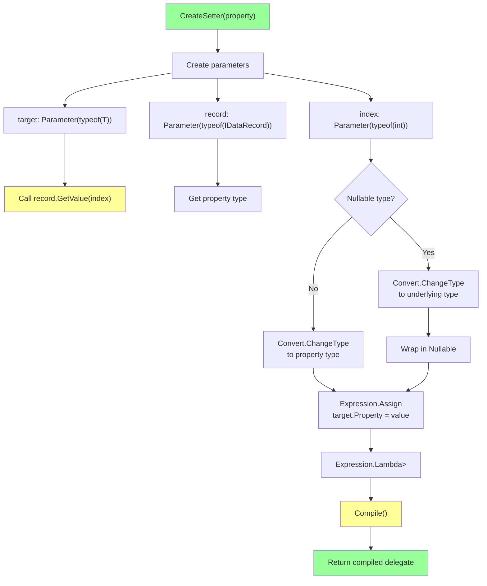
```mermaid
flowchart TD
    Start["CreateSetter(property)"] --> Params["Create parameters"]
    
    Params --> P1["target: Parameter(typeof(T))"]
    Params --> P2["record: Parameter(typeof(IDataRecord))"]
    Params --> P3["index: Parameter(typeof(int))"]
    
    P1 --> GetValue["Call record.GetValue(index)"]
    P2 --> GetType["Get property type"]
    P3 --> CheckNull{"Nullable type?"}
    
    CheckNull -->|Yes| ConvNull["Convert.ChangeType<br/>to underlying type"]
    CheckNull -->|No| ConvNotNull["Convert.ChangeType<br/>to property type"]
    
    ConvNull --> Wrap["Wrap in Nullable<T>"]
    ConvNotNull --> Assign
    
    Wrap --> Assign["Expression.Assign<br/>target.Property = value"]
    Assign --> Lambda["Expression.Lambda<Action<T, IDataRecord, int>>"]
    Lambda --> Compile["Compile()"]
    Compile --> Return["Return compiled delegate"]
    
    style Start fill:#9f9
    style Return fill:#9f9
    style GetValue fill:#ff9
    style Compile fill:#ff9
```

### Generated Expression Tree

```csharp
// For property: public int Id { get; set; }

// Generated lambda:
(T target, IDataRecord record, int index) =>
{
    target.Id = (int)Convert.ChangeType(
        record.GetValue(index),
        typeof(int)
    );
};

// Compiled to IL (no reflection at runtime):
IL_0000: ldarg.0  // target
IL_0001: ldarg.1  // record
IL_0002: ldarg.2  // index
IL_0003: callvirt IDataRecord.GetValue
IL_0008: ldclass typeof(int)
IL_000d: call Convert.ChangeType
IL_0012: unbox.any int
IL_0017: stfld Product.Id
```

---

## Getter/Setter Resolution

### GetSetters Flow

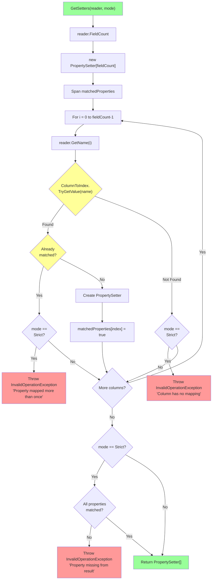
```mermaid
flowchart TD
    Start["GetSetters(reader, mode)"] --> GetCount["reader.FieldCount"]
    GetCount --> Alloc["new PropertySetter<T>[fieldCount]"]
    Alloc --> InitSpan["Span<bool> matchedProperties"]
    
    InitSpan --> Loop["For i = 0 to fieldCount-1"]
    
    Loop --> GetName["reader.GetName(i)"]
    GetName --> Lookup{"ColumnToIndex.<br/>TryGetValue(name)"}
    
    Lookup -->|Found| CheckMatched{"Already<br/>matched?"}
    Lookup -->|Not Found| StrictCheck{"mode ==<br/>Strict?"}
    
    CheckMatched -->|Yes| StrictMatch{"mode ==<br/>Strict?"}
    CheckMatched -->|No| CreateSetter["Create PropertySetter<T>"]
    
    StrictMatch -->|Yes| ThrowDup["Throw: duplicate mapping"]
    StrictMatch -->|No| Continue
    
    StrictCheck -->|Yes| ThrowMissing["Throw: no mapping"]
    StrictCheck -->|No| Continue
    
    CreateSetter --> MarkMatched["matchedProperties[index] = true"]
    MarkMatched --> Continue{"More columns?"}
    Continue -->|Yes| Loop
    Continue -->|No| CheckAllMatched
    
    CheckAllMatched{"mode == Strict?"} -->|Yes| VerifyAll
    CheckAllMatched -->|No| Return
    
    VerifyAll{"All properties<br/>matched?"} -->|No| ThrowMissingProp
    VerifyAll -->|Yes| Return
    
    ThrowDup["Throw InvalidOperationException<br/>'Property mapped more than once'"]
    ThrowMissing["Throw InvalidOperationException<br/>'Column has no mapping'"]
    ThrowMissingProp["Throw InvalidOperationException<br/>'Property missing from result'"]
    
    Return["Return PropertySetter<T>[]"]
    
    style Start fill:#9f9
    style Return fill:#9f9
    style ThrowDup fill:#f99
    style ThrowMissing fill:#f99
    style ThrowMissingProp fill:#f99
    style Lookup fill:#ff9
    style CheckMatched fill:#ff9
```

---

## NULL Handling

### NULL Resolution Flow

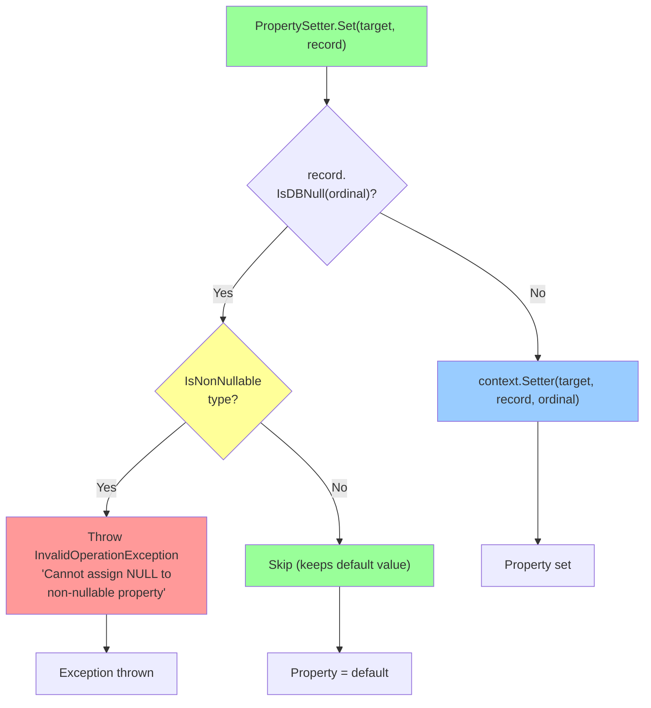
```mermaid
flowchart TD
    Start["PropertySetter.Set(target, record)"] --> CheckNull{"record.<br/>IsDBNull(ordinal)?"}
    
    CheckNull -->|No| SetValue["context.Setter(target, record, ordinal)"]
    CheckNull -->|Yes| CheckType{"IsNonNullable<br/>type?"}
    
    CheckType -->|Yes| Throw["Throw InvalidOperationException<br/>'Cannot assign NULL to<br/>non-nullable property'"]
    CheckType -->|No| Skip["Skip (keeps default value)"]
    
    SetValue --> Done["Property set"]
    Skip --> Done2["Property = default"]
    Throw --> Error["Exception thrown"]
    
    style Start fill:#9f9
    style SetValue fill:#9cf
    style CheckType fill:#ff9
    style Throw fill:#f99
    style Skip fill:#9f9
```

**Type Handling**:

| Type | NULL Behavior |
|------|---------------|
| `string` | Becomes `null` |
| `int?` | Becomes `null` |
| `DateTime?` | Becomes `null` |
| `int` | **Throws** `InvalidOperationException` |
| `DateTime` | **Throws** `InvalidOperationException` |
| `bool` | **Throws** `InvalidOperationException` |

---

## Configuration Interaction

### Static Caching Behavior

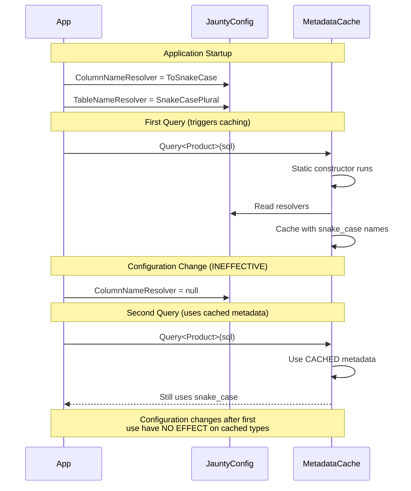
```mermaid
sequenceDiagram
    participant App
    participant JauntyConfig
    participant MetadataCache
    
    Note over App,MetadataCache: Application Startup
    
    App->>JauntyConfig: ColumnNameResolver = ToSnakeCase
    App->>JauntyConfig: TableNameResolver = SnakeCasePlural
    
    Note over App,MetadataCache: First Query (triggers caching)
    
    App->>MetadataCache: Query<Product>(sql)
    MetadataCache->>MetadataCache: Static constructor runs
    MetadataCache->>JauntyConfig: Read resolvers
    MetadataCache->>MetadataCache: Cache with snake_case names
    
    Note over App,MetadataCache: Configuration Change (INEFFECTIVE)
    
    App->>JauntyConfig: ColumnNameResolver = null
    
    Note over App,MetadataCache: Second Query (uses cached metadata)
    
    App->>MetadataCache: Query<Product>(sql)
    MetadataCache->>MetadataCache: Use CACHED metadata
    MetadataCache-->>App: Still uses snake_case
    
    Note over App,MetadataCache: Configuration changes after first<br/>use have NO EFFECT on cached types
```

---

## Performance Characteristics

### Initialization Cost (One-Time per Type)


```mermaid
gantt
    title MetadataCache<T> Initialization Timeline
    dateFormat X
    axisFormat %Lms
    
    section Build
    MetadataBuilder.Build<T>     :0, 500
    Extract attributes           :50, 200
    Apply resolvers              :250, 100
    
    section Cache
    Create PropertyContext       :500, 1000
    Build expression trees       :600, 800
    Compile delegates            :1400, 2000
    Build ColumnToIndex          :3400, 500
    
    section Complete
    Ready for queries            :3900, 100
```

**Typical Cost**:
- Entity with 10 properties: ~1-5ms
- Entity with 50 properties: ~5-15ms

### Query Execution Cost (Per-Query)

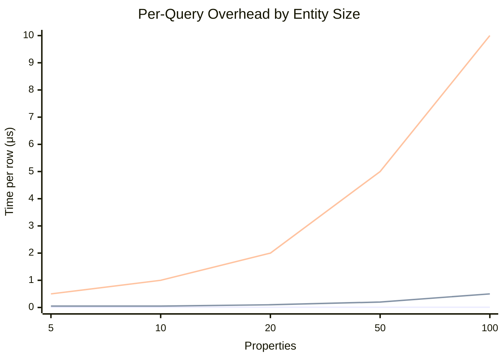
```mermaid
xychart-beta
    title "Per-Query Overhead by Entity Size"
    x-axis "Properties" [5, 10, 20, 50, 100]
    y-axis "Time per row (μs)" 0 --> 10
    line "Metadata lookup" [0.01, 0.01, 0.01, 0.01, 0.01]
    line "ColumnToIndex lookup" [0.05, 0.05, 0.1, 0.2, 0.5]
    line "Property setters" [0.5, 1, 2, 5, 10]
```

**Typical Cost**:
- Metadata lookup: O(1) - ~10ns
- Column-to-index lookup: O(1) - ~50ns (FrozenDictionary)
- Property setter invocation: O(1) - ~100ns per property

---

## Thread Safety

### Static Initialization Guarantee

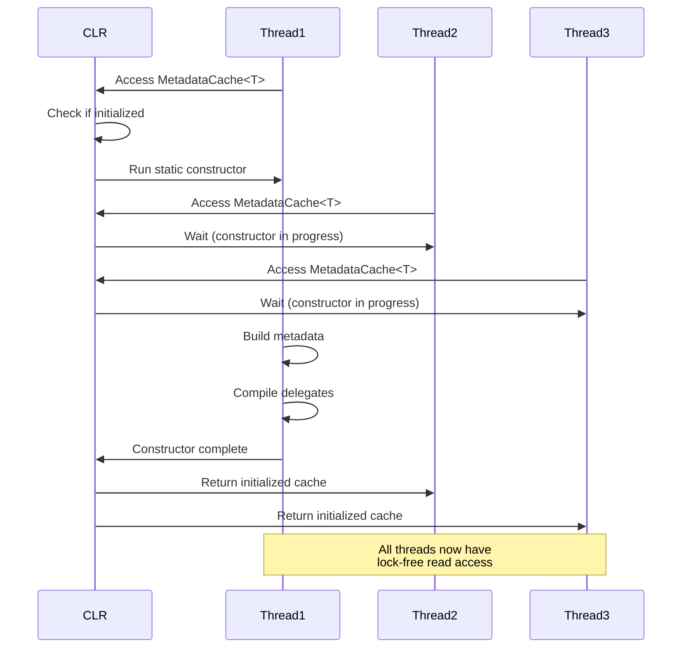
```mermaid
sequenceDiagram
    participant CLR
    participant Thread1
    participant Thread2
    participant Thread3
    
    Thread1->>CLR: Access MetadataCache<T>
    CLR->>CLR: Check if initialized
    CLR->>Thread1: Run static constructor
    
    Thread2->>CLR: Access MetadataCache<T>
    CLR->>Thread2: Wait (constructor in progress)
    
    Thread3->>CLR: Access MetadataCache<T>
    CLR->>Thread3: Wait (constructor in progress)
    
    Thread1->>Thread1: Build metadata
    Thread1->>Thread1: Compile delegates
    
    Thread1->>CLR: Constructor complete
    CLR->>Thread2: Return initialized cache
    CLR->>Thread3: Return initialized cache
    
    Note over Thread1,Thread3: All threads now have<br/>lock-free read access
```

**Guarantees**:
- Static constructors are thread-safe by CLR guarantee
- Only one thread runs the constructor
- Other threads wait until initialization completes
- After initialization: lock-free reads (all fields are `readonly`)

---

## Extension Points

### IMapped<T> Override

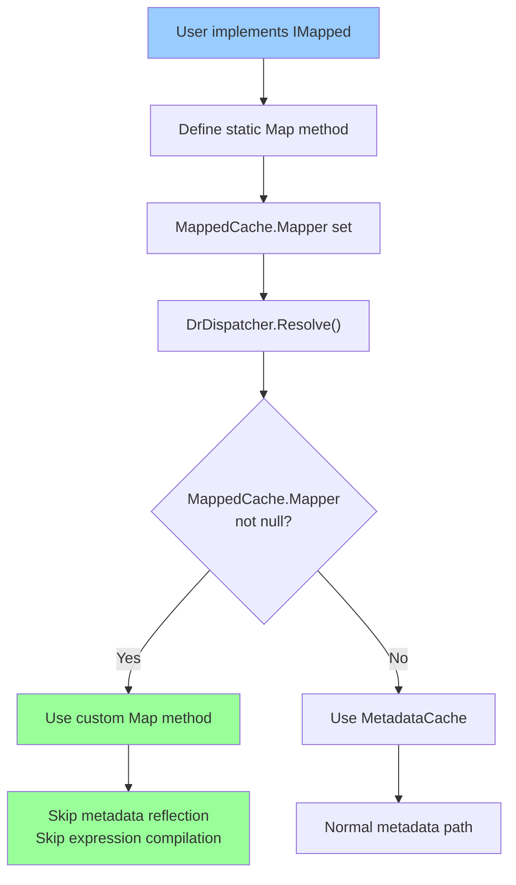
```mermaid
flowchart TD
    User["User implements IMapped<T>"] --> Define["Define static Map method"]
    Define --> Cache["MappedCache<T>.Mapper set"]
    Cache --> DrDisp["DrDispatcher.Resolve<T>()"]
    
    DrDisp --> Check{"MappedCache<T>.Mapper<br/>not null?"}
    Check -->|Yes| UseCustom["Use custom Map method"]
    Check -->|No| UseMetadata["Use MetadataCache<T>"]
    
    UseCustom --> Skip["Skip metadata reflection<br/>Skip expression compilation"]
    UseMetadata --> Normal["Normal metadata path"]
    
    style User fill:#9cf
    style UseCustom fill:#9f9
    style Skip fill:#9f9
```

**Example**:

```csharp
public class Product : IMapped<Product>
{
    public int Id { get; set; }
    public string Name { get; set; }
    public decimal Price { get; set; }
    
    // Custom mapping - bypasses MetadataCache
    public static void Map(ref Product target, IDataReader reader, int columnIndex)
    {
        target.Id = reader.GetInt32(columnIndex);
        target.Name = reader.GetString(columnIndex + 1);
        target.Price = reader.GetDecimal(columnIndex + 2);
    }
}
```

---

## Error Handling

### Error Scenarios

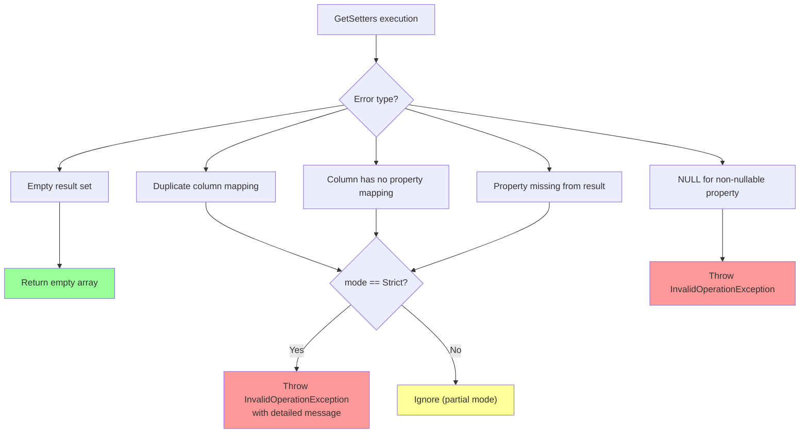
```mermaid
flowchart TD
    Start["GetSetters execution"] --> Error{"Error type?"}
    
    Error --> EmptyResult["Empty result set"]
    Error --> DupMapping["Duplicate column mapping"]
    Error --> MissingMapping["Column has no property mapping"]
    Error --> MissingProp["Property missing from result"]
    Error --> NullNonNullable["NULL for non-nullable property"]
    
    EmptyResult --> ReturnEmpty["Return empty array"]
    DupMapping --> ThrowStrict{"mode == Strict?"}
    MissingMapping --> ThrowStrict
    MissingProp --> ThrowStrict
    NullNonNullable --> ThrowAlways["Throw InvalidOperationException"]
    
    ThrowStrict -->|Yes| Throw["Throw InvalidOperationException<br/>with detailed message"]
    ThrowStrict -->|No| Ignore["Ignore (partial mode)"]
    
    style ReturnEmpty fill:#9f9
    style Throw fill:#f99
    style ThrowAlways fill:#f99
    style Ignore fill:#ff9
```

### Error Message Examples

```
┌─────────────────────────────────────────────────────────────────┐
│ Strict mapping failed: property 'Price' (mapped to column      │
│ 'price') was missing from the result set.                       │
│                                                                 │
│ Type: MyApp.Product                                             │
│ SQL columns: [id, name, category_id]                           │
│ Missing properties: [Price]                                     │
└─────────────────────────────────────────────────────────────────┘

┌─────────────────────────────────────────────────────────────────┐
│ Strict mapping failed: Property 'Name' was mapped more than    │
│ once from the result set.                                       │
│                                                                 │
│ Type: MyApp.Product                                             │
│ Duplicate column: 'name' appears at positions 1 and 3          │
└─────────────────────────────────────────────────────────────────┘

┌─────────────────────────────────────────────────────────────────┐
│ Cannot assign NULL to non-nullable property 'Id' on type       │
│ 'Product'.                                                      │
│                                                                 │
│ Column: 'id' (ordinal: 0)                                       │
│ Value: DBNull                                                   │
└─────────────────────────────────────────────────────────────────┘
```

---

## See Also

| Document | Purpose |
|----------|---------|
| [`architecture-specification.md`](architecture-specification.md) | Full architecture |
| [`parameter-binding-spec.md`](parameter-binding-spec.md) | Parameter binding |
| [`performance-spec.md`](performance-spec.md) | Performance optimization |
| [`../../01-api-reference/attributes.md`](../01-api-reference/attributes.md) | Mapping attributes |
| [`../../01-api-reference/configuration.md`](../01-api-reference/configuration.md) | JauntyConfig |
