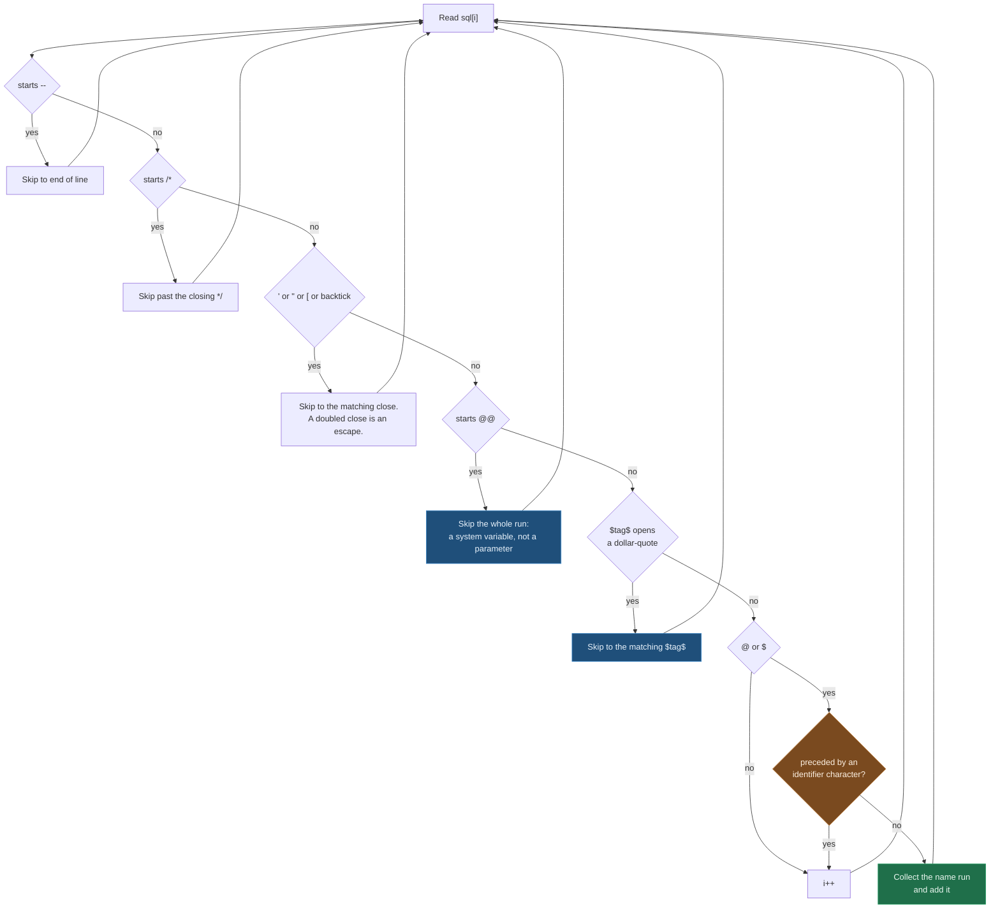

# Parameter Binding Specification

**Version**: 2026.02.19  
**Status**: Active

---

## Overview

Jaunty's parameter binding system extracts parameter names from SQL, validates counts, and binds object properties to `DbCommand.Parameters`.

---

## Components

### 1. SqlParameterParser

**Purpose**: single-pass scanner that extracts `@name` and `$name` placeholders from SQL,
skipping everything that only looks like one.

**Location**: `src/Jaunty/Internals/Parameters/SqlParameterParser.cs`

There is no state variable. The scanner is one loop over the characters, and every construct it
recognizes is skipped by a helper that returns the index just past that construct, so a comment or a
literal is jumped over rather than walked in a different mode. The order of the tests below is the
order in the source, and it matters: dollar-quoting has to be tried before `$` is read as a sigil,
or the body of `$$SELECT 1$$` is scanned as ordinary SQL and `SELECT` comes back as a parameter
name.



### What gets skipped, and what each one is protecting against

| construct | closed by | without this rule |
|---|---|---|
| `-- comment` | newline or carriage return | `-- @NotAParam` becomes a parameter |
| `/* comment */` | `*/`, or end of input | as above, across lines |
| `'literal'` | `'`, doubled to escape | `'@NotAParam'` becomes a parameter |
| `"identifier"` | `"`, doubled to escape | as above |
| `[identifier]` | `]`, doubled to escape | as above; no backslash rule here |
| `` `identifier` `` | `` ` ``, doubled to escape | `` `it's` `` opens a phantom literal that swallows the rest of the statement, losing every later parameter |
| `@@IDENTITY` | end of the name run | `@@ROWCOUNT` is reported as a parameter named `IDENTITY` |
| `$tag$body$tag$` | the matching `$tag$` | identifier-shaped runs inside a PostgreSQL function body are read as parameters |

An unterminated construct skips to the end of the input rather than falling back to normal scanning.
That loses the parameters after it, which is the safe direction: the alternative is to report
parameters that the database will not see, and the count check then passes on SQL that fails.

**Backslash escaping is off by default and is a MySQL/MariaDB concession.** `ExtractParameterNames`
takes `backslashEscapes`, and the walker passes it through for single-quoted and double-quoted
constructs; bracket and backtick quoting are pinned to `false` regardless. Every other engine
treats a literal ending in a backslash as complete, so applying the rule there would swallow the
closing quote and take the rest of the statement with it.

### The sigil rule

A `@` or `$` counts as a placeholder only when the character before it is not an identifier
character. `IsParameterChar` is ASCII letters, digits and underscore, and nothing else, which is
what makes `user@domain` and `a$b` stay whole instead of yielding parameters named `domain` and `b`.
The rule has a `string` and a `ReadOnlySpan<char>` overload with the same body; they are asserted to
agree.

### Duplicates are returned, not deduplicated

```csharp
ExtractParameterNames("SELECT * FROM products WHERE name = @Name OR supplier = @Name")
// Returns: ["Name", "Name"]
```

The result is the placeholder occurrences in the order the SQL mentions them, not the distinct set.
Callers that need the set make it themselves.

### Two copies, and one deferred allocation

The walker ships twice: a span version for `net8.0` and above, and a hand-maintained `string` copy
for the older targets. They are held to the same behaviour by property tests that run both.

The result list is not allocated until the first placeholder is found. Opening with a sized `List`
cost every parameterless statement a `List` plus its backing array for a result that is always
empty, which the source records as a measured 120 bytes per call. What the allocation-budget
tests assert today is the outcome of that fix: a budget of zero for the no-parameter cases.

**Examples**:

```csharp
ExtractParameterNames("SELECT * FROM products WHERE id = @Id")
// Returns: ["Id"]

ExtractParameterNames("SELECT * FROM products WHERE category_id = @CategoryId AND price > @MinPrice")
// Returns: ["CategoryId", "MinPrice"]

ExtractParameterNames("SELECT * FROM products WHERE id = @Id -- @NotAParam")
// Returns: ["Id"]

ExtractParameterNames("SELECT * FROM products WHERE name = '@NotAParam'")
// Returns: []

ExtractParameterNames("SELECT * FROM [products] WHERE [id] = @Id")
// Returns: ["Id"]

ExtractParameterNames("SELECT @@ROWCOUNT, * FROM products WHERE id = @Id")
// Returns: ["Id"]

ExtractParameterNames("SELECT * FROM users WHERE email = 'a@b.com' OR name = @Name")
// Returns: ["Name"]
```

---

### 2. SqlParameterParserCache

**Purpose**: Caches parsed parameter names per SQL string.

**Location**: `src/Jaunty/Internals/Parameters/SqlParameterParserCache.cs`

```csharp
internal static class SqlParameterParserCache
{
    // Size-capped: callers that embed literals or build SQL dynamically would otherwise leak
    // memory through an ever-growing set of distinct SQL-text keys.
    private static readonly BoundedCache<string, string[]> Cache = new(StringComparer.Ordinal);

    // AUD-R34-014: the same SQL text parses differently under MySQL/MariaDB, where a backslash
    // escapes the next character inside a string literal. Two caches rather than one composite
    // key, because the flag is fixed per engine.
    private static readonly BoundedCache<string, string[]> BackslashEscapedCache = new(StringComparer.Ordinal);

    public static string[] GetOrAdd(string sql, bool backslashEscapes = false)
    {
        return backslashEscapes
            ? BackslashEscapedCache.GetOrAdd(sql, static s => SqlParameterParser.ExtractParameterNames(s, backslashEscapes: true))
            : Cache.GetOrAdd(sql, static s => SqlParameterParser.ExtractParameterNames(s));
    }
}
```

**Cache Key**: Raw SQL string (case-sensitive).

**Eviction**: None (application lifetime).

---

### 3. ParameterBinder

**Purpose**: Binds object properties to `DbCommand.Parameters`.

**Location**: `src/Jaunty/Internals/Parameters/ParameterBinder.cs`

**Named Parameter Binding**:

```csharp
internal static class ParameterBinder
{
    public static void Bind(DbCommand command, object parameters)
    {
        if (parameters is null) return;
        
        var type = parameters.GetType();
        var properties = ParameterCache.GetProperties(type);
        
        foreach (var prop in properties)
        {
            var value = prop.GetValue(parameters);
            var dbParam = command.CreateParameter();
            dbParam.ParameterName = prop.Name;
            dbParam.Value = value ?? DBNull.Value;
            command.Parameters.Add(dbParam);
        }
    }
}
```

**Positional Parameter Binding**:

```csharp
public static void BindPositional(DbCommand command, object[] parameters, string[] parameterNames)
{
    if (parameters.Length != parameterNames.Length)
    {
        throw new ArgumentException(
            $"Parameter count mismatch: SQL contains {parameterNames.Length} unique parameter(s), " +
            $"but {parameters.Length} value(s) provided.");
    }
    
    for (var i = 0; i < parameters.Length; i++)
    {
        var dbParam = command.CreateParameter();
        dbParam.ParameterName = parameterNames[i];
        dbParam.Value = parameters[i] ?? DBNull.Value;
        command.Parameters.Add(dbParam);
    }
}
```

**Type Handling**:

| CLR Type | DbType | Notes |
|----------|--------|-------|
| `string` | `String` | NULL → `DBNull.Value` |
| `int` | `Int32` | - |
| `long` | `Int64` | - |
| `decimal` | `Decimal` | - |
| `double` | `Double` | - |
| `float` | `Single` | - |
| `bool` | `Boolean` | - |
| `DateTime` | `DateTime` | - |
| `Guid` | `Guid` | - |
| `byte[]` | `Binary` | - |
| `enum` | underlying | Converted to underlying type |

---

### 4. ParameterCache<T>

**Purpose**: Caches property info for parameter types.

**Location**: `src/Jaunty/Internals/Parameters/ParameterCache.cs`

```csharp
internal static class ParameterCache<T>
{
    public static readonly PropertyInfo[] Properties = typeof(T)
        .GetProperties(BindingFlags.Public | BindingFlags.Instance)
        .Where(p => p.CanRead)
        .ToArray();
}

internal static class ParameterCache
{
    private static readonly ConcurrentDictionary<Type, PropertyInfo[]> _cache = new();
    
    public static PropertyInfo[] GetProperties(Type type)
    {
        return _cache.GetOrAdd(type, t =>
            t.GetProperties(BindingFlags.Public | BindingFlags.Instance)
                .Where(p => p.CanRead)
                .ToArray());
    }
}
```

---

## Validation

### Parameter Count Validation

**Purpose**: Catch parameter mismatches early with clear error messages.

```csharp
public static void ValidateParameterCount(string sql, object? parameters)
{
    if (parameters is null) return;
    
    var expectedParameters = SqlParameterParserCache.GetOrAdd(sql);
    
    if (parameters is not IEnumerable<object> paramArray)
    {
        // Single object - check property count matches
        var properties = ParameterCache.GetProperties(parameters.GetType());
        
        // Handle duplicate parameters in SQL
        var uniqueSqlParams = expectedParameters.Length;
        var providedParams = properties.Length;
        
        if (uniqueSqlParams != providedParams)
        {
            throw new ArgumentException(
                $"Parameter count mismatch: SQL contains {uniqueSqlParams} unique parameter(s), " +
                $"but {providedParams} property/properties provided.");
        }
    }
    else
    {
        // Array - check element count matches
        var paramList = paramArray.ToList();
        if (expectedParameters.Length != paramList.Count)
        {
            throw new ArgumentException(
                $"Parameter count mismatch: SQL contains {expectedParameters.Length} unique parameter(s), " +
                $"but {paramList.Count} value(s) provided.");
        }
    }
}
```

**Error Messages**:

```
Parameter count mismatch: SQL contains 2 unique parameter(s), but 3 value(s) provided.
SQL parameters: [@CategoryId, @MinPrice]. Provided: [1, 100, 200].

Parameter count mismatch: SQL contains 3 unique parameter(s), but 2 property/properties provided.
SQL parameters: [@CategoryId, @MinPrice, @MaxPrice]. Provided: [CategoryId, MinPrice].
```

---

## Collection Parameter Expansion

**Purpose**: Support `WHERE id IN @Ids` syntax.

**Location**: `src/Jaunty/Internals/Parameters/ParameterBinder.cs`

```csharp
public static void BindWithCollectionExpansion(DbCommand command, object parameters)
{
    var type = parameters.GetType();
    var properties = ParameterCache.GetProperties(type);
    
    foreach (var prop in properties)
    {
        var value = prop.GetValue(parameters);
        
        if (value is IEnumerable enumerable && value is not string)
        {
            // Expand collection into individual parameters
            var items = enumerable.Cast<object>().ToList();
            
            if (items.Count == 0)
            {
                // Empty collection - use sentinel value
                var dbParam = command.CreateParameter();
                dbParam.ParameterName = prop.Name;
                dbParam.Value = DBNull.Value;
                command.Parameters.Add(dbParam);
            }
            else
            {
                // Create individual parameters @Ids_0, @Ids_1, etc.
                for (var i = 0; i < items.Count; i++)
                {
                    var dbParam = command.CreateParameter();
                    dbParam.ParameterName = $"{prop.Name}_{i}";
                    dbParam.Value = items[i] ?? DBNull.Value;
                    command.Parameters.Add(dbParam);
                }
            }
        }
        else
        {
            // Single value
            var dbParam = command.CreateParameter();
            dbParam.ParameterName = prop.Name;
            dbParam.Value = value ?? DBNull.Value;
            command.Parameters.Add(dbParam);
        }
    }
}
```

**SQL Rewriting**:

The SQL must be rewritten to match expanded parameters:

```csharp
// Original SQL
WHERE category_id IN @CategoryIds

// Rewritten SQL
WHERE category_id IN (@CategoryIds_0, @CategoryIds_1, @CategoryIds_2)
```

---

## Performance Characteristics

### Parsing Cost (One-Time per SQL)

| Operation | Complexity | Allocations |
|-----------|------------|-------------|
| `ExtractParameterNames` | O(s) where s = SQL length | string[], HashSet |
| Cache lookup | O(1) | None (after warm) |

**Typical cost**: ~1-10μs for 100-1000 character SQL.

### Binding Cost (Per-Query)

| Operation | Complexity | Allocations |
|-----------|------------|-------------|
| Property lookup | O(1) | None (cached) |
| Property value read | O(1) | Boxed value (if value type) |
| DbParameter creation | O(1) | DbParameter instance |

**Typical cost**: ~100-500ns per parameter.

---

## Error Handling

### NULL Handling

```csharp
// Reference types: NULL → null
// Value types: NULL → throws
// Nullable<T>: NULL → null

if (value is null)
{
    dbParam.Value = DBNull.Value;
}
```

### Type Conversion Errors

```csharp
try
{
    dbParam.Value = value;
}
catch (InvalidCastException ex)
{
    throw new ArgumentException(
        $"Cannot convert parameter '{prop.Name}' of type '{value?.GetType().Name ?? "null"}' " +
        $"to database type '{dbParam.DbType}'.", ex);
}
```

---

## See Also

- [`architecture-specification.md`](architecture-specification.md) - Full architecture
- [`../01-api-reference/query-methods.md`](../01-api-reference/query-methods.md) - Query method API
- [`../03-development/adding-new-methods.md`](../03-development/adding-new-methods.md) - Adding methods
