# Source Generator Pipeline

The generator runs inside the IDE's typing loop. Every keystroke in the consumer's solution hands
the incremental driver a new compilation and asks it what changed, so the shape of the pipeline
decides whether a keystroke costs nothing or costs a full re-analysis of every entity in the
project. Jaunty's pipeline is four independent lanes, each written so that an edit which does not
change its answer produces an equal value and stops there.

## The four lanes

```mermaid
flowchart TD
    subgraph L12["Entity mappers"]
        J["ForAttributeWithMetadataName<br/>Jaunty.Attributes.TableAttribute"]
        A["ForAttributeWithMetadataName<br/>DataAnnotations TableAttribute"]
        J --> JM["BuildEntityModel<br/>value-equatable, no symbols"]
        A --> AM["BuildEntityModel<br/>value-equatable, no symbols"]
        JM --> D["Collect + Combine<br/>Deduplicate by hint name"]
        AM --> D
        D --> PE["Source output, per entity"]
        PE --> G1["Type.JauntyMapper.g.cs"]
    end

    subgraph L3["Hand-written mappers"]
        H["CreateSyntaxProvider: class with a<br/>base list, or declaring a<br/>convention binder by name"]
        H --> HM["FindHandWrittenMapper<br/>small struct or null"]
        HM --> G2["JAUNTYGEN002"]
    end

    subgraph L4["Parameter rooting"]
        P["CreateSyntaxProvider: call sites of<br/>Values, Set, Query*, Execute*,<br/>WhereRaw, AndRaw, OrRaw"]
        P --> PM["FindParameterSite"]
        PM --> PR["Rootable: collect"]
        PM --> PU["Unrootable: warn"]
        PR --> CE{"Any roots, and<br/>ModuleInitializerAttribute<br/>present, and C# 9+?"}
        CE -- yes --> G3["JauntyAotParameterRoots.g.cs"]
        CE -- no --> Skip["Emit nothing"]
        PU --> G4["JAUNTYGEN003"]
    end

    style PE fill:#1f6f4a,stroke:#2ea36a,color:#eaf6ef
    style G1 fill:#1f4f7a,stroke:#3a86c8,color:#e8f2fb
    style G3 fill:#1f4f7a,stroke:#3a86c8,color:#e8f2fb
    style G2 fill:#7a4a1f,stroke:#c07c34,color:#fdf1e3
    style G4 fill:#7a4a1f,stroke:#c07c34,color:#fdf1e3
    style Skip fill:#7a1f2e,stroke:#c2405a,color:#fdeaee
```

## What the shape is defending against

The pipeline used to be a single `CreateSyntaxProvider` yielding `ClassDeclarationSyntax`, collected
and combined with `CompilationProvider`, feeding one source output that emitted every entity in the
project. Both halves of that input defeat the driver's caching. Syntax nodes compare by reference,
and the compilation is a new object after any keystroke anywhere, so a character typed in a file
containing no entity at all still re-ran semantic analysis for, and re-emitted, every `[Table]` class
in the project. The generator's whole cost, on every keystroke.

Three properties keep that from happening, and each one is a rule to preserve when adding a lane:

| rule | what breaks without it |
|---|---|
| Key on the attribute, not on syntax | the driver has to run a semantic check over every attributed class instead of reading the compiler's attribute index |
| Yield a value-equatable model holding no symbols | a `Location`, an `ISymbol` or a `SyntaxNode` in the model roots the syntax tree it came from, and compares by reference so nothing downstream is ever skipped |
| Register the output per item, not over the collected array | editing one entity re-emits its neighbours |

The parameter-rooting lane needs the compilation, because it has to know whether
`ModuleInitializerAttribute` exists and whether the language version is C# 9 or later. It selects a
`bool` out of `CompilationProvider` rather than combining the compilation itself: a new compilation
arrives on every keystroke, but a `bool` that has not changed compares equal and downstream work is
skipped anyway. **Select the smallest equatable answer out of a provider that changes constantly**
is the general form of that fix.

`LocationInfo` exists for the same reason. It is a plain record of a file path and a span that is
turned back into a Roslyn `Location` only at the moment a diagnostic is created, so cached models
carry a location without rooting a `SyntaxTree` for the length of the IDE session. `EntityModel` and
the hand-written-mapper model both use it. The parameter-rooting lane is the exception: its
`ParameterSite` holds a Roslyn `Location` directly, and only the rooting expressions it produces —
which hold no location — are collected and cached.

## Which `[Table]` wins

Both attribute lanes build the same `EntityModel`, and `Deduplicate` merges them keyed on hint name
with Jaunty's own `[Table]` taking precedence. A class carrying both attributes is generated once,
from the Jaunty one.

Recognition is by fully-qualified metadata name, which is a deliberate narrowing. It used to be by
simple name, so any attribute called `TableAttribute` — including one a consumer declared themselves
— marked a class as an entity. Only the two documented attributes are recognized now, which is what
the attribute reference always claimed. Aliased usage is unaffected, because the match is on the
resolved symbol rather than the spelling at the use site.

## Why the parameter lane reads call sites

Every other lane reads type declarations. This one reads invocations, because a parameters object is
frequently anonymous, is often a type Jaunty has never been told about, and is never declared as an
entity — the call site is the only place its type is knowable.

Jaunty binds a parameters object by reflecting over its public properties, and nothing in that path
tells the trimmer those getters are needed. A NativeAOT publish removes them and binding fails at
runtime with `No property found on type 'X' matching SQL parameter '@Id'. Available properties:` and
an empty list. The generator emits one `JauntyAot.PreserveParameters<T>()` per distinct type from a
`[ModuleInitializer]`, which preserves them with no change to consumer source.

Three measured facts shape it (`samples/NativeAOT-Basic`, osx-arm64, 2026-07-30):

- A `[DynamicallyAccessedMembers(PublicProperties)]` annotation on a generic type parameter
  preserves its type argument program-wide, and does **not** have to be at the call site. That is
  what makes the approach possible at all.
- The rooting call must be in **reachable** code. The first version emitted the same calls into an
  ordinary method nobody invoked; the trimmer removed the method and the parameter types failed as
  before. Hence `[ModuleInitializer]`.
- Anonymous type identity is **structural and per-assembly**, so `new { Id = default(int) }` emitted
  by the generator is the same type as `new { Id = 1 }` in the consumer's file. That is the only way
  to root a type that cannot be named, since both `PreserveParameters<T>()` and `[DynamicDependency]`
  need a name and an anonymous type has none.

The limit is unavoidable: this sees static types at call sites. A parameters object held in an
`object`-typed variable, or built by reflection, cannot be rooted from here, and `JAUNTYGEN003` says
so at the call site rather than letting it fail after publish.

## Diagnostics

| id | severity | says |
|---|---|---|
| `JAUNTYGEN001` | warning | two properties map to the same column; the generated binder binds one parameter name twice and the command fails at execution |
| `JAUNTYGEN002` | warning | a hand-written mapper or binder is located by reflection, so trimming can remove its members |
| `JAUNTYGEN003` | warning | a parameters object at this call site cannot be rooted for trimming |
| `JAUNTYGEN004` | warning | the entity is nested in a type no mapper can be generated into; reflection maps it instead |
| `JAUNTYGEN005` | warning | the generated mapper drops a property the reflection mapper maps, so referencing the generator package silently changes behaviour |

All five are warnings rather than errors, for two different reasons. `JAUNTYGEN002`, `JAUNTYGEN003`
and `JAUNTYGEN004` are trimming warnings: the code is correct under the JIT, and only a trimmed or
NativeAOT publish is affected. The other two are not about trimming at all — `JAUNTYGEN001` reports
a command that will fail at execution on any runtime, and `JAUNTYGEN005` reports a column the
generated mapper drops that the reflection mapper keeps, so referencing the generator package
changes behaviour under the JIT too. Both are warnings because the fix is a decision only the author
can make.

**Generation failure is never fatal.** When an entity cannot be generated, the generator reports and
emits nothing, and the reflection mapper maps it in full. Emitting a partial that cannot compile
would be strictly worse: it fails the consumer's build in a file they cannot open.

## See also

- [Reflection and trimming](reflection-and-trimming.md) for what the reflection fallback costs
- [Metadata system specification](metadata-system-spec.md) for what an `EntityModel` becomes
- [Parameter binding specification](parameter-binding-spec.md) for what happens to the rooted
  properties at run time
