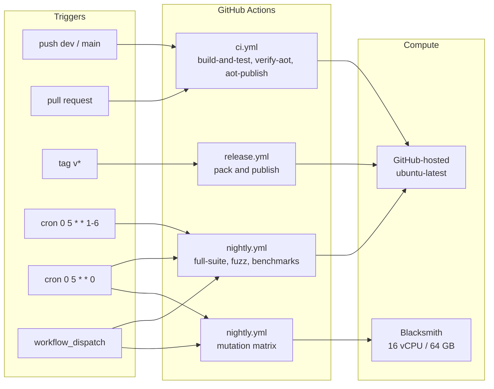
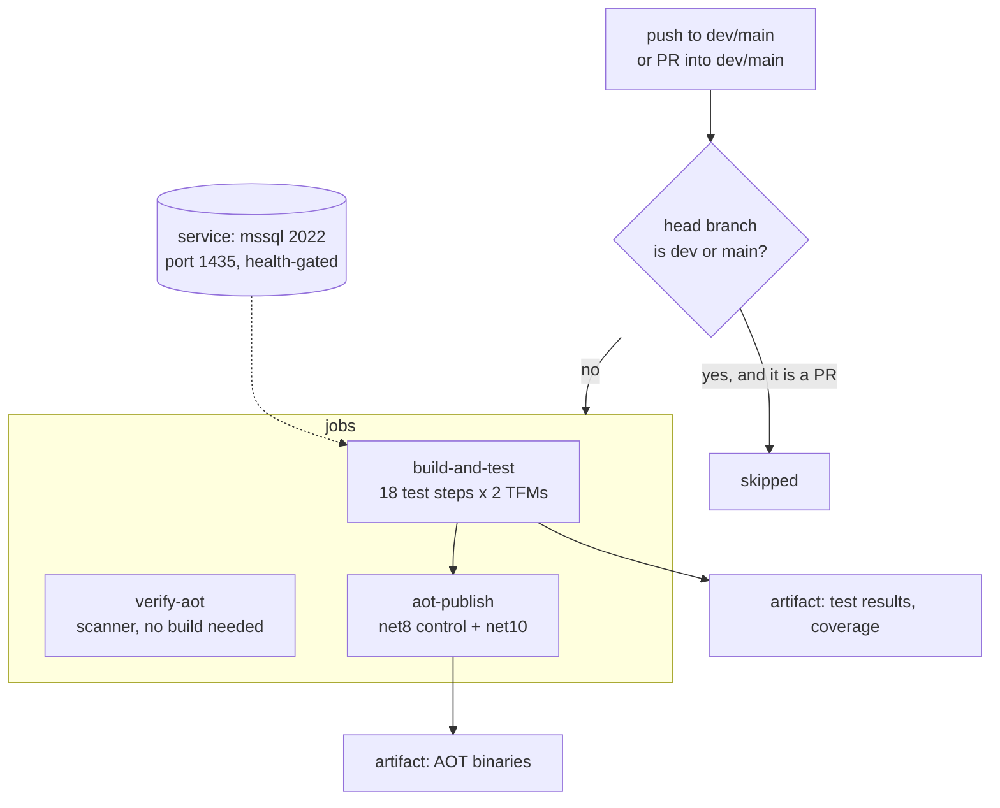
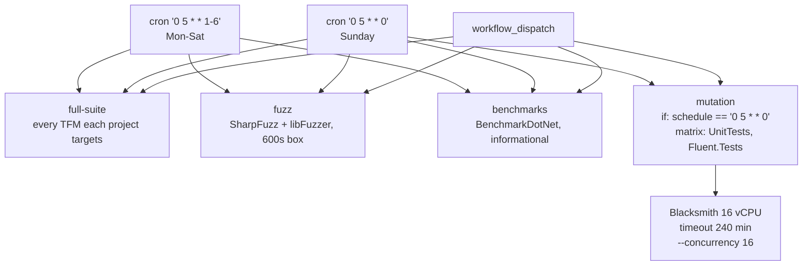
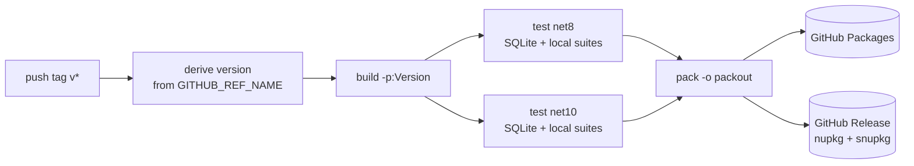

# CI Architecture

Where Jaunty's automated work runs, what triggers each piece, and why each piece lives where it
does. Measured 2026-08-29; every host fact in here was probed, not assumed.

Three workflows and one off-GitHub loop:

| Piece | Trigger | Host | Gate? |
|---|---|---|---|
| `ci.yml` | push to `dev`/`main`, PR into `dev`/`main` | GitHub-hosted | **Yes** — merge blocker |
| `nightly.yml` | cron 05:00 UTC, `workflow_dispatch` | GitHub-hosted, except mutation | No — reports only |
| `release.yml` | push of a `v*` tag | GitHub-hosted | **Yes** — it ships |

---

## 1. The whole picture

Every `runs-on` except the mutation job is `${{ vars.CI_RUNNER || 'ubuntu-latest' }}`. The
variable is an escape hatch: set `CI_RUNNER` and everything moves without a commit. It is unset on
the public repository, so every job resolves to `ubuntu-latest`. It was deleted before the
repository went public because a self-hosted runner on a public repo executes fork-PR code on the
owner's hardware.

---

## 2. `ci.yml` — the merge gate

Three things here are deliberate and easy to break:

- **`concurrency: cancel-in-progress`** keyed on workflow + ref, so a rapid second push kills the
  first run.
- **The `if:` guard on `build-and-test` and `verify-aot`.** Every push to `dev` used to run CI
  twice — once for the push, once as a `pull_request` sync of the standing `dev → main` PR whose
  *head* branch is `dev`. Concurrency cannot collapse the pair (different `github.ref`), and the
  trigger cannot either (`pull_request.branches` filters the **base**, not the head). Hence a
  job-level condition. Feature and dependabot PRs into `dev` still run, which is the case that
  matters.
- **`permissions: contents: read`** at workflow level. Without it the token inherits the
  repository default, which may be read/write — it matters more once the repo is public.

SQL Server runs as a **service container**, with the workspace bind-mounted to the same path
inside the container because `BULK INSERT` executes server-side and the CSV tests pass host paths.

### Engines are skipped when absent, required in CI

A dialect test decides for itself whether its engine is there. `TestConfiguration.Has*` only
answers "is a connection string configured", so the three server dialects also probe: they open a
connection once per process and cache the verdict, the same shape `MicrosoftSqliteAttribute` has
always used for its native library. An engine that does not answer is **skipped**, with the
provider's own error as the reason.

That default is right on a developer box and wrong here. A service container that failed to start
would skip silently and report a green leg that tested nothing, so each `Test - Core*` step sets:

| Variable | Makes this engine's absence a failure |
|---|---|
| `JAUNTY_REQUIRE_SQLSERVER` | SQL Server |
| `JAUNTY_REQUIRE_POSTGRESQL` | PostgreSQL |
| `JAUNTY_REQUIRE_MYSQL` | MySQL **and** MariaDB — one name, because `TestConfiguration` already aliases the two connection strings onto each other |

`0`, `false` and `no` read as off, so a job can disable one engine without deleting the line;
anything else non-blank counts as on. The same variables work in `Jaunty.Scaffolding.Tests`, whose
`OpenOrSkip` has always probed — the names are the contract between the two projects, which share
no assembly and so carry a copy of the rule each.

Setting one does **not** make the tests throw a tidier exception. It makes the attribute decline
to skip, so the row runs and fails on connect. That is deliberate: a `DataAttribute` that throws
fails the whole test method and takes every other dialect's row with it — measured as a total of
11 rather than 55 on `Integration/Get/GetTests`. A red leg should still say whether anything else
broke.

---

## 3. `nightly.yml` — two schedules, four jobs

**Why two cron entries rather than one.** GitHub fires each `schedule:` entry as its own workflow
run — two entries at the same minute do not merge, they double the work. So the weekday cron
excludes Sunday, and the Sunday cron is the one that additionally admits `mutation` through its
`if:`. `github.event.schedule` holds the literal cron string of the entry that fired, which makes
the gate a **string comparison between two places in the file**. Edit the cron and forget the
condition and the mutation job silently never runs again: no error, no skipped-job badge.
`NightlyWorkflowCadenceTests` exists to fail when those two drift apart.

05:00 rather than 03:00 because jauntyq's nightly fires at `0 3 * * *` and the two collided.

**Why mutation is the one job off `CI_RUNNER`.** 2,364 mutants took **2 h 10 m on the mutation host at concurrency 8**; a 2-core hosted runner does not finish inside GitHub's 6-hour job limit at all.
Blacksmith documents no maximum job duration. Three numbers there only make sense together and
`MutationRunnerContractTests` pins all three:

| Setting | Value | If it drifts |
|---|---|---|
| `runs-on` | `blacksmith-16vcpu-ubuntu-2404` | Falling back to `ubuntu-latest` doesn't fail — it runs for hours and produces nothing |
| `timeout-minutes` | `240` | GitHub's **default is 360 and applies to every runner**, Blacksmith included, so "no maximum duration" upstream is not by itself a bound |
| `--concurrency` | `16` | Blacksmith runners report the **host** CPU count, not the allocated vCPUs, so Stryker cannot size itself — the number must be passed and must move with the tier |

Blacksmith's 3,000 free minutes are **2vCPU-minutes consumed proportionally**: a 16 vCPU run bills
at 8× wall clock, so one weekly jaunty run is roughly 2,400 a month — most of the org allowance,
which is shared with jauntyq. Anything else moving to Blacksmith needs that arithmetic redone
first. Mutation is not a gate (`"break": 0` in every `stryker-config.json`); the report is an
artifact.

---

## 4. `release.yml` — the only workflow that writes

`permissions: contents: write, packages: write` — the only workflow that needs either.

**The known sharp edge:** the test filter names suites explicitly by substring, and substring
matching is not the same as suite membership. `~Jaunty.Fluent.Tests` does **not** match
`Jaunty.Fluent.SourceGen.Tests`, and `~Jaunty.Scaffolding.Tests` does not match
`Jaunty.Scaffolding.Cli.Tests`. Both were missing and shipped untested until 2026-08-01. **A new
suite must be added to that filter by hand.**

---

## 5. Open items

| Item | Owner action | Blocks |
|---|---|---|
| Delete `CI_RUNNER` | done before the public release; every job resolves to `ubuntu-latest` | — |
| First real Blacksmith mutation run | `gh workflow run nightly.yml` | replacing the extrapolated 70-90 min estimate with an observed duration and cost |
| `ci.yml` least-privilege review | done — `contents: read` is in place | — |

## See Also

- [`self-hosted-ci-runner.md`](self-hosted-ci-runner.md) — **historical.** Documents the WSL2
  runner and the July 2026 hosted-minutes billing block that justified it. That block is over;
  jauntyq's runs on `ubuntu-latest` disprove it. Kept for the reasoning, not as current guidance.
- [`../decisions/2026-08-31-008-history-rewritten-before-first-public-release.md`](../decisions/2026-08-31-008-history-rewritten-before-first-public-release.md)
  — what changed in the repository at the first public release
- `tests/Jaunty.UnitTests/Unit/NightlyWorkflowCadenceTests.cs`,
  `tests/Jaunty.UnitTests/Unit/MutationRunnerContractTests.cs` — the tests that keep this document
  honest
