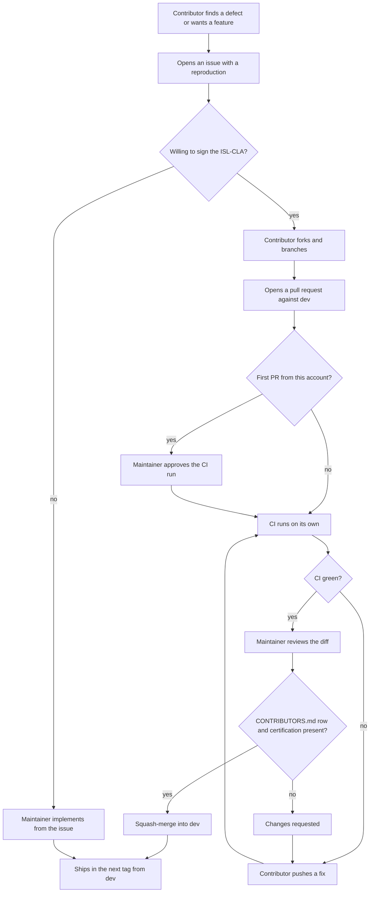
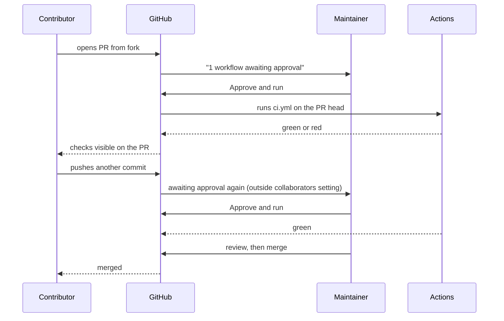

# Contribution workflow

How a change from outside the organisation reaches `dev`, and which GitHub setting guards each
step. [CONTRIBUTING.md](../../CONTRIBUTING.md) states the rules (licence, the ISL-CLA and how
Jaunty adopts it, no AI-generated code); this page is the mechanics.

> The ISL-CLA is a draft pending legal review, so **pull requests are not yet accepted**. Until it
> is in force, the workflow below stops at step 2: open an issue, describe the change, and the
> maintainers implement it. Everything from step 3 on describes what happens once the ISL-CLA is
> live.

## The path of a change

A contributor never pushes to this repository. The fork is theirs, the pull request is a request,
and every step from the CI run onwards happens only with a maintainer's action.

## Who acts when

The approval prompt is about **running the workflow**, not about the code. It exists because a
pull request can change `.github/workflows/*.yml`, and without the gate a stranger's edit would
execute on the project's runners the moment the PR opened. Reviewing the diff is a separate step
and is never skipped.

## The settings and what each one guards

| Setting | Where | Guards | Fires when |
|---|---|---|---|
| Require approval for outside collaborators | Settings → Actions → General | Workflow execution on fork PRs | Every push to a PR from an account without write access |
| Require approval for first-time contributors | same, the lighter option | Same, once per account | The first PR from an account; later ones run unprompted |
| Branch protection on `main` and `dev` | Settings → Branches | Direct pushes, unreviewed merges, force pushes | Any push to either branch, including the maintainer's own |
| CodeQL | Settings → Code security | Injection and unsafe-pattern findings in `src/` | Every PR and every push to `dev` |
| Dependabot alerts | Settings → Code security | A dependency with a published advisory | When an advisory is published, independent of version-bump PRs |
| Secret scanning with push protection | Settings → Code security | Tokens and keys in any commit | At push time, server side, and over the whole history |

Two of these are about code review; the other four are about what runs and what leaks. The
**first-time contributors** option is the recommended one: the gate matters for an unknown
account's first workflow edit, and asking on every push after that adds friction without adding
safety, because fork PRs never receive repository secrets and no self-hosted runner is registered.
The stricter option is the owner's call and changes nothing else on this page.

Secret scanning on GitHub is the last line, not the first. The maintainers' local pre-commit hook
should reject a token before it is committed; GitHub's push protection catches what slips past, and
its history scan catches what was committed before either existed.

## What the contributor sees

Taking a concrete case: someone clones the repository, changes a file, and wants it merged.

1. **They cannot push.** A clone of a public repository has read access only. `git push` is
   rejected, and the fix is to fork, push the branch to the fork, and open a pull request.
2. **The PR opens against `dev`.** `main` is release-only and branch protection rejects PRs to it
   from anyone.
3. **A yellow banner says a workflow is awaiting approval.** Nothing runs until a maintainer clicks.
   For an account that has had a PR merged before, this step does not appear.
4. **Checks run.** Build, the unit and SQLite suites, the SQL Server leg, AOT verification. A red
   check blocks the merge button under branch protection.
5. **A maintainer reviews.** The contributor's row must be in `CONTRIBUTORS.md` (added in this PR
   if it is their first), the certification from the CONTRIBUTING.md template must be in the PR
   description, and the code must be theirs; any of the three missing means changes requested.
   ISL-CLA Section 9.6 makes the row the record of agreement, and the commit that adds it, from
   the contributor's own account, the signature.
6. **Squash-merge.** One commit lands on `dev` under the contributor's name. Their fork branch can
   be deleted by them; nothing here deletes it.

## Maintainer checklist per pull request

- Approve the workflow run only after reading any change under `.github/`.
- Confirm the `CONTRIBUTORS.md` row exists at the adopted ISL-CLA version and the certification is
  in the PR description. A row added by a maintainer from an emailed statement needs that statement
  kept.
- Confirm the change has tests in the same PR, and that the tests fail without the change.
- Run the container-database legs locally if the change touches a dialect: CI covers SQL Server
  and SQLite only.
- Merge with squash, keep the contributor as author, reference the issue in the subject.

## Where audit findings enter

The private nightly audit writes a report that a maintainer reproduces locally. A confirmed
finding becomes a public issue with its reproduction and an `audit` label, and is fixed on a branch
that closes it. Refuted findings are recorded privately and never become issues, so the tracker
holds only what has been reproduced.
