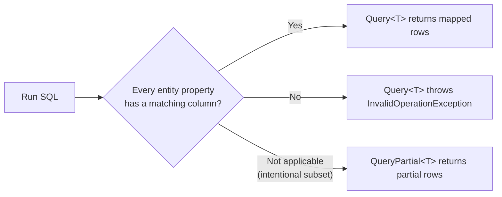

# Your First Hour with Jaunty

This is a hands-on walkthrough, not a reference. Every snippet below is runnable as-is against
an in-memory SQLite database, so you can follow along without installing a database server.
By the end you'll have touched every core Jaunty feature: strict and partial mapping, parameters,
writes, transactions, custom mappers, attribute mapping, async, and streaming.

If you want the full API surface, see `README.md` at the repository root. This guide only
uses APIs documented there (plus the two official samples under `samples/`), so anything you see
here is safe to rely on.

## Setup

Create a new console project and add the packages:

```bash
dotnet new console -n JauntyLearn
cd JauntyLearn
dotnet add package Extrode.Jaunty
dotnet add package Microsoft.Data.Sqlite
```

Open `Program.cs` and start with an in-memory database, a schema, and some seed data:

```csharp
using Jaunty;
using Microsoft.Data.Sqlite;

using var connection = new SqliteConnection("Data Source=:memory:");
connection.Open();

using (var cmd = connection.CreateCommand())
{
    cmd.CommandText = """
        CREATE TABLE products (
            product_id INTEGER PRIMARY KEY AUTOINCREMENT,
            product_name TEXT NOT NULL,
            unit_price REAL NOT NULL,
            discontinued INTEGER NOT NULL DEFAULT 0
        );
        INSERT INTO products (product_name, unit_price, discontinued) VALUES ('Chai', 18.00, 0);
        INSERT INTO products (product_name, unit_price, discontinued) VALUES ('Chang', 19.00, 0);
        INSERT INTO products (product_name, unit_price, discontinued) VALUES ('Aniseed Syrup', 10.00, 0);
        INSERT INTO products (product_name, unit_price, discontinued) VALUES ('Tofu', 23.25, 0);
        INSERT INTO products (product_name, unit_price, discontinued) VALUES ('Genen Shouyu', 15.50, 1);
        """;
    cmd.ExecuteNonQuery();
}
```

Keep this connection open for the rest of the walkthrough. Run it now (`dotnet run`) just to
confirm the schema and seed data work before we touch Jaunty at all.

## Step 1: Your First `Query<T>`

Define an entity whose properties line up with the columns you're about to select:

```csharp
public class Product
{
    public int Id { get; set; }
    public string Name { get; set; }
    public decimal Price { get; set; }
}
```

Query for it, aliasing each column to the matching property name:

```csharp
var products = connection.Query<Product>(
    "SELECT product_id AS Id, product_name AS Name, unit_price AS Price FROM products");

foreach (var p in products)
    Console.WriteLine($"[{p.Id}] {p.Name} - ${p.Price:F2}");
```

Expected output:

```
[1] Chai - $18.00
[2] Chang - $19.00
[3] Aniseed Syrup - $10.00
[4] Tofu - $23.25
[5] Genen Shouyu - $15.50
```

Nothing surprising yet. `Query<T>` selected five rows and mapped each one onto a `Product`.

## Step 2: Break It on Purpose (Strict Mode)

Now drop the `Price` column from the query and run it again:

```csharp
var broken = connection.Query<Product>(
    "SELECT product_id AS Id, product_name AS Name FROM products");
```

This throws immediately:

```
System.InvalidOperationException: Strict mapping failed: property 'Price' has no matching column
```

This is deliberate, and it's the whole reason `Query<T>` exists in this strict form. Every
property on `Product` — `Id`, `Name`, `Price` — must have a matching column in the result set.
If you meant to select all three, the exception just caught a real bug in your SQL before it
shipped. If you meant to select only two columns on purpose, Jaunty wants you to say so
explicitly, which is exactly what Step 3 does.



## Step 3: Projections with `QueryPartial<T>`

Define a smaller DTO for a summary view:

```csharp
public class ProductSummary
{
    public int Id { get; set; }
    public string Name { get; set; }
}
```

Select only the columns you need, and use `QueryPartial<T>` instead of `Query<T>`:

```csharp
var summaries = connection.QueryPartial<ProductSummary>(
    "SELECT product_id AS Id, product_name AS Name FROM products");

foreach (var s in summaries)
    Console.WriteLine($"{s.Id}: {s.Name}");
```

You can even select extra columns you don't map — `QueryPartial<T>` ignores anything without a
matching property, silently:

```csharp
var summaries2 = connection.QueryPartial<ProductSummary>(
    "SELECT product_id AS Id, product_name AS Name, unit_price, discontinued FROM products");
```

Same five rows, same two mapped properties. `unit_price` and `discontinued` are simply not
looked at. This is the tool you reach for whenever you're intentionally projecting a subset of
columns.

## Step 4: Parameterized Queries

Pass an anonymous object for named parameters:

```csharp
var cheap = connection.Query<Product>(
    "SELECT product_id AS Id, product_name AS Name, unit_price AS Price FROM products WHERE unit_price < @MaxPrice",
    new { MaxPrice = 15.00m });
```

Or skip the object entirely and pass values positionally — Jaunty parses the SQL to find the
parameter names and binds your values in order:

```csharp
var cheapPositional = connection.Query<Product>(
    "SELECT product_id AS Id, product_name AS Name, unit_price AS Price FROM products WHERE unit_price < @MaxPrice",
    15.00m);
```

Both return the same three rows (Chai, Aniseed Syrup, Genen Shouyu).

## Step 5: Writing Data

Insert, update, and delete work against the same connection, using the entity's shape to build
the SQL. For this section we need `[Key]` so Jaunty knows which column identifies a row — see
Step 8 for the full attribute story. For now, a minimal write:

```csharp
var rows = connection.QueryScalar<long>("SELECT COUNT(*) FROM products");
Console.WriteLine($"Before insert: {rows} products");

using (var insertCmd = connection.CreateCommand())
{
    insertCmd.CommandText = "INSERT INTO products (product_name, unit_price, discontinued) VALUES (@Name, @Price, 0)";
    var nameParam = insertCmd.CreateParameter();
    nameParam.ParameterName = "@Name";
    nameParam.Value = "Ikura";
    insertCmd.Parameters.Add(nameParam);

    var priceParam = insertCmd.CreateParameter();
    priceParam.ParameterName = "@Price";
    priceParam.Value = 31.00m;
    insertCmd.Parameters.Add(priceParam);

    insertCmd.ExecuteNonQuery();
}

var after = connection.QueryScalar<long>("SELECT COUNT(*) FROM products");
Console.WriteLine($"After insert: {after} products");
```

Expected output:

```
Before insert: 5 products
After insert: 6 products
```

We'll come back to Jaunty's entity-based `Insert`/`Update`/`Delete` in Step 8, once we have an
entity with `[Key]` and `[DatabaseGenerated]` attributes wired up correctly.

## Step 6: A Transaction

Wrap several statements in a transaction so they succeed or fail together:

```csharp
using var transaction = connection.BeginTransaction();

try
{
    using (var cmd1 = connection.CreateCommand())
    {
        cmd1.Transaction = transaction;
        cmd1.CommandText = "INSERT INTO products (product_name, unit_price, discontinued) VALUES ('Konbu', 6.00, 0)";
        cmd1.ExecuteNonQuery();
    }

    var totalRows = connection.Query<Product>(
        "SELECT product_id AS Id, product_name AS Name, unit_price AS Price FROM products",
        CommandOptions.WithTransaction(transaction));

    Console.WriteLine($"Rows visible inside the transaction: {totalRows.Count}");

    transaction.Commit();
}
catch
{
    transaction.Rollback();
    throw;
}
```

`CommandOptions.WithTransaction(transaction)` is how you tell any Jaunty call — reads or writes —
to participate in a transaction. There's no special "transactional" overload to remember; every
`Query`/`Insert`/`Update`/`BulkInsert` call accepts the same `CommandOptions`.

## Step 7: A Custom Row Mapper

Sometimes you want full control over how a row becomes an object — no attributes, no
reflection, just a function. Jaunty lets you hand it a mapper delegate through
`CommandOptions<T>`:

```csharp
using System.Data;
using Jaunty.Core;

public class ProductRow
{
    public int Id { get; set; }
    public string Name { get; set; }
    public decimal Price { get; set; }
}

static ProductRow MapProductRow(IDataReader reader)
{
    return new ProductRow
    {
        Id = reader.GetInt32(reader.GetOrdinal("product_id")),
        Name = reader.GetString(reader.GetOrdinal("product_name")),
        Price = (decimal)reader.GetDouble(reader.GetOrdinal("unit_price"))
    };
}

var options = CommandOptions<ProductRow>.WithMapper(MapProductRow);

var mapped = connection.Query<ProductRow>(
    "SELECT product_id, product_name, unit_price FROM products",
    options: options);

foreach (var p in mapped)
    Console.WriteLine($"{p.Id}: {p.Name} (${p.Price:F2})");
```

Notice the SQL doesn't even need column aliases anymore — the mapper reads columns by their
real database names via `reader.GetOrdinal`. This is the escape hatch for cases where
reflection-based mapping (or a source-generated one) isn't the right fit: hand-tuned
performance-critical paths, unusual type conversions, or NativeAOT builds that can't use
runtime reflection at all.

## Step 8: Attribute Mapping

Real schemas rarely match your C# naming exactly. Attributes let you keep idiomatic C# property
names while pointing at whatever the database actually calls things:

```csharp
using Jaunty.Attributes;

[Table("products")]
public class ProductEntity
{
    [Key]
    [Column("product_id")]
    [DatabaseGenerated(DatabaseGeneratedOption.Identity)]
    public int Id { get; set; }

    [Column("product_name")]
    public string Name { get; set; }

    [Column("unit_price")]
    public decimal Price { get; set; }

    [Column("discontinued")]
    public bool Discontinued { get; set; }
}
```

`[Table]` overrides the table name Jaunty infers from the class name. `[Column]` does the same
for a property's column. `[Key]` marks the primary key, and
`[DatabaseGenerated(DatabaseGeneratedOption.Identity)]` tells Jaunty the database assigns this
value on insert, so `Insert` won't try to send it and will hand you back the generated id:

```csharp
var entity = new ProductEntity { Name = "Mishi Kobe Niku", Price = 97.00m, Discontinued = false };
var newId = connection.Insert(entity);
Console.WriteLine($"Inserted product with id {newId}");

entity.Id = (int)newId;
entity.Price = 99.00m;
var updatedRows = connection.Update(entity);
Console.WriteLine($"Updated {updatedRows} row(s)");

var deletedRows = connection.Delete(entity);
Console.WriteLine($"Deleted {deletedRows} row(s)");
```

Because `ProductEntity` maps onto the same `products` table with `[Column]` attributes, you can
also read it back with `QueryPartial<T>` using the real database column names directly, no
aliasing required:

```csharp
var entities = connection.QueryPartial<ProductEntity>(
    "SELECT product_id, product_name, unit_price, discontinued FROM products");
```

## Step 9: Async Variants

Every method used so far has an async counterpart with the same name plus `Async`:

```csharp
var asyncProducts = await connection.QueryAsync<Product>(
    "SELECT product_id AS Id, product_name AS Name, unit_price AS Price FROM products");

Console.WriteLine($"Fetched {asyncProducts.Count} products asynchronously");

var id = await connection.InsertAsync(new ProductEntity { Name = "Async Item", Price = 5.00m });
Console.WriteLine($"Inserted async with id {id}");
```

`CancellationToken` is an optional trailing argument on all of these — pass one when you have a
real cancellation source (an HTTP request, a background job) and skip it otherwise.

## Step 10: Streaming a Large Result Set

`Query<T>` buffers the whole result set into a `List<T>`. When a result set is too large to
comfortably hold in memory, use `QueryStream<T>` (or the async, `IAsyncEnumerable`-based
`QueryStreamAsync<T>`) to process rows one at a time as they arrive from the database:

```csharp
foreach (var product in connection.QueryStream<Product>(
    "SELECT product_id AS Id, product_name AS Name, unit_price AS Price FROM products"))
{
    Console.WriteLine($"Streamed: {product.Name}");
}

await foreach (var product in connection.QueryStreamAsync<Product>(
    "SELECT product_id AS Id, product_name AS Name, unit_price AS Price FROM products"))
{
    Console.WriteLine($"Streamed async: {product.Name}");
}
```

With only five rows this won't feel any different from `Query<T>` — the value shows up once
you're pulling back tens of thousands of rows and don't want them all resident in memory at once.

## Where to Go Next

You've now touched every core building block: strict mapping, partial mapping, parameters,
writes, transactions, a custom mapper, attribute mapping, async, and streaming. From here:

- Read the [`exercises.md`](exercises.md) in this folder to practice each of these on your own.
- The root `README.md` in the repository documents the full API surface, including bulk
  operations, upserts, stored procedures, `GridReader` for multiple result sets, and
  interceptors for logging and auditing.
